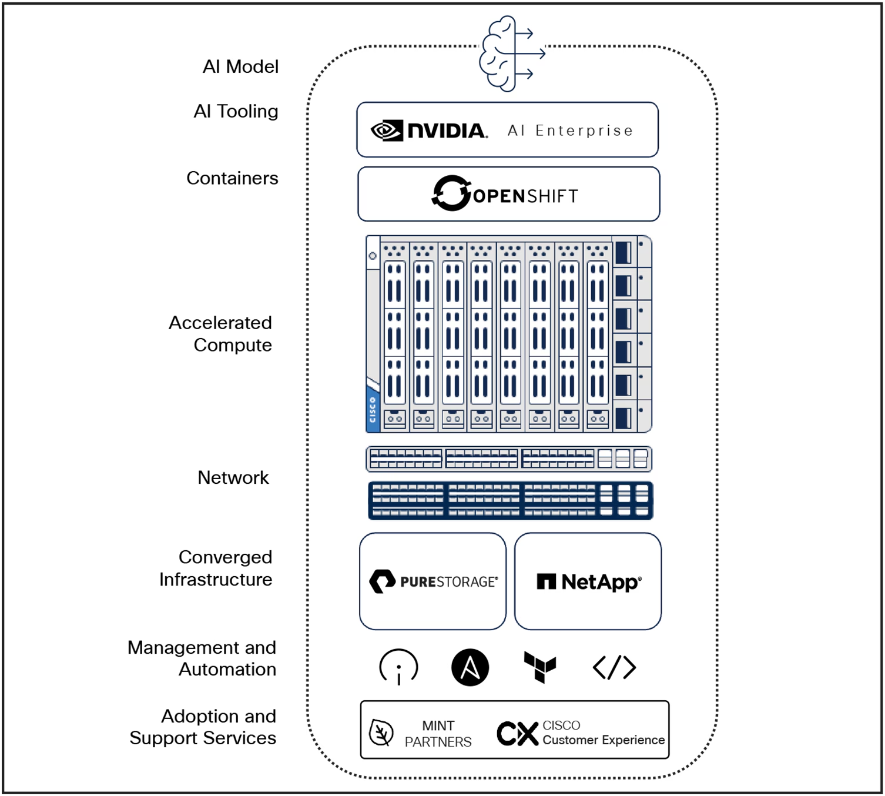
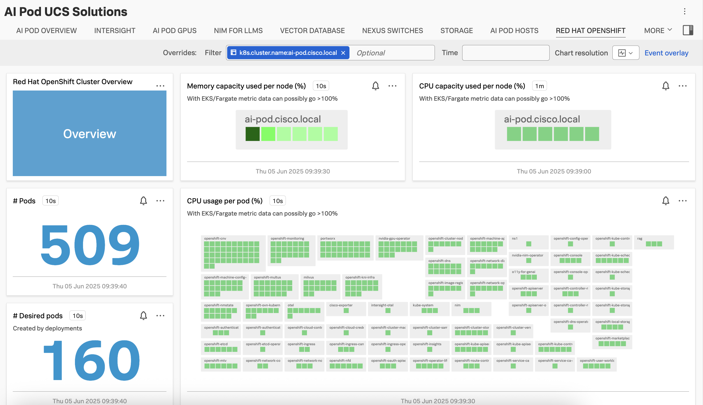
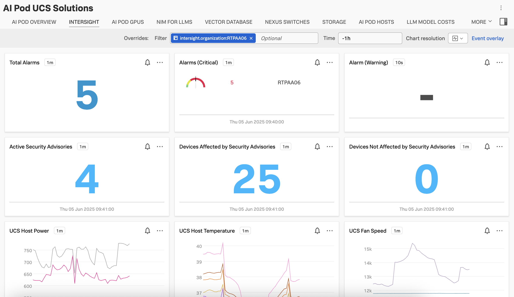
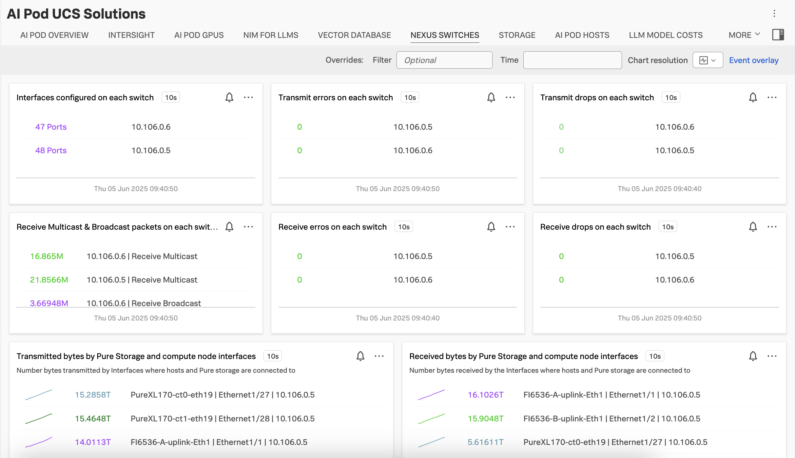
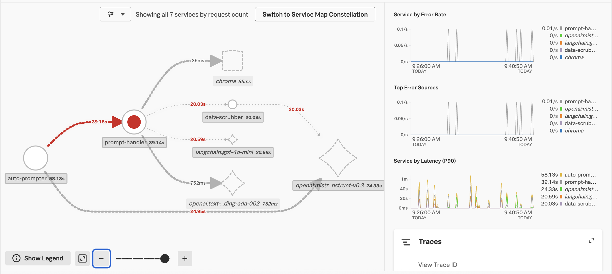
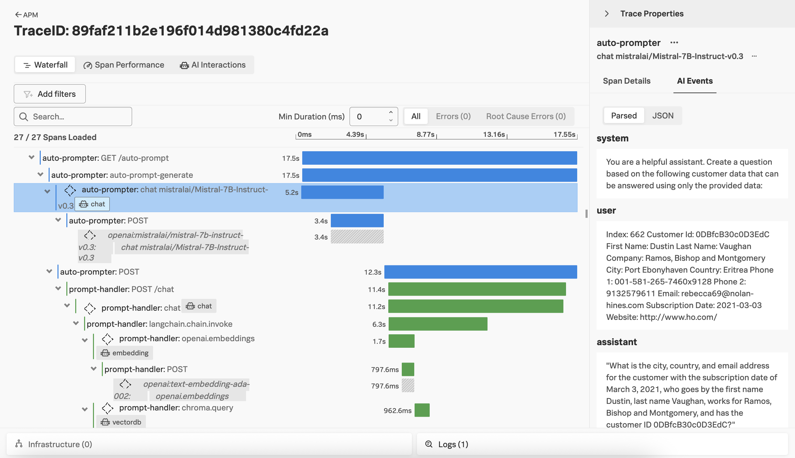

# Splunk Observability for Cisco AI Ready Pods 

Cisco’s AI-ready PODs combine the best of hardware and software technologies to create a robust, 
scalable, and efficient AI-ready infrastructure tailored to diverse needs.

This example demonstrates how Splunk Observability Cloud can be used to monitor a Cisco AI POD 
with the following components: 

* Cisco Unified Computing System™ (Cisco UCS), which ensures that the compute power required for demanding AI workloads is readily available and scalable.
* FlexPod and FlashStack converged infrastructure, which provide high-performance storage and compute capabilities essential for handling large-scale AI and machine learning tasks.
* Cisco's Nexus switches, which provide an AI-ready infrastructure designed to support high-performance AI/ML workloads.
* NVIDIA AI Enterprise, for deploying and managing AI workloads.
* Red Hat OpenShift, which is a Kubernetes-based container platform that simplifies the orchestration and deployment of containerized AI applications.



Source:  https://www.cisco.com/c/en/us/products/collateral/servers-unified-computing/ucs-x-series-modular-system/ai-infrastructure-pods-inferencing-aag.html 

We’ll demonstrate how Splunk Observability Cloud provides comprehensive visibility into all of this 
infrastructure along with all the application components that are running on this stack.

## Deploy the Splunk Distribution of the OpenTelemetry Collector 

First, we'll create a new namespace for the collector: 

```bash
kubectl create ns otel 
```

Add the Splunk OpenTelemetry Collector for Kubernetes' Helm chart repository:

```bash
helm repo add splunk-otel-collector-chart https://signalfx.github.io/splunk-otel-collector-chart
````

Ensure the repository is up-to-date: 

```bash
helm repo update
````

Then we'll deploy the OpenTelemetry collector in that namespace:

> Note: update the command below before running it 
> to include the desired cluster name, environment, access token, etc. 

```bash
helm install ucs-otel-collector \
  --set="clusterName=<cluster name>" \
  --set="environment=<environment name>" \
  --set="splunkObservability.accessToken=***" \
  --set="splunkObservability.realm=<realm e.g. us0, us1, eu0>" \
  --set="splunkPlatform.endpoint=https://<hostname>:443/services/collector/event" \
  --set="splunkPlatform.token=***" \
  --set="splunkPlatform.index=<index name>" \
  -f ./otel-collector/values.yaml \
  -n otel \
  splunk-otel-collector-chart/splunk-otel-collector
```

The [otel-collector/values.yaml](./otel-collector/values.yaml) file includes prometheus receivers 
to scrape metrics for the following components: 

* Nexus
* NVIDIA GPUs 
* NVIDIA NIM for Large Language Models
* NVIDIA NIM for Text Embedding
* NVIDIA NIM for Text Re-Ranking
* Milvus (vector database)
* Cloud-native, software-defined storage 

Update the [otel-collector/values.yaml](./otel-collector/values.yaml) as appropriate for your environment.  For example, if 
your environment doesn't use Trident, then this section can be commented out.  If your environment 
uses Redfish, then ensure the target IP addresses are added to the `values.yaml` file. 



## Deploy the Intersight Integration

This integration is based on the example [here](https://github.com/cgascoig/intersight-otel?tab=readme-ov-file#usage). 
It makes requests to Intersight APIs and sends the resulting metrics to the OpenTelemetry collector
deployed in the previous step. 

First, we'll create a new namespace for this integration: 

```bash 
kubectl create namespace intersight-otel
```

Then, we'll add the Intersight API key as a Kubernetes secret. This assumes you have your 
Intersight Key ID in `/tmp/intersight.keyid.txt` and your Intersight Key in `/tmp/intersight.pem`:

```bash
kubectl -n intersight-otel create secret generic intersight-api-credentials \
    --from-file=intersight-key-id=/tmp/intersight.keyid.txt \
    --from-file=intersight-key=/tmp/intersight.pem
````

Finally, we can apply the manifest as follows: 

```bash
kubectl -n intersight-otel apply -f ./intersight/values.yaml
```



## Deploy the Nexus Integration

This integration is based on the example [here](https://github.com/lwlcom/cisco_exporter).
This solution was dockerized and then run as a deployment in `cisco-exporter` namespace.

It uses ssh to connect to the switches, then scrapes data and exposes those as metrics in 
prometheus format at port 9362.

These metrics can then be scraped by the prometheus receiver included in the OpenTelemetry 
collector deployed above. 

First, we'll create a new namespace for this integration:

```bash 
kubectl create namespace cisco-exporter
```

Then, update the [cisco_exporter_k8s_all_in_one.yaml](./nexus/cisco_exporter_k8s_all_in_one.yaml) file 
to specify the hostname, username, and password for each device:  

````
host: <hostname>
username: <username>
password: <password>
````

Finally, we can apply the manifest as follows:

```bash
kubectl -n cisco-exporter apply -f ./nexus/cisco_exporter_k8s_all_in_one.yaml
```


## Deploy the Redfish Integration

This integration utilizes the Redfish Prometheus Exporter found [here](https://github.com/sapcc/redfish-exporter/tree/main).
This solution was dockerized and then run as a deployment in the `redfish` namespace.

These metrics can then be scraped by the Prometheus receiver included in the OpenTelemetry
collector deployed above.

## Instrument Applications with OpenTelemetry 

The Python agent from the Splunk Distribution of OpenTelemetry Python can automatically instrument 
Python applications by dynamically patching supported libraries. Follow the [steps here](https://docs.splunk.com/observability/en/gdi/get-data-in/application/python/instrumentation/instrument-python-application.html) 
to start collecting metrics and traces from your Python-based Gen AI applications.

Activate [Always On Profiling](https://docs.splunk.com/observability/en/gdi/get-data-in/application/python/instrumentation/instrument-python-application.html) 
if you’d like to capture CPU call stacks for your application as well.

The metric and trace data captured by the Splunk Distribution of OpenTelemetry Python 
can be enhanced with an open-source solution, such as [OpenLIT](https://openlit.io/).

Doing this requires only two steps. First, install the openlit package:

```bash
pip install openlit
```

Second, import the openlit package in your Python code, and then initialize it:

```bash
import openlit
…
# Initialize OpenLIT instrumentation
openlit.init()
```



