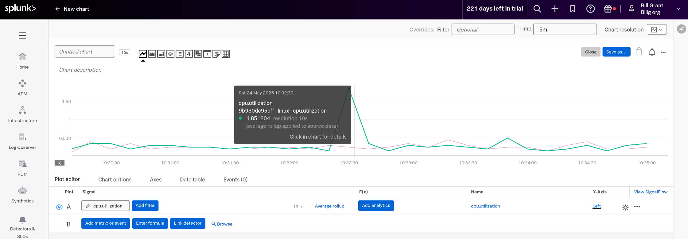
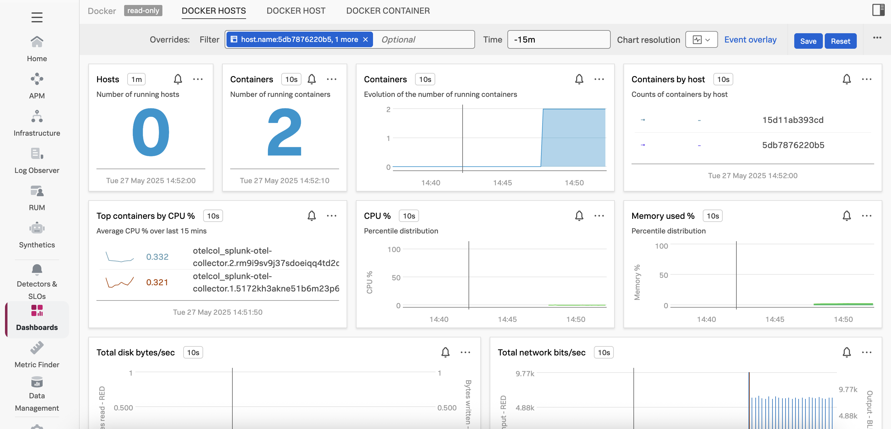
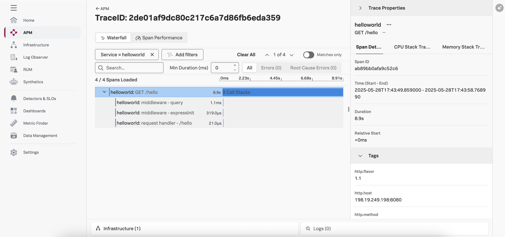

# Docker Swarm Example

This example shows how to use OrbStack on MacOS to provision a 3-node docker swarm environment. 
If you already have a docker swarm environment provisioned, these steps can be skipped. 

## Initialize Docker Swarm

### Install OrbStack

```bash
brew install orbstack
```

Alternatively, you can download Orbstack from [here](https://orbstack.dev/download) and install it. 

### Provision Linux Instances and Install Docker

Run the following from the host to deploy the 3 systems with docker

```bash
sh -x init_instance.sh manager
sh -x init_instance.sh worker1
sh -x init_instance.sh worker2
```

Then initialize the swarm:

```bash
orb -m manager docker swarm init
```
Take the token and IP address provided as output from the previous command and use it to connect the workers:

```bash
orb -m worker1 docker swarm join --token [token] [ip]:2377
orb -m worker2 docker swarm join --token [token] [ip]:2377
```

Confirm the swarm:
```bash
orb -m manager docker node ls
```

The output should look like the following: 
````
ID                            HOSTNAME   STATUS    AVAILABILITY   MANAGER STATUS   ENGINE VERSION
jf6b2v57nx0wlchnk0zk7dviz *   manager    Ready     Active         Leader           28.1.1
o6mfzffyu1y9jahb3cf3g7zrn     worker1    Ready     Active                          28.1.1
ryjfhsj6unp9uktecd0uc7jzc     worker2    Ready     Active                          28.1.1
````

## OpenTelemetry Collector deployment

Now we want to deploy the OpenTelemetry collector. Update the
[docker-compose_config.yml](./docker-compose_config.yml) file 
with the target realm and access token.

Next, use the following commands to copy the `docker-compose_config.yml` to the 
manager node, and the collector configuration file (`config1.yml`) to the worker 
nodes.  Then deploy the collector service. 

```bash
# Push the compose file and the config file
orb push -m manager docker-compose_config.yml /home/ubuntu/docker-compose.yml
orb push -m worker1 config1.yml /home/ubuntu/collector.yml
orb push -m worker2 config1.yml /home/ubuntu/collector.yml
# Deploy
orb -m manager docker stack deploy --compose-file /home/ubuntu/docker-compose.yml otelcol
# Verify
orb -m manager docker stack services otelcol
```

You will know it is deployed successfully when the output of `docker stack services otelcol` 
reaches 2/2.

You can shell into each of the instances and do the regular investigations what's happening:

```bash
# View running containers
orb -m worker1 docker ps -a
# View logs of otel collector
orb -m worker1 docker logs [Container ID]
```

Here's an example of the `cpu.utilization` metric being sent:


You can view Docker container stats by navigating to Infrastructure -> Docker and selecting 
your Docker hosts: 



## Deploy an Application 

Next, let's deploy an application.  We'll use a node.js Docker image that's already 
been instrumented with OpenTelemetry.  The source code and Dockerfile for this application 
can be found [here](../../instrumentation/nodejs/linux).  

```bash
orb -m manager docker stack rm otelcol
```

Update the [docker-compose_with_app.yml](./docker-compose_with_app.yml) file with the target realm 
and access token. 

Use the following commands to deploy the sample application: 

```bash
# Push the compose file 
orb push -m manager docker-compose_with_app.yml /home/ubuntu/docker-compose_with_app.yml
# Deploy
orb -m manager docker stack deploy --with-registry-auth --compose-file docker-compose_with_app.yml app-with-collector
# Verify
orb -m manager docker stack services app-with-collector
```

You will know it is deployed successfully when the output of `docker stack services app-with-collector` reaches 2/2.

To access the application, first get the IP address of one of the nodes in the docker swarm: 

```bash
orb -m manager ip addr
```

It should return something like the following: 

````
...
5: eth0@if15: <BROADCAST,MULTICAST,UP,LOWER_UP> mtu 1500 qdisc noqueue state UP group default qlen 1000
    link/ether b6:77:18:42:d9:54 brd ff:ff:ff:ff:ff:ff link-netnsid 0
    inet 198.19.249.198/24 metric 100 brd 198.19.249.255 scope global dynamic eth0
       valid_lft 170138sec preferred_lft 170138sec
    inet6 fd07:b51a:cc66:0:b477:18ff:fe42:d954/64 scope global mngtmpaddr noprefixroute 
       valid_lft forever preferred_lft forever
    inet6 fe80::b477:18ff:fe42:d954/64 scope link proto kernel_ll 
       valid_lft forever preferred_lft forever
...
````

We'll connect to the application using the IP address of the manager (but it can be any of the nodes): 

```bash
curl http://198.19.249.198:8080/hello
```

It should return `Hello, World!`. 

After a minute or so, you should see a trace in Splunk Observability Cloud: 



## Cleanup

To undeploy the collector and application, run the following command:

```bash
orb -m manager docker stack rm app-with-collector
```

To delete the OrbStack instances: 

```bash
orb delete manager worker1 worker2 
```