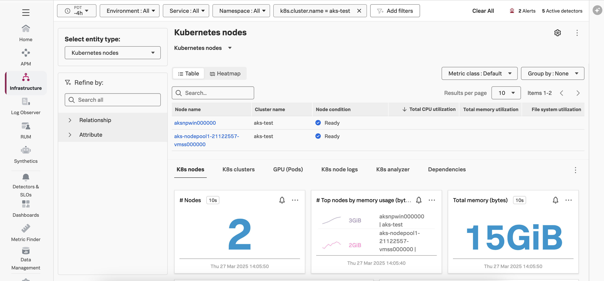

# Using the Splunk Distribution of OpenTelemetry Collector for Kubernetes with Windows Nodes

The Splunk Distribution of OpenTelemetry Collector for Kubernetes supports collecting metrics, traces, and logs 
from Windows nodes. We'll provide an example here of how this is done.  Please refer to 
[Configure Windows worker nodes](https://docs.splunk.com/observability/en/gdi/opentelemetry/collector-kubernetes/kubernetes-config.html#configure-windows-worker-nodes) 
in the official product documentation for further details. 

## Prerequisites

A Kubernetes cluster with at least one Linux node and one Windows node is required to deploy this example. 

We used an AKS cluster for testing.  Please refer to [Deploy a Windows Server container on an Azure Kubernetes Service (AKS) cluster using Azure CLI](https://learn.microsoft.com/en-us/azure/aks/learn/quick-windows-container-deploy-cli?tabs=add-windows-node-pool) 
for an example of how to provision an AKS cluster with both Linux and Windows nodes.

Once connected to the target cluster with kubectl, run the following commands to install the collector 
helm chart and ensure it's up to date: 

``` bash
helm repo add splunk-otel-collector-chart https://signalfx.github.io/splunk-otel-collector-chart
helm repo update
```

## Linux Config

The [values-linux.yaml](./values-linux.yaml) file provides an example of how to configure the collector for Linux 
nodes.  

When deploying the collector using Helm, we want to ensure that the operator is deployed to a Linux node rather 
than Windows.  We've added a node selector to do this: 

``` yaml
operator:
  enabled: true
  nodeSelector:
    kubernetes.io/os: linux
```

After adding your realm, access token, HEC URL and HEC token to the [values-linux.yaml](./values-linux.yaml) file, use 
the following command to deploy the collector to Linux nodes using Helm: 

``` bash
helm install splunk-otel-collector \
  -f values-linux.yaml \
  splunk-otel-collector-chart/splunk-otel-collector 
```

## Windows Config

The [values-windows.yaml](./values-windows.yaml) file provides an example of how to configure the collector for Windows
nodes.

With this config, we've disabled the operator (since it will be deployed on a Linux node instead).  We've also 
disabled the cluster receiver, as this is enabled in the Linux collector and we don't want to duplicate date. 

After adding your realm, access token, HEC URL and HEC token to the [values-windows.yaml](./values-windows.yaml) file, use
the following command to deploy the collector to Windows nodes using Helm:

``` bash
helm install splunk-otel-collector-win \
  -f values-windows.yaml \
  splunk-otel-collector-chart/splunk-otel-collector 
```

Note that we've used a different Helm release name for Windows (`splunk-otel-collector-win`), to avoid duplication with the earlier release
we installed for Linux (`splunk-otel-collector`). 

## Config Data in Splunk Observability Cloud

Once both collectors are installed, we should see both the Linux and Windows nodes in the 
`Infrastructure` -> `Kubernetes` -> `Kubernetes nodes` section of Splunk Observability Cloud: 


