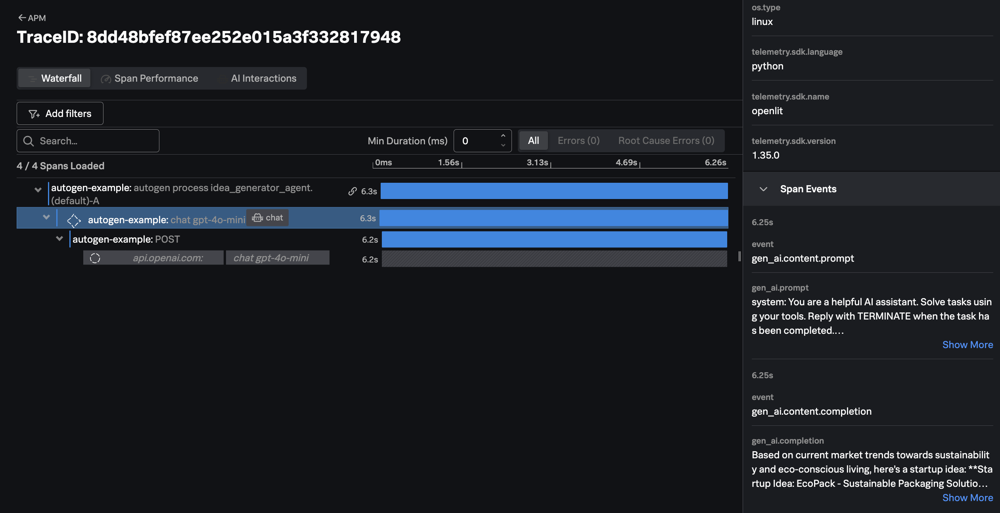
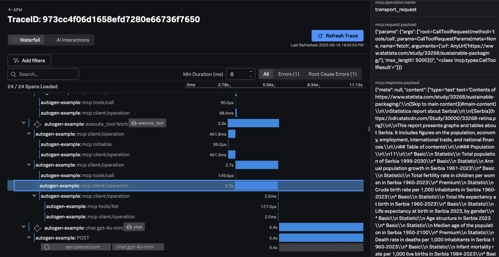
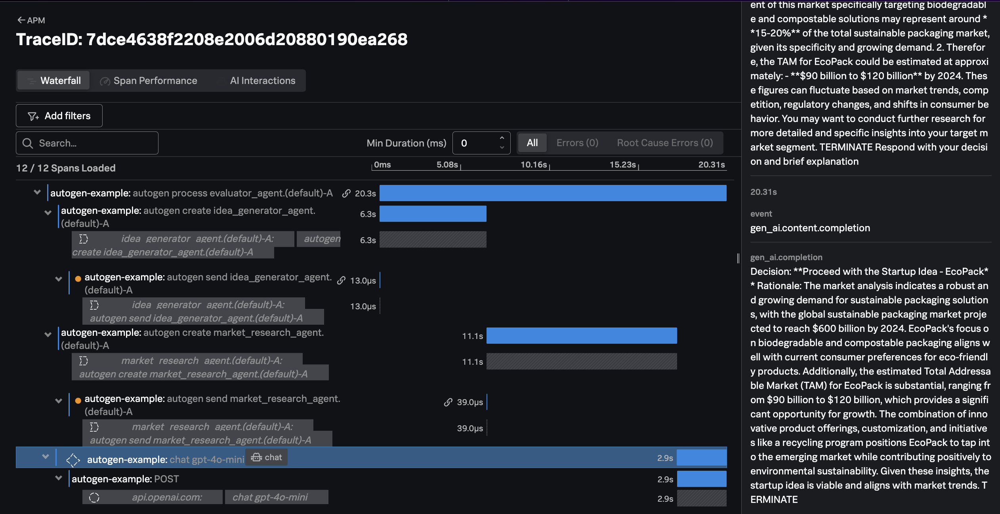

# AutoGen + MCP Example with Splunk

This example demonstrates how the
[Splunk Distribution of OpenTelemetry Python](https://help.splunk.com/en/splunk-observability-cloud/manage-data/instrument-back-end-services/instrument-back-end-applications-to-send-spans-to-splunk-apm./instrument-a-python-application/about-splunk-otel-python)
can be used to capture metrics and traces from an application that utilizes
[AutoGen](https://microsoft.github.io/autogen/stable//index.html).

The metrics and traces are sent to an [OpenTelemetry Collector](https://help.splunk.com/en/splunk-observability-cloud/manage-data/splunk-distribution-of-the-opentelemetry-collector/get-started-with-the-splunk-distribution-of-the-opentelemetry-collector),
which exports the data to [Splunk Observability Cloud](https://www.splunk.com/en_us/products/observability-cloud.html).

It uses a sample application with three agents:

* An idea generator, that comes up with an idea for a startup
* A market research analyst, that performs research on the idea 
* An evaluator, that evaluates the idea and uses the findings from the research agent to determine whether it makes sense to proceed with the idea 

To conduct research, the market research agent uses the [Fetch MCP server](https://github.com/modelcontextprotocol/servers/tree/main/src/fetch) 
to perform web searches. 

## Prerequisites

* Splunk distribution of OpenTelemetry collector running on the host where the example is deployed
* An OpenAI API key
* Python 3.12
* [uv Package Manager](https://docs.astral.sh/uv/guides/install-python/#installing-a-specific-version)

## Setup the Environment

``` bash
# clone the repo if you haven't already
git clone https://github.com/signalfx/splunk-opentelemetry-examples.git

# navigate to the directory repo
cd splunk-opentelemetry-examples/gen-ai/autogen/src

```

## Setup the New Project (Optional)

We first installed AutoGen with the following command:

``` bash
# install autogen 
uv add autogen-agentchat
uv add autogen-core
uv add autogen-ext
uv pip install "autogen-ext[openai]"
uv pip install "autogen-ext[grpc]"
uv pip install "autogen-ext[mcp]"
```

We then installed the Splunk Distribution of OpenTelemetry Python, along with OpenLit,
which enhances spans with additional details:

``` bash
uv add splunk-opentelemetry
uv add openlit
```

Then we ran the following command to add additional instrumentation packages:

``` bash
uv run opentelemetry-bootstrap -a requirements | uv pip install --requirement -
```

Note that there's no need to run these commands a second time, as the code
has already been generated.

## Set Environment Variables

``` bash
export OPENAI_API_KEY="REPLACE_WITH_YOUR_KEY_VALUE_HERE"
export OTEL_SERVICE_NAME=autogen-example
export OTEL_EXPORTER_OTLP_ENDPOINT=http://localhost:4317
export OTEL_EXPORTER_OTLP_PROTOCOL=grpc
export OTEL_PYTHON_DISABLED_INSTRUMENTATIONS=click
export OTEL_LOGS_EXPORTER=otlp
export OTEL_PYTHON_LOG_LEVEL=info
export OTEL_PYTHON_LOGGING_AUTO_INSTRUMENTATION_ENABLED=true
```

## Run the Application

Execute the following command to run the application:

``` bash
uv run opentelemetry-instrument python app.py
```
## View Traces in Splunk Observability Cloud

You should see several traces in Splunk Observability Cloud, which are linked together using Span Links. 

The first trace shows the idea generator agent invoking OpenAI to generate an idea: 



In the next trace, we can see the market research analyst using an MCP tool to perform a web search, 
and then making a request to OpenAI: 



Finally, in the evaluator trace we can see the evaluator agent taking the output from the idea generator and 
market research agents, and then calling OpenAI to make a decision as to whether to proceed with 
the idea: 


