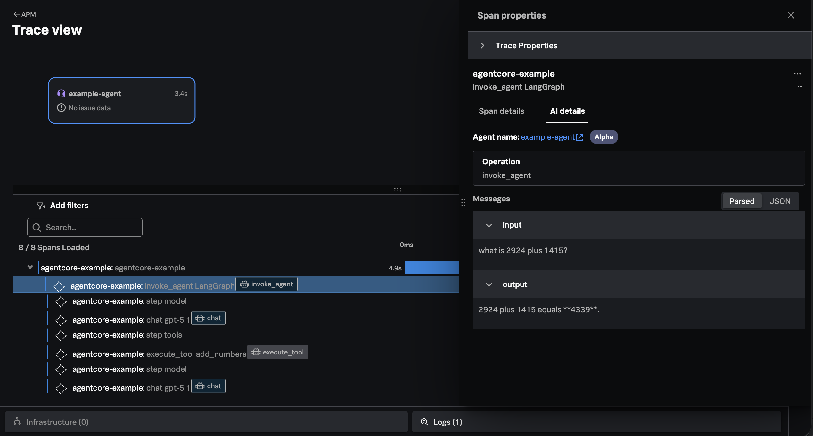

# AWS AgentCore with OpenTelemetry and Splunk (Work in Progress)

This example is based on [Get started with Amazon Bedrock AgentCore](https://docs.aws.amazon.com/bedrock-agentcore/latest/devguide/agentcore-get-started-toolkit.html). 

## Prerequisites

* Python 3.10+
* An OpenAI API key
* An OpenTelemetry Collector accessible to the AgentCore runtime environment, configured to send logs to Splunk Platform and metrics/traces to Splunk Observability Cloud

## Install the AgentCore CLI 

We'll start by installing the AgentCore CLI: 

``` bash
pip install bedrock-agentcore-starter-toolkit
```

## Create an Agent

Create an agent by running the following command: 

``` bash
agentcore create 
```

We chose the following options for this example: 

````
Where should we create your new agent?
./agentcoreExample  

How would you like to start?
> ● A basic starter project (recommended)

What agent framework should we use?
> ● LangChain + LangGraph

Which model provider will power your agent?
> ● OpenAI

Add your API key now for OpenAI (optional)
<blank> 

Initialize a new git repository?
> ● No
````

## Login to AWS 

Use the following command to login to your AWS account: 

``` bash
Run the following commands in your terminal to set the AWS environment variable:
export AWS_ACCESS_KEY_ID="<add_access_key_here>"
export AWS_SECRET_ACCESS_KEY="<add_secret_access_key_here"
export AWS_SESSION_TOKEN="<add_session_token_here>"
```

Provide your AWS Access Key ID, and other secrets when prompted. 

## Test the Local Agent Manually 

Add your OpenAI API key to the [.env.local](./agentcoreEaxmple/.env.local) file. 

Then use the following command to start a local dev server:

``` bash
cd agentcoreExample
agentcore dev
```

Run the below command in a separate terminal to test the agent: 

``` bash
agentcore invoke --dev 'Hello!'
```

It should return output like the following: 

````
✓ Response from dev server:
{'response': '{"result": "Hello! How can I help you today?"}'}
````

## Add Splunk OpenTelemetry Packages 

Ensure `uv` uses Python 3.12 (as issues occur when using a newer version
such as 3.14): 

``` bash
uv python pin 3.12
```

First, remove the AWS distribution of OpenTelemetry: 

``` bash
uv remove aws-opentelemetry-distro
```

Execute the following commands to add the required Splunk OpenTelemetry packages: 

``` bash
uv add splunk-opentelemetry==2.8.0
uv add splunk-otel-instrumentation-langchain==0.1.7
uv add opentelemetry-instrumentation-boto==0.59b0
uv add opentelemetry-instrumentation-urllib3==0.59b0
uv add splunk-otel-util-genai
```

To enable instrumentation-side LLM-as-a-judge evaluation for your application, 
install the following additional packages:

``` bash
uv add splunk-otel-genai-emitters-splunk   
uv add splunk-otel-genai-evals-deepeval
```

## Add OpenTelemetry

To ensure our agent is instrumented with OpenTelemetry, we've modified the 
`main.py` file to import OpenTelemetry packages, initialize 
OpenTelemetry, and get a handle to the tracer. We also initiate the 
LangChain instrumentor: 

``` python
from opentelemetry import trace
from opentelemetry.instrumentation.langchain import LangChainInstrumentor

from splunk_otel import init_splunk_otel
init_splunk_otel()

tracer = trace.get_tracer("agentcore-example-tracer")
LangChainInstrumentor().instrument()
```

Then, in the application's entry point, we use the tracer to initiate a 
root span for our trace: 

``` python
@app.entrypoint
async def invoke(payload):
    # assume payload input is structured as { "prompt": "<user input>" }

    with tracer.start_as_current_span("agentcore-example") as span:
```

We also disabled observability in the `.bedrock_agentcore.yaml` file: 

``` bash
      observability:
        enabled: false
```

## Set the Agent Name 

We also modified the `main.py` file to include the agent name as follows: 

``` python
    graph = _create_react_agent(llm, tools=tools + [add_numbers]).with_config(
        {
            "metadata": { "agent_name": "example-agent"}
        }
    )
```

## Deploy the Agent in Amazon Bedrock AgentCore Runtime

Use the following command to deploy the agent: 

``` bash
agentcore deploy \
    --env DISABLE_ADOT_OBSERVABILITY=true \
    --env OTEL_EXPORTER_OTLP_ENDPOINT=http://<collector endpoint>:4317 \
    --env OTEL_EXPORTER_OTLP_PROTOCOL=grpc \
    --env OTEL_EXPORTER_OTLP_METRICS_TEMPORALITY_PREFERENCE=DELTA \
    --env OTEL_TRACES_EXPORTER=otlp \
    --env OTEL_LOGS_EXPORTER=otlp \
    --env OTEL_SERVICE_NAME=agentcore-example \
    --env OTEL_RESOURCE_ATTRIBUTES='deployment.environment=agentcore-example' \
    --env OTEL_PYTHON_LOGGING_AUTO_INSTRUMENTATION_ENABLED=true \
    --env OTEL_INSTRUMENTATION_GENAI_EMITTERS=span_metric_event,splunk \
    --env OTEL_INSTRUMENTATION_GENAI_CAPTURE_MESSAGE_CONTENT=true \
    --env OTEL_INSTRUMENTATION_GENAI_CAPTURE_MESSAGE_CONTENT_MODE=SPAN_AND_EVENT \
    --env OTEL_INSTRUMENTATION_GENAI_EVALS_RESULTS_AGGREGATION=true \
    --env OTEL_INSTRUMENTATION_GENAI_EMITTERS_EVALUATION=replace-category:SplunkEvaluationResults
```

We've included environment variables to do the following: 

* Disable the built-in observability included with AgentCore (since we're using the Splunk distribution of OpenTelemetry instead)
* Tell the OpenTelemetry SDK where to export data 
* Configure LLM-as-a-judge evaluation settings

## Test the Deployed Agent 

Use a command such as the following to test the agent: 

``` bash
agentcore invoke '{"prompt": "what is 2924 plus 1415?"}'
```

Note that we've asked it to add two numbers, since it's likely to invoke 
the `add_numbers` function tool to accomplish this. 

## View Traces in Splunk Observability Cloud 

After sending the test request to your agent, you should see a trace similar to 
the following in Splunk Observability Cloud: 



## Cleanup 

Run the following command to undeploy the agent: 

``` bash
agentcore destroy
```
