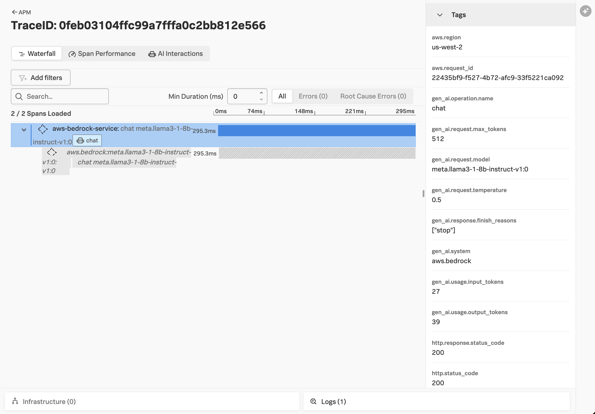
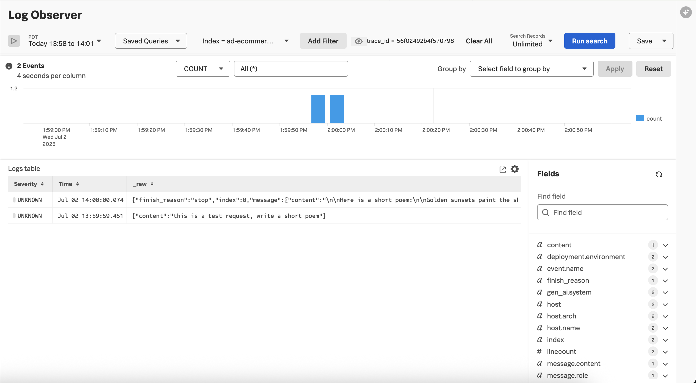

# Amazon Bedrock Example with Boto3 SDK

[Amazon Bedrock](https://aws.amazon.com/bedrock/) is a fully-managed service that provides 
access to various foundational large language models, including models from [Anthropic](https://aws.amazon.com/bedrock/anthropic), 
[Cohere](https://aws.amazon.com/bedrock/cohere/), [Meta](https://aws.amazon.com/bedrock/llama/), 
[Mistral AI](https://aws.amazon.com/bedrock/mistral/), and more. 

This example demonstrates how the
[Splunk Distribution of OpenTelemetry Python](https://help.splunk.com/en/splunk-observability-cloud/manage-data/instrument-back-end-services/instrument-back-end-applications-to-send-spans-to-splunk-apm./instrument-a-python-application/about-splunk-otel-python)
can be used to capture metrics and traces from an application that utilizes
[Amazon Bedrock](https://aws.amazon.com/bedrock/).

The metrics and traces are sent to an [OpenTelemetry Collector](https://help.splunk.com/en/splunk-observability-cloud/manage-data/splunk-distribution-of-the-opentelemetry-collector/get-started-with-the-splunk-distribution-of-the-opentelemetry-collector),
which exports the data to [Splunk Observability Cloud](https://www.splunk.com/en_us/products/observability-cloud.html).

This example uses the [boto3](https://aws.amazon.com/sdk-for-python/) Python SDK from AWS to access 
Amazon Bedrock's foundational models using the OpenAI APIs. Please refer to the 
[Amazon Bedrock Example with LiteLLM Proxy](../aws-bedrock-lite-llm-proxy) for an example
of accessing Amazon Bedrock models using LiteLLM instead.

## Prerequisites

* An AWS account the ability to utilize Amazon Bedrock
* Splunk distribution of OpenTelemetry collector running on the host where the example is deployed

## Add Amazon Bedrock Foundational Model(s)

Before you can use a foundation model in Amazon Bedrock, you must request access to it.
This example will use the Llama 3.1 8B Instruct model from Meta.  Follow the instructions in
[Add or remove access to Amazon Bedrock foundation models](https://docs.aws.amazon.com/bedrock/latest/userguide/model-access-modify.html)
to add this model to your AWS account.

## Setup the Environment 

``` bash
# navigate to the application directory
cd splunk-opentelemetry-examples/gen-ai/aws-bedrock

# create a virtual environment for the proxy
python3 -m venv venv

# activate the virtual environment for the proxy
source venv/bin/activate

# install boto3 and splunk-opentelemetry
pip install boto3
pip install splunk-opentelemetry
```

Run the bootstrap script to install instrumentation for every supported package in your environment:

``` bash
./venv/bin/opentelemetry-bootstrap -a install
```

## Set Environment Variables

Set the following environment variables to tell the application how to connect to 
your AWS account: 

``` bash
export AWS_ACCESS_KEY_ID="REPLACE_WITH_YOUR_KEY_VALUE_HERE"
export AWS_SECRET_ACCESS_KEY="REPLACE_WITH_YOUR_ENDPOINT_HERE"
export AWS_REGION_NAME="REPLACE_WITH_YOUR_REGION_HERE"
```

Next, tell the OpenTelemetry SDK to send data to our collector using gRPC:

``` bash
export OTEL_SERVICE_NAME=aws-bedrock-service
export OTEL_RESOURCE_ATTRIBUTES='deployment.environment=test'
export OTEL_EXPORTER_OTLP_ENDPOINT=http://localhost:4317
export OTEL_EXPORTER_OTLP_PROTOCOL=grpc
export OTEL_INSTRUMENTATION_GENAI_CAPTURE_MESSAGE_CONTENT=true
```

## Run the Application

Next, we'll run a custom application that uses the Boto3 SDK to access the 
Meta Llama model in Amazon Bedrock.  This code is based on the example from AWS 
found [here](https://docs.aws.amazon.com/bedrock/latest/userguide/bedrock-runtime_example_bedrock-runtime_InvokeModel_MetaLlama3_section.html).

``` bash
opentelemetry-instrument python3 app.py
```

You should see traces in Splunk Observability Cloud that look like the following:



We can also view any log entries related to this trace by clicking on the Logs button
at the bottom right of the trace:

