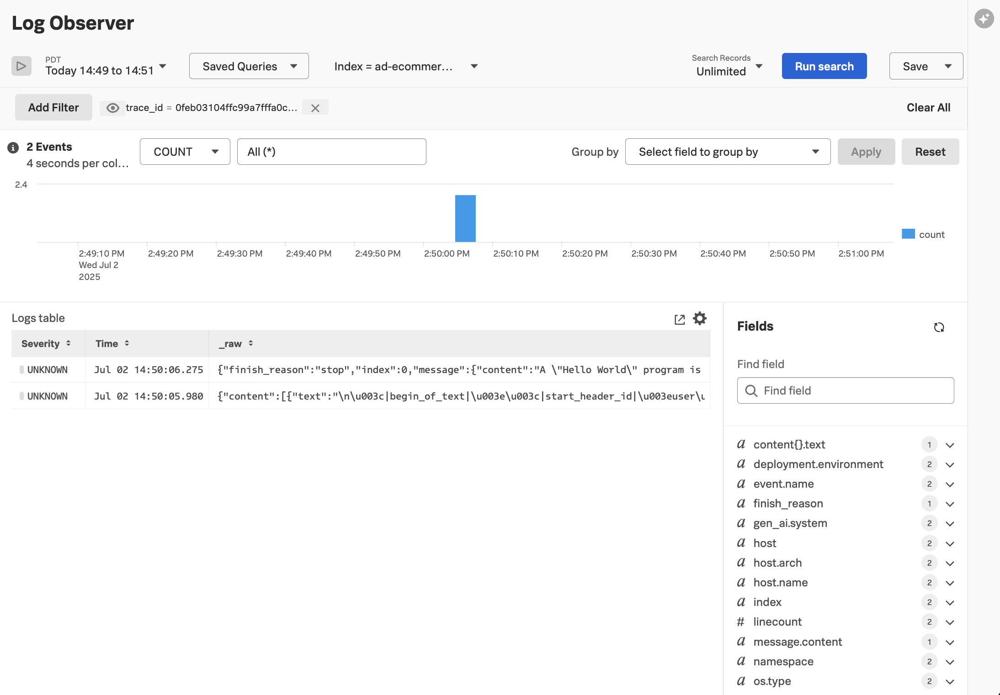

# Amazon Bedrock Example with Splunk

[Amazon Bedrock](https://aws.amazon.com/bedrock/) is a fully-managed service that provides 
access to various foundational large language models, including models from [Anthropic](https://aws.amazon.com/bedrock/anthropic), 
[Cohere](https://aws.amazon.com/bedrock/cohere/), [Meta](https://aws.amazon.com/bedrock/llama/), 
[Mistral AI](https://aws.amazon.com/bedrock/mistral/), and more. 

This example demonstrates how the
[Splunk Distribution of OpenTelemetry Python](https://help.splunk.com/en/splunk-observability-cloud/manage-data/instrument-back-end-services/instrument-back-end-applications-to-send-spans-to-splunk-apm./instrument-a-python-application/about-splunk-otel-python)
can be used to capture metrics and traces from an application that utilizes
[Amazon Bedrock](https://aws.amazon.com/bedrock/).

The metrics and traces are sent to an [OpenTelemetry Collector](https://help.splunk.com/en/splunk-observability-cloud/manage-data/splunk-distribution-of-the-opentelemetry-collector/get-started-with-the-splunk-distribution-of-the-opentelemetry-collector),
which exports the data to [Splunk Observability Cloud](https://www.splunk.com/en_us/products/observability-cloud.html).

Application developers can use SDKs from Amazon to interact with Amazon Bedrock's 
foundational models.  In this example, we're going to use [LiteLLM Proxy](https://docs.litellm.ai/)
to access Amazon Bedrock's foundational models using the OpenAI APIs. Please refer to the 
[LiteLLM Proxy example](../lite-llm-proxy) for a more comprehensive example of how LiteLLM can 
be utilized. 

This example uses [opentelemetry-instrumentation-openai-v2](https://pypi.org/project/opentelemetry-instrumentation-openai-v2/)
to instrument the application.

## Prerequisites

* An AWS account the ability to utilize Amazon Bedrock
* Splunk distribution of OpenTelemetry collector running on the host where the example is deployed

## Add Amazon Bedrock Foundational Model(s)

Before you can use a foundation model in Amazon Bedrock, you must request access to it.
This example will use the Llama 3.1 8B Instruct model from Meta.  Follow the instructions in
[Add or remove access to Amazon Bedrock foundation models](https://docs.aws.amazon.com/bedrock/latest/userguide/model-access-modify.html)
to add this model to your AWS account.

## Set Environment Variables

Set the following environment variables to tell LiteLLM proxy how to connect to 
your AWS account.  Set the Amazon Bedrock model name as well.  An example value is provided, 
though you'll need to substitute your AWS region and Account ID: 

``` bash
export AWS_ACCESS_KEY_ID="REPLACE_WITH_YOUR_KEY_VALUE_HERE"
export AWS_SECRET_ACCESS_KEY="REPLACE_WITH_YOUR_ENDPOINT_HERE"
export AWS_REGION_NAME="REPLACE_WITH_YOUR_REGION_HERE"
export AWS_MODEL_NAME="bedrock/arn:aws:bedrock:<AWS Region>:<AWS Account ID>:inference-profile/us.meta.llama3-1-8b-instruct-v1:0"
```

## Deploy the Lite LLM Proxy 

In the same terminal where the environment variables were just set, run 
the following commands to setup a virtual environment: 

``` bash
# create a virtual environment for the proxy
python3 -m venv venv

# activate the virtual environment for the proxy
source venv/bin/activate

# install litellm proxy 
pip install 'litellm[proxy]'
```

### Configure LiteLLM Proxy to Emit OpenTelemetry

We can configure LiteLLM Proxy to emit OpenTelemetry spans by executing the following steps.

First, install the OpenTelemetry SDK:

```bash
pip install opentelemetry-api opentelemetry-sdk opentelemetry-exporter-otlp -U
```

Next, tell the SDK to send data to our collector using gRPC:

```bash
export OTEL_SERVICE_NAME=litellm-proxy
export OTEL_RESOURCE_ATTRIBUTES='deployment.environment=test'
export OTEL_EXPORTER_OTLP_ENDPOINT=http://localhost:4317
export OTEL_EXPORTER_OTLP_PROTOCOL=grpc
```

### Start LiteLLM Proxy

Start LiteLLM proxy using the following command:

``` bash
litellm --config config.yaml --model llama3-1-8b-instruct-v1
```

Note that the command references a config file specific to Amazon Bedrock. This config file 
references the environment variables we set earlier: 

````
model_list:
  - model_name: llama3-1-8b-instruct-v1
    litellm_params:
      model: os.environ/AWS_MODEL_NAME
      aws_access_key_id: os.environ/AWS_ACCESS_KEY_ID
      aws_secret_access_key: os.environ/AWS_SECRET_ACCESS_KEY
      aws_region_name: os.environ/AWS_REGION_NAME
````

## Run the Application

Next, we'll run a custom application that uses the LiteLLM proxy to access the 
Meta Llama model in Amazon Bedrock. 

### Setup the Environment

Open another terminal window in the same directory and run the following commands:

``` bash
# navigate to the application directory
cd splunk-opentelemetry-examples/gen-ai/aws-bedrock/app

# create a virtual environment for the application
python3 -m venv venv

# activate the virtual environment for the application
source venv/bin/activate

# install required dependencies 
pip install -r requirements.txt 
```

### Set Environment Variables

Set the following environment variables.  Add the value for the `LITELLM_VIRTUAL_KEY` copied above
before running the following commands:

``` bash
export OTEL_SERVICE_NAME=aws-bedrock-meta-llama
export OTEL_RESOURCE_ATTRIBUTES='deployment.environment=test'
export OTEL_EXPORTER_OTLP_ENDPOINT=http://localhost:4317
export OTEL_EXPORTER_OTLP_PROTOCOL=grpc
export OTEL_INSTRUMENTATION_GENAI_CAPTURE_MESSAGE_CONTENT=true
```

### Launch the Application

Finally, we can launch the application which uses the LiteLLM proxy to invoke OpenAI:

``` bash
opentelemetry-instrument python3 app.py
```

You should see traces in Splunk Observability Cloud that look like the following:


Prompt details are available on the AI Events tab on the right-hand side of the screen:


We can also view any log entries related to this trace by clicking on the Logs button
at the bottom right of the trace:

