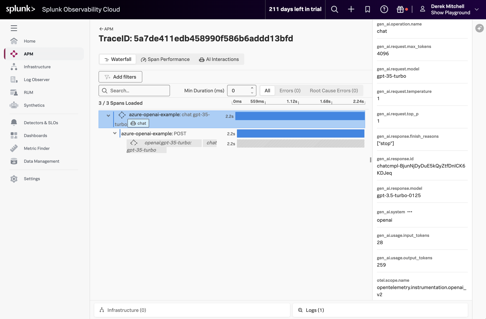
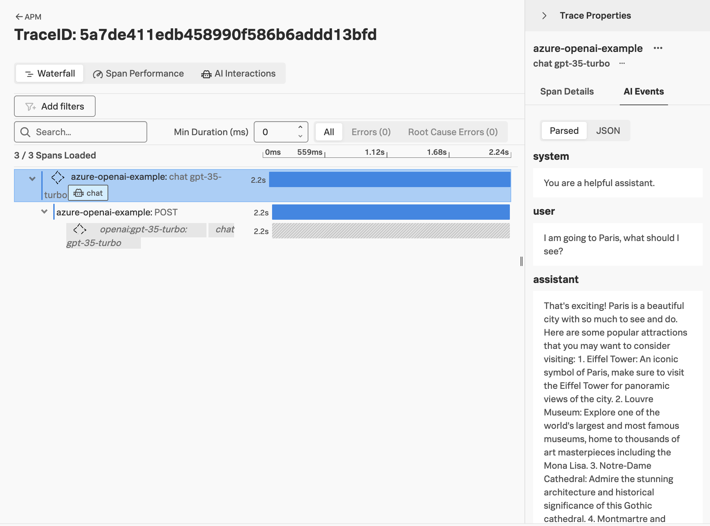
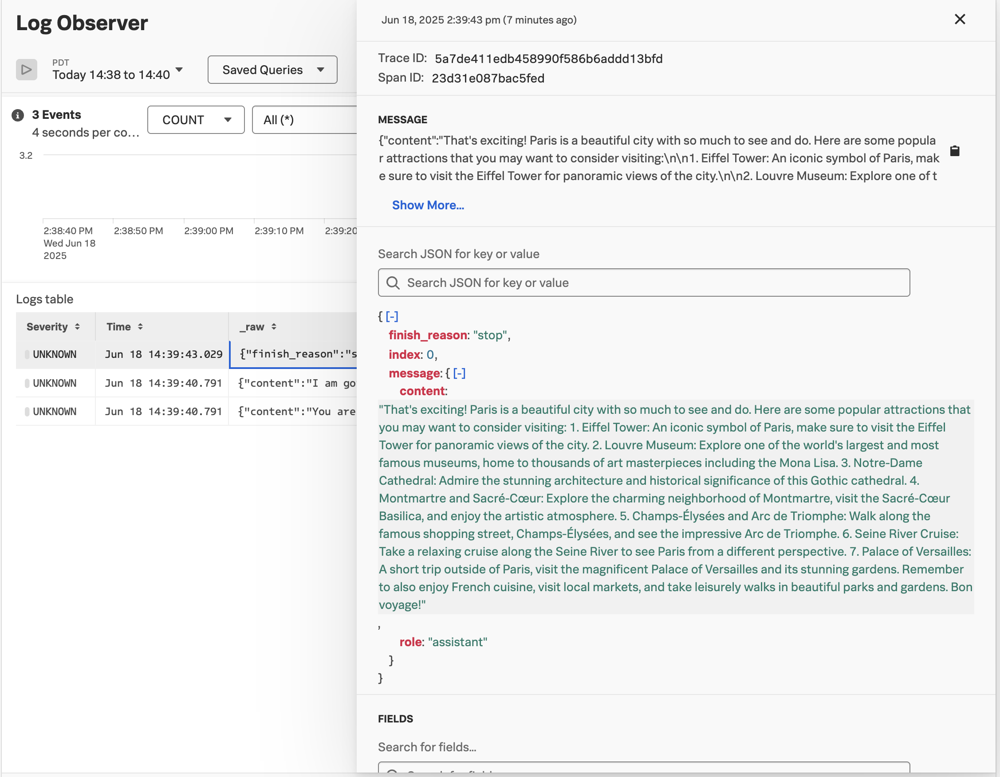

# Azure OpenAI Example with Splunk

This example demonstrates how the 
[Splunk Distribution of OpenTelemetry Python](https://help.splunk.com/en/splunk-observability-cloud/manage-data/instrument-back-end-services/instrument-back-end-applications-to-send-spans-to-splunk-apm./instrument-a-python-application/about-splunk-otel-python) 
can be used to capture metrics and traces from an application that utilizes 
[Azure OpenAI](https://azure.microsoft.com/en-us/products/ai-services/openai-service/).  

The metrics and traces are sent to an [OpenTelemetry Collector](https://help.splunk.com/en/splunk-observability-cloud/manage-data/splunk-distribution-of-the-opentelemetry-collector/get-started-with-the-splunk-distribution-of-the-opentelemetry-collector), 
which exports the data to [Splunk Observability Cloud](https://www.splunk.com/en_us/products/observability-cloud.html). 

This example uses [opentelemetry-instrumentation-openai-v2](https://pypi.org/project/opentelemetry-instrumentation-openai-v2/)
to instrument the application.

## Prerequisites

* Azure account with Azure OpenAI enabled (refer to this [document](https://learn.microsoft.com/en-us/azure/ai-services/openai/how-to/create-resource?pivots=web-portal) for details)
* Azure OpenAI deployment with gpt-35-turbo model
* Splunk distribution of OpenTelemetry collector running on the host where the example is deployed

## Setup the Environment 

``` bash
# clone the repo if you haven't already
git clone https://github.com/signalfx/splunk-opentelemetry-examples.git

# navigate to the directory repo
cd splunk-opentelemetry-examples/gen-ai/azure-openai.git

# create a virtual environment 
python3.12 -m venv venv

# activate the virtual environment
source venv/bin/activate

pip install -r requirements.txt 
```

## Set Environment Variables 

``` bash
export AZURE_OPENAI_API_KEY="REPLACE_WITH_YOUR_KEY_VALUE_HERE"
export AZURE_OPENAI_ENDPOINT="REPLACE_WITH_YOUR_ENDPOINT_HERE"
export OTEL_SERVICE_NAME=azure-openai-example
export OTEL_RESOURCE_ATTRIBUTES='deployment.environment=test'
export OTEL_EXPORTER_OTLP_ENDPOINT=http://localhost:4317
export OTEL_EXPORTER_OTLP_PROTOCOL=grpc
export OTEL_INSTRUMENTATION_GENAI_CAPTURE_MESSAGE_CONTENT=true
```

## Run the Application 

``` bash
./venv/bin/opentelemetry-instrument python app.py 
```

You should see traces in Splunk Observability Cloud that look like the following:



Prompt details are available on the AI Events tab on the right-hand side of the screen: 



We can also view any log entries related to this trace by clicking on the Logs button 
at the bottom right of the trace: 

