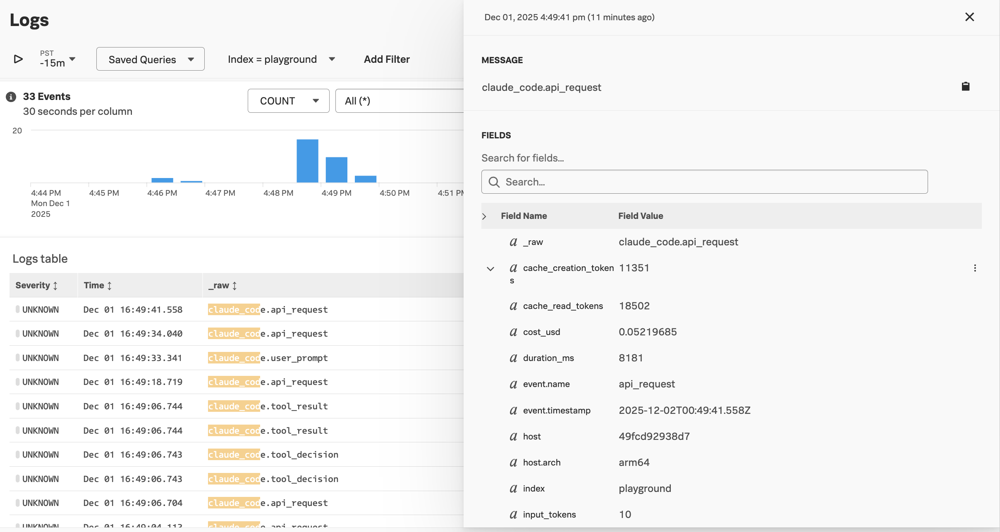
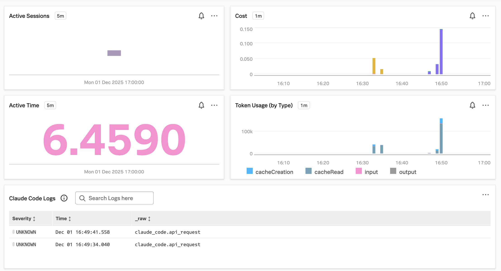

# Integrating Splunk Observability with Claude Code 

[Claude Code](https://www.claude.com/product/claude-code) is an AI-powered coding tool developed by Anthropic 
that operates directly in a command-line terminal, assisting developers with tasks like refactoring, documenting, and 
debugging code. 

This example shows how we can use Splunk Observability Cloud to monitor Claude Code usage. 

## Prerequisites

* A [Claude.ai](https://claude.ai/) account

## Deploy an OpenTelemetry Collector 

For this example, we deployed the Splunk Distribution of the OpenTelemetry Collector onto our machine, and 
configured it to export metrics and traces to Splunk Observability Cloud, and logs to Splunk Cloud. 

Please refer to [Install the Collector using packages and deployment tools](https://docs.splunk.com/observability/en/gdi/opentelemetry/install-the-collector.html#collector-package-install)
for collector installation instructions.

## Install Claude Code

If you don't already have Claude Code installed, follow the steps [here](https://code.claude.com/docs/en/overview)
to do so. 

This example was built using macOS, so I used the following command to install it: 

``` bash
curl -fsSL https://claude.ai/install.sh | bash
```

Navigate to a folder you'd like to use Claude Code with, then start it with the following command: 

``` bash
claude
```

Login using the provided instructions, then ensure it's working by using a command such as: 

``` bash
what does this project do?
```

## Configure OpenTelemetry 

Next, we'll configure Claude to export metric data to our OpenTelemetry collector, which will
then send it to Splunk. This is based on the example provided in 
[Claude's documentation](https://code.claude.com/docs/en/monitoring-usage).

Stop Claude and set the following environment variables to enable OpenTelemetry: 

``` bash
# Enable telemetry
export CLAUDE_CODE_ENABLE_TELEMETRY=1

# Choose exporters 
export OTEL_METRICS_EXPORTER=otlp
export OTEL_LOGS_EXPORTER=otlp

# Configure OTLP endpoint (for OTLP exporter)
export OTEL_EXPORTER_OTLP_PROTOCOL=grpc
export OTEL_EXPORTER_OTLP_ENDPOINT=http://localhost:4317

# For debugging: reduce export intervals
export OTEL_METRIC_EXPORT_INTERVAL=10000  # 10 seconds (default: 60000ms)
export OTEL_LOGS_EXPORT_INTERVAL=5000     # 5 seconds (default: 5000ms)

# Distinguish between different teams (Optional)
export OTEL_RESOURCE_ATTRIBUTES="team.id=observability-specialists"

# Run Claude Code
claude
```

Ask Claude another question or two to generate some metric data. 

## View Metric Data 

Claude Code exports the following metrics:

| Metric Name | Description | Unit |
|----------------------------------------|-----------------------------------------------|--------|
| claude_code.session.count | Count of CLI sessions started | count |
| claude_code.lines_of_code.count | Count of lines of code modified | count |
| claude_code.pull_request.count | Number of pull requests created | count |
| claude_code.commit.count | Number of git commits created | count |
| claude_code.cost.usage | Cost of the Claude Code session | USD |
| claude_code.token.usage | Number of tokens used | tokens |
| claude_code.code_edit_tool.decision | Count of code editing tool permission decisions| count |
| claude_code.active_time.total | Total active time in seconds | s |

The following dashboard provides an example of how these metrics can be visualized 
in Splunk Observability Cloud: 


## View Logs and Events 

We can also view logs by filtering on `claude_code`: 



If desired, we can add the logs to our dashboard as well: 

