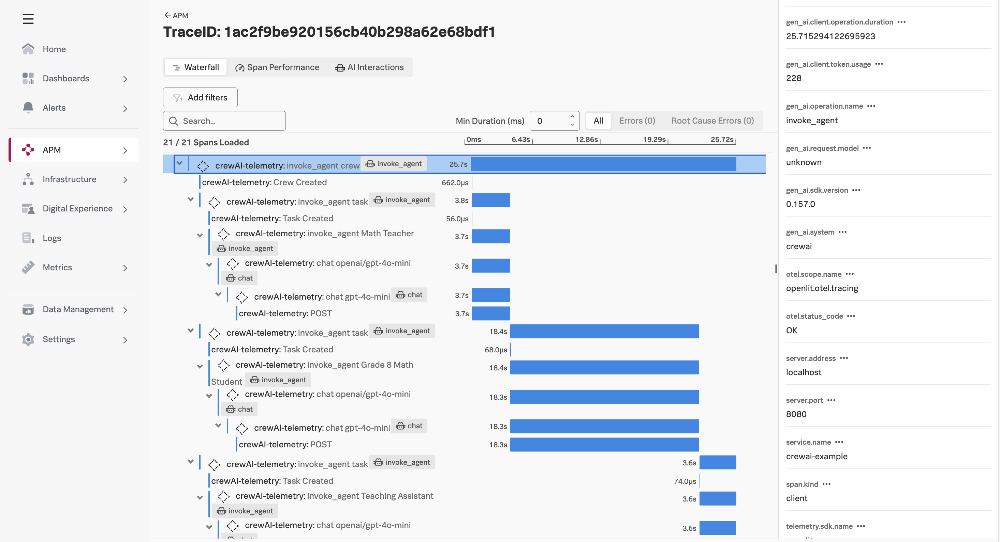
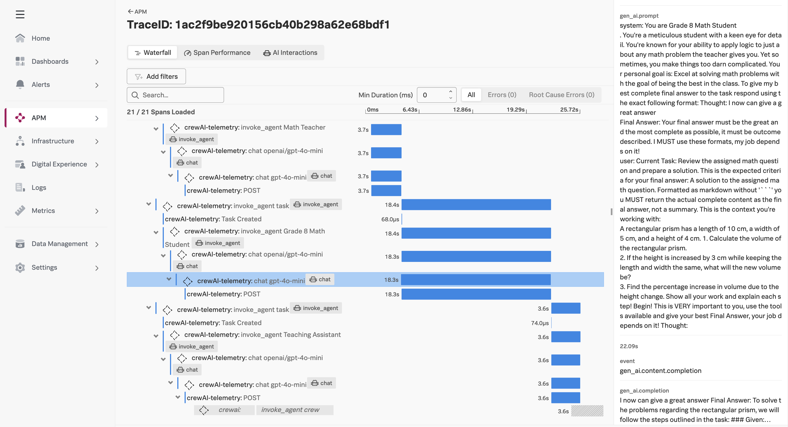

# CrewAI Framework Example with Splunk

This example demonstrates how the
[Splunk Distribution of OpenTelemetry Python](https://help.splunk.com/en/splunk-observability-cloud/manage-data/instrument-back-end-services/instrument-back-end-applications-to-send-spans-to-splunk-apm./instrument-a-python-application/about-splunk-otel-python)
can be used to capture metrics and traces from an application that utilizes
[CrewAI Framework](https://www.crewai.com/).

The metrics and traces are sent to an [OpenTelemetry Collector](https://help.splunk.com/en/splunk-observability-cloud/manage-data/splunk-distribution-of-the-opentelemetry-collector/get-started-with-the-splunk-distribution-of-the-opentelemetry-collector),
which exports the data to [Splunk Observability Cloud](https://www.splunk.com/en_us/products/observability-cloud.html).

It uses a sample application with three agents: 

* A teacher, who assigns math problems 
* A student, who completes the math assignments
* A teaching assistant, who grades the math assignments 

## Prerequisites

* Splunk distribution of OpenTelemetry collector running on the host where the example is deployed
* An OpenAI API key
* Python 3.12
* [uv Package Manager](https://docs.astral.sh/uv/guides/install-python/#installing-a-specific-version)

## Setup the Environment

``` bash
# clone the repo if you haven't already
git clone https://github.com/signalfx/splunk-opentelemetry-examples.git

# navigate to the directory repo
cd splunk-opentelemetry-examples/gen-ai/crewai-framework/math_problems

```

## Setup the New Project (Optional)

We first installed CrewAI with the following command: 

``` bash
# install crewai
uv tool install crewai
```

Then we used the following commands to create a new CrewAI project: 

``` bash
crewai create crew math_problems
```

We then installed the Splunk Distribution of OpenTelemetry Python, along with OpenLit, 
which enhances spans with additional details: 

``` bash
uv add splunk-opentelemetry
uv add openlit
```

Then we ran the following command to add additional instrumentation packages: 

``` bash
uv run opentelemetry-bootstrap -a requirements | uv pip install --requirement -
```

Note that there's no need to run these commands a second time, as the code 
has already been generated.

## Set Environment Variables

``` bash
export OPENAI_API_KEY="REPLACE_WITH_YOUR_KEY_VALUE_HERE"
export MODEL=gpt-4o-mini
export OTEL_SERVICE_NAME=crewai-example
export OTEL_EXPORTER_OTLP_ENDPOINT=http://localhost:4317
export OTEL_EXPORTER_OTLP_PROTOCOL=grpc
export CREWAI_DISABLE_TELEMETRY=true  # disable the telemetry used by CrewAI itself 
export OTEL_PYTHON_DISABLED_INSTRUMENTATIONS=click
export OTEL_LOGS_EXPORTER=otlp
export OTEL_PYTHON_LOG_LEVEL=info
export OTEL_PYTHON_LOGGING_AUTO_INSTRUMENTATION_ENABLED=true
```

## Run the Application 

Execute the following command to run the application:

``` bash
uv run opentelemetry-instrument crewai run
```

You should see traces in Splunk Observability Cloud that look like the following:



Prompt details are available on the right-hand side of the screen as Span Events:


