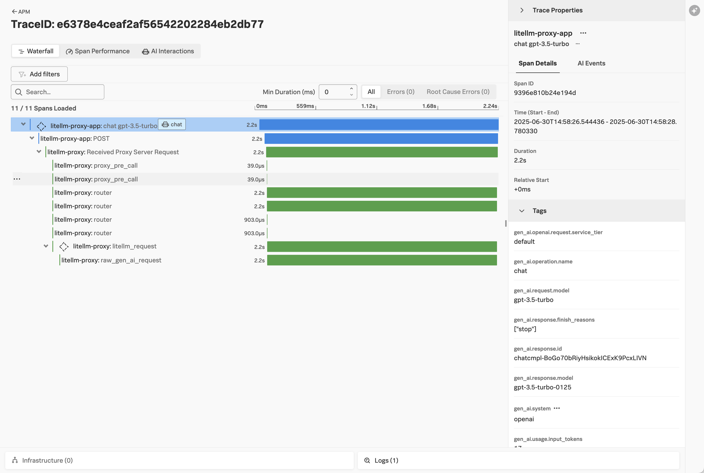
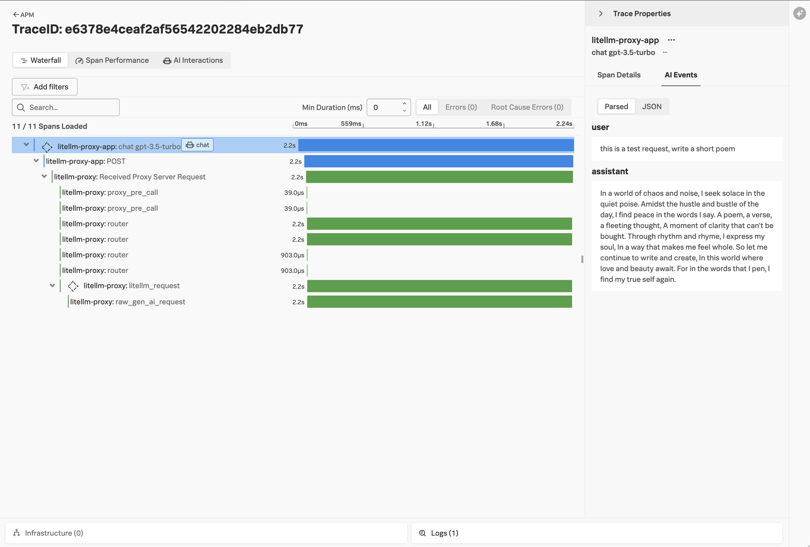
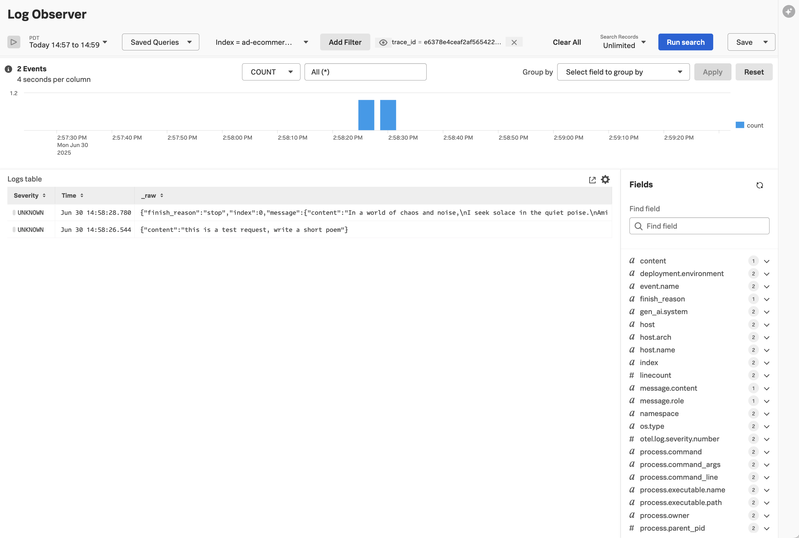

# LiteLLM Proxy Example with Splunk

[LiteLLM Proxy](https://docs.litellm.ai/) provides a centralized, unified interface to more than
100 different types of LLMs.  It includes the ability to track LLM usage and cost. 

This example demonstrates how the
[Splunk Distribution of OpenTelemetry Python](https://help.splunk.com/en/splunk-observability-cloud/manage-data/instrument-back-end-services/instrument-back-end-applications-to-send-spans-to-splunk-apm./instrument-a-python-application/about-splunk-otel-python)
can be used to capture metrics and traces from an application that utilizes the LiteLLM Proxy 
to connect to one or more LLMs. 

The metrics and traces are sent to an [OpenTelemetry Collector](https://help.splunk.com/en/splunk-observability-cloud/manage-data/splunk-distribution-of-the-opentelemetry-collector/get-started-with-the-splunk-distribution-of-the-opentelemetry-collector),
which exports the data to [Splunk Observability Cloud](https://www.splunk.com/en_us/products/observability-cloud.html).

This example uses [opentelemetry-instrumentation-openai-v2](https://pypi.org/project/opentelemetry-instrumentation-openai-v2/)
to instrument the application.

## Prerequisites

* Splunk distribution of OpenTelemetry collector running on the host where the example is deployed
* An OpenAI API key 
* Python 3.12

## Install the LiteLLM Proxy

### Setup the Environment 

``` bash
# clone the repo if you haven't already
git clone https://github.com/signalfx/splunk-opentelemetry-examples.git

# navigate to the proxy directory
cd splunk-opentelemetry-examples/gen-ai/lite-llm-proxy/proxy

# create a virtual environment for the proxy 
python3 -m venv venv

# activate the virtual environment for the proxy
source venv/bin/activate

# install litellm proxy
pip install 'litellm[proxy]'
```

### Set Environment Variables

``` bash
export OPENAI_API_KEY="REPLACE_WITH_YOUR_KEY_VALUE_HERE"
```

### Configure LiteLLM Proxy to Emit OpenTelemetry

We can configure LiteLLM Proxy to emit OpenTelemetry spans by executing the following steps. 

First, install the OpenTelemetry SDK: 

```bash
pip install opentelemetry-api opentelemetry-sdk opentelemetry-exporter-otlp -U
```

Next, tell the SDK to send data to our collector using gRPC: 

```bash
export OTEL_SERVICE_NAME=litellm-proxy
export OTEL_RESOURCE_ATTRIBUTES='deployment.environment=test'
export OTEL_EXPORTER_OTLP_ENDPOINT=http://localhost:4317
export OTEL_EXPORTER_OTLP_PROTOCOL=grpc
```

Note that we've also enabled OpenTelemetry in the [config.yaml](./proxy/config.yaml) file as follows: 

```yaml
litellm_settings:
  callbacks: ["otel"]
````

### Start the LiteLLM Proxy

Start LiteLLM proxy using the following command: 

``` bash
litellm --config config.yaml
```

## Run the Application 

Next, we'll run a custom application that uses the LiteLLM proxy instead of 
calling OpenAI's API directly. 

### Setup the Environment

Open another terminal window in the same directory and run the following commands: 

``` bash
# navigate to the application directory
cd splunk-opentelemetry-examples/gen-ai/lite-llm-proxy/app

# create a virtual environment for the application
python3 -m venv venv

# activate the virtual environment for the application
source venv/bin/activate

# install required dependencies 
pip install -r requirements.txt 
```

### Set Environment Variables

``` bash
export OTEL_SERVICE_NAME=litellm-proxy-app
export OTEL_RESOURCE_ATTRIBUTES='deployment.environment=test'
export OTEL_EXPORTER_OTLP_ENDPOINT=http://localhost:4317
export OTEL_EXPORTER_OTLP_PROTOCOL=grpc
export OTEL_INSTRUMENTATION_GENAI_CAPTURE_MESSAGE_CONTENT=true
```

### Launch the Application

Finally, we can launch the application which uses the LiteLLM proxy to invoke OpenAI: 

``` bash
opentelemetry-instrument python3 app.py
```

You should see traces in Splunk Observability Cloud that look like the following:



Prompt details are available on the AI Events tab on the right-hand side of the screen:



We can also view any log entries related to this trace by clicking on the Logs button
at the bottom right of the trace:

