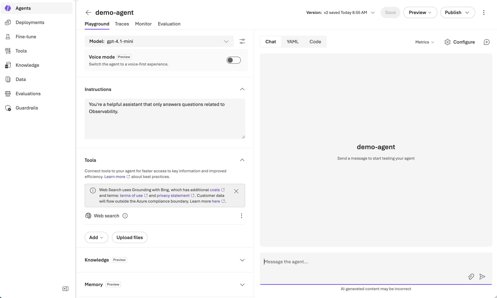
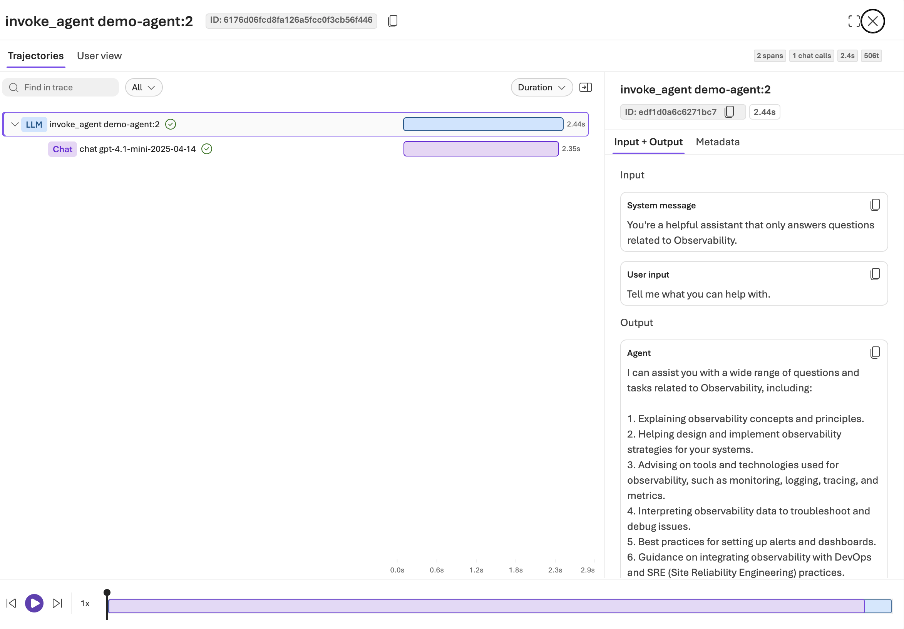
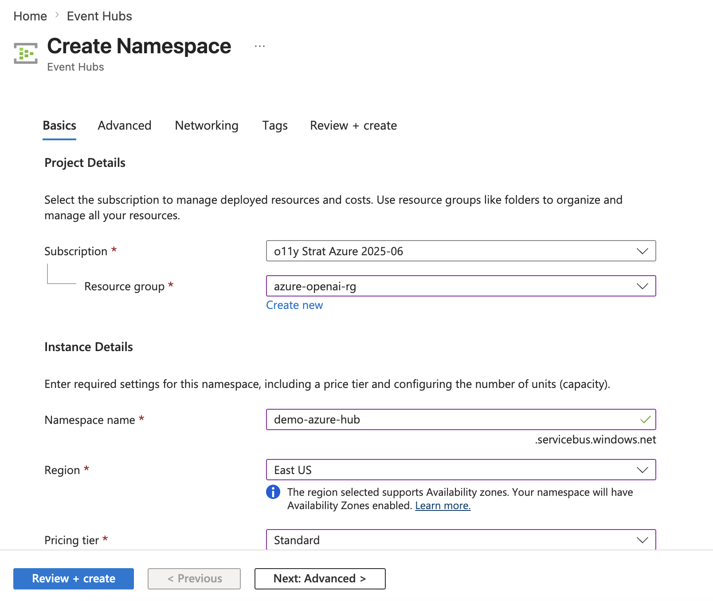
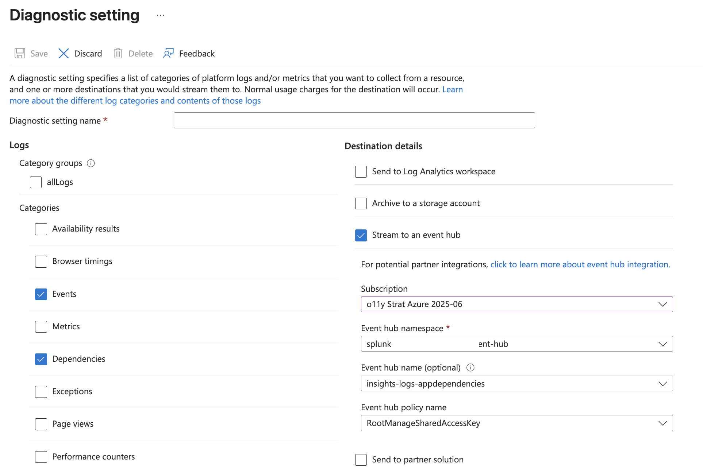
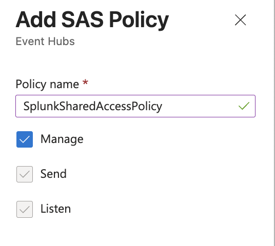
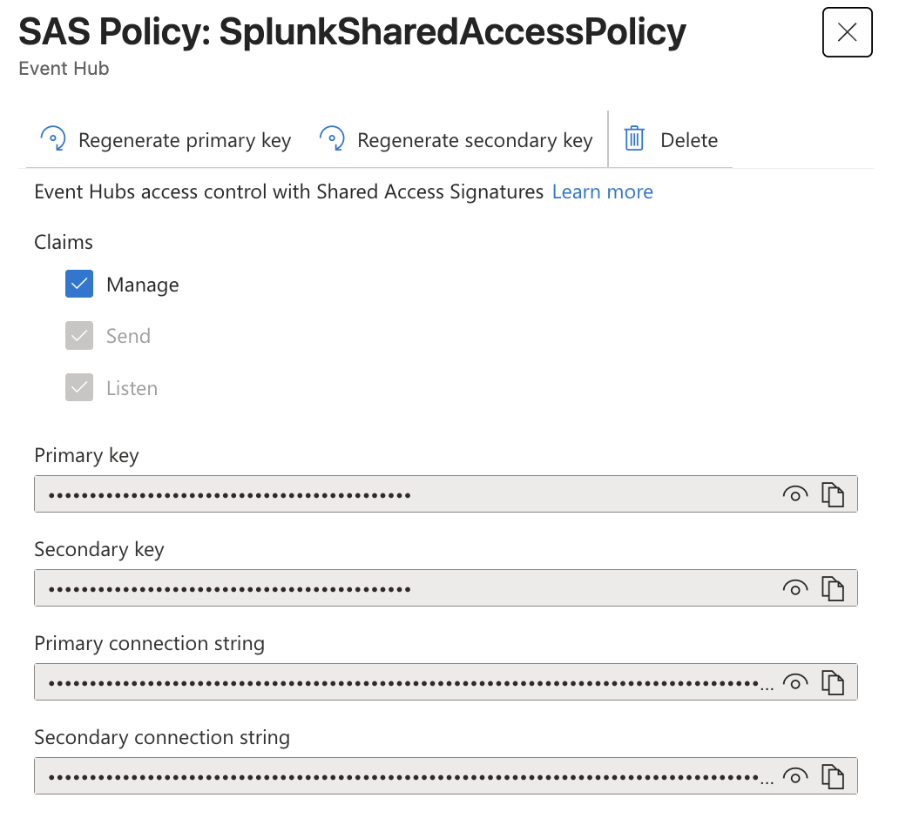
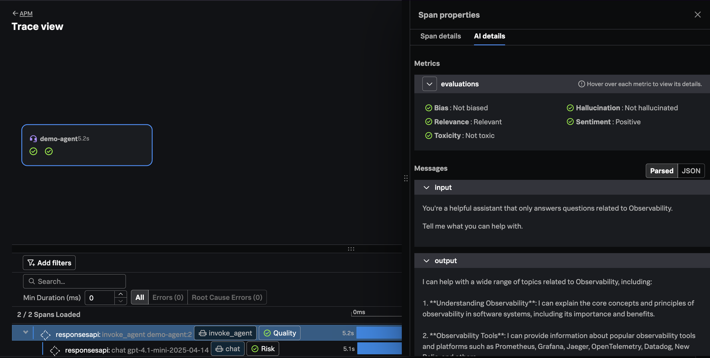

# Microsoft Foundry Agent Service with OpenTelemetry and Splunk (Work in Progress)

[Foundry Agent Service](https://learn.microsoft.com/en-us/azure/foundry/agents/overview) 
is a "fully managed platform for building, deploying, and scaling AI agents."

This example shows how we can instrument a "no code" agent built with **Foundry Agent Service** 
with **OpenTelemetry** and send the resulting data to **Splunk Observability Cloud**. 

## Prerequisites

* Active **Microsoft Azure** subscription
* Permissions to create agents in **Azure Foundry**
* A host to deploy an **OpenTelemetry** collector

## High-Level Approach

The high-level approach we'll use to get trace data from Azure Foundry to Splunk 
Observability Cloud is as follows: 

* Enable tracing for the **Agent** in **Azure Foundry** 
* On the corresponding **Application Insights** resource, configure **Diagnostic Settings** to export trace events to an **Azure Event Hub**
* Deploy an **OpenTelemetry Collector** with an `azureeventhub` receiver to read events from the Event Hub and send them to **Splunk Observability Cloud**

## Create an Agent

Create a simple prompt agent named `demo-agent` using Microsoft Foundry. For our example, we've included  
system instructions that state the following: 

````
You're a helpful assistant that only answers questions related to Observability.
````



## Enable Tracing 

Navigate to the `Traces` tab and ensure tracing is enabled for your agent. 

## Test the Agent 

In this section, we'll use a Python application to connect to our agent as a client. 
Create a virtual environment and install the required packages: 

```bash
cd client
python3 -m venv venv
source ./venv/bin/activate
pip install azure-ai-projects
```

Set the Azure Foundry project endpoint: 

> Note: set your Azure Foundry DNS name and project name before running the command below

```bash
export AZURE_FOUNDRY_PROJECT_ENDPOINT="https://<DNS name>.services.ai.azure.com/api/projects/<project name>"
```

Use the following command to run the application: 

```bash
python app.py
```

## View Trace in Azure 

In Azure Foundry, navigate to the `Traces` tab for your agent. You should see a trace collected 
for your agent that looks like the following: 



At this point, we've successfully collected a trace for our agent. Next, 
let's walk through the steps required to get traces into Splunk 
Observability Cloud. 

## Create an Azure Event Hub Namespace

Using Azure console, search for `Event Hubs` then create a new `Event Hub Namespace` 
using the same subscription, resource group, and region where your Azure Foundry 
Agent is deployed: 



## Configure Diagnostic Settings 

With Azure console, search for `Application Insights`, then navigate to the 
Application Insights resource that's associated with your Azure Foundry Agent. 

Using the left-hand menu, navigate to **Monitoring -> Diagnostic Settings**, then 
click **+ Add diagnostic setting**. Under `Categories` select `Events`, `Dependencies`, 
and `Traces`. Under `Destination details`, select `Stream to an event hub` and then 
input the name of the Subscription and Event Hub Namespace created in the previous step: 



## Obtain the Event Hub Connection String 

Now that diagnostic settings are configured to send traces to Event Hub, execute 
the Python application from above a few more times to generate traces. 

Then, navigate back to the Event Hub Namespace created above in Azure. Select 
**Settings -> Shared access policies** from the left-hand menu. 

Click **+ Add** to add a new policy. Give it a name such as `SplunkSharedAccessPolicy` 
along with `Manage` permissions:



Once the access policy is created, copy the `Primary connection string` and save 
it for later: 



## Deploy an OpenTelemetry Collector 

Next, deploy an OpenTelemetry collector on a VM in Azure (or anywhere that 
can access the Event Hub endpoint). Follow the
instructions in [Install the Collector for Linux with the installer script](https://docs.splunk.com/observability/en/gdi/opentelemetry/collector-linux/install-linux.html#install-the-collector-using-the-installer-script)
to install the collector on your host.

Modify the collector configuration by opening the `/etc/otel/collector/agent_config.yaml` 
file for editing. Add the `azureeventhub` receiver to the receivers section as follows: 

> Note: substitute the Event Hub connection string from above, along with the Event Hub name before running the command below

> Caution: ensure that you substitute the Event Hub Name, rather than the Event Hub Namespace 

```yaml
receivers: 
  azureeventhub: 
    connection: <event hub connection string>;EntityPath=<event hub name>
```

Then, modify the traces pipeline to add the `azureeventhub` receiver: 

```yaml
  pipelines: 
    traces: 
      receivers: [jaeger, otlp, zipkin, azureeventhub] 
```

Save the changes, then restart the collector with the following command: 

```bash
sudo systemctl restart splunk-otel-collector
```

## View Traces in Splunk Observability Cloud 

Run the Python application a few more times to generate traces, then 
navigate to Splunk Observability Cloud to view the traces from Azure, 
which should look something like the following: 



In the trace, we can see that the LLM prompt and response were captured. 
The response was also evaluated against several quality characteristics, 
including bias, relevance, toxicity, hallucination, and sentiment. 