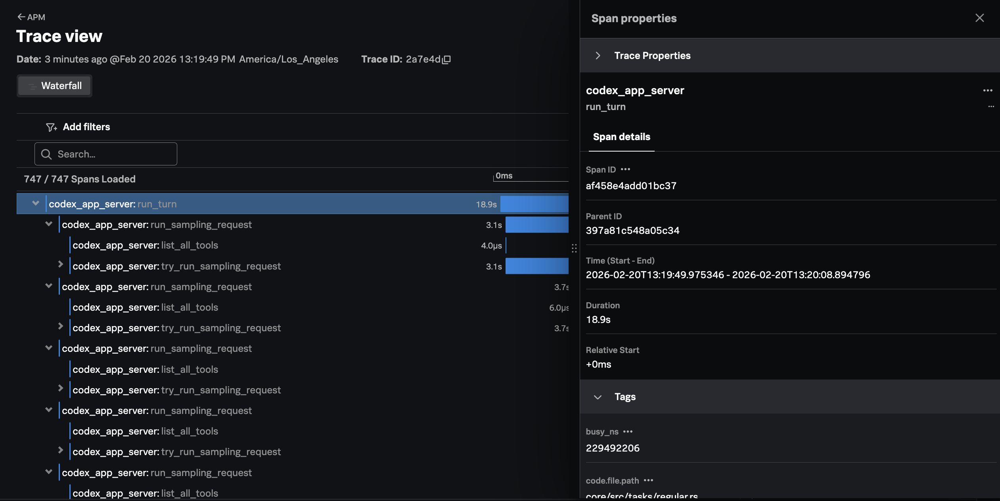

# Integrating OpenAI Codex with Claude Code

[OpenAI Codex](https://chatgpt.com/codex) is an AI-powered coding agent. It's integrated 
into IDEs like VS Code, and available as a standalone Mac OS application. 

This example shows how we can use Splunk Observability Cloud to monitor OpenAI Codex usage.

## Prerequisites

* A ChatGPT account or [OpenAI API Key](https://platform.openai.com/api-keys) 
* Mac OS 

## Deploy an OpenTelemetry Collector

For this example, we deployed the Splunk Distribution of the OpenTelemetry Collector onto our machine, and
configured it to export traces to Splunk Observability Cloud, and logs to Splunk Cloud.

Please refer to [Install the Collector using packages and deployment tools](https://docs.splunk.com/observability/en/gdi/opentelemetry/install-the-collector.html#collector-package-install)
for collector installation instructions.

## Install OpenAI Codex

If you don't already have the OpenAI Codex app installed, follow the steps 
[here](https://developers.openai.com/codex/app) to do so.

Once you downloaded and installed the Codex app, open it and sign in with your 
ChatGPT account or an OpenAI API key.

Select a project folder that you want Codex to work in. 

## Configure OpenTelemetry

Next, we'll configure Codex to export metric data to our OpenTelemetry collector, which will
then send it to Splunk. This is based on the example provided the 
[Sample Configuration](https://developers.openai.com/codex/config-sample).

Create a new file named `~/.codex/config.toml` with the following content: 

````
[otel]
log_user_prompt = true
environment = "codex-example"
exporter = { "otlp-http" = { endpoint = "http://localhost:4318/v1/logs", protocol = "json" } }
trace_exporter = { "otlp-http" = { endpoint = "http://localhost:4318/v1/traces", protocol = "json" } }
````

Restart Codex and then ask it a question in the context of your project to generate some telemetry data. 
For example: 

````
Can you create a simple hello world application using python flask? 
````

## View Trace Data

The following dashboard provides an example of how these traces can be visualized
in Splunk Observability Cloud:


