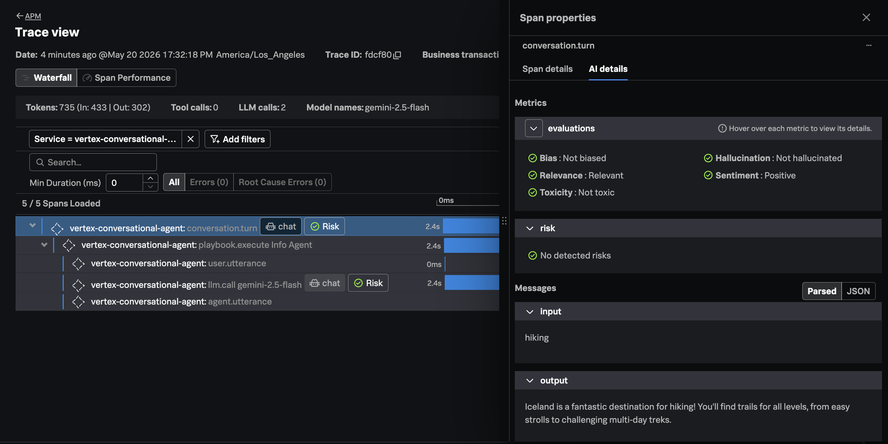

# Gemini Enterprise Agent Platform with OpenTelemetry and Splunk

[Gemini Enterprise Agent Platform (Formerly Vertex AI)](https://cloud.google.com/products/gemini-enterprise-agent-platform)
is "Google Cloud's comprehensive platform for developers to build, scale, govern and optimize agents. It's a single destination for technical teams to build agents that can transform enterprise applications and workflows into powerful agentic systems."

This example shows how we can instrument a "no code" agent built with **Gemini Enterprise Agent Platform**
with **OpenTelemetry** and send the resulting data to **Splunk Observability Cloud**.

## Prerequisites

* Active **Google Cloud Platform** subscription
* Access to a GCP account with the following IAM roles:
  * `Dialogflow API Admin`
* gcloud CLI installed locally 

## High-Level Approach 

While "no code" agents created with Vertex AI Agent Builder don't have the ability to 
export OpenTelemetry traces, they do export valuable log data that we can use 
to create our own traces. 

So the high-level approach taken in this example is as follows: 

````
Cloud Logging → Pub/Sub → Cloud Run Shim → Splunk O11y
````

We instrumented Vertex AI Agent Builder by transforming the agent's 
native execution logs into OpenTelemetry spans in a downstream pipeline, 
rather than instrumenting the managed runtime directly 
(which isn't possible).

How It Works

1. **Interaction logging** is enabled on the Conversational Agent, so each conversation turn produces a Cloud Logging entry containing rich `traceBlocks` data: per-step timings, LLM model and token counts, tool invocations, playbook transitions, and utterances. 
2. A **Cloud Logging sink** filters those entries (`dialogflow-runtime.googleapis.com/requests` with `traceBlocks` present) and routes them to a **Pub/Sub topic**. 
3. A **Cloud Run service** (1vertex-otel-shim1) receives the logs via Pub/Sub push delivery. It:
* Parses the nested `traceBlocks` structure
* Synthesizes a span hierarchy: `conversation.turn` → `playbook.execute` → individual actions (`llm.call`, `tool.use`, utterances) → sub-execution steps
* Generates deterministic trace and span IDs from `responseId` so retries don't create duplicates
* Maps fields to OpenTelemetry GenAI semantic conventions (`gen_ai.request.model`, `gen_ai.usage.input_tokens`, etc.)
* Exports the spans via OTLP/HTTP to the observability backend
4. The shim is private (`--ingress internal-and-cloud-load-balancing`, `--no-allow-unauthenticated`) and authenticated by a dedicated `pubsub-invoker` service account with `roles/run.invoker`.

> Caution: this example is intended to illustrate the concept and is not production ready

> Note: Pub/Sub and Cloud Run use results in additional cost

## Enable APIs 

Navigate to **APIs & Services → Library** in the Google Cloud Console, and ensure 
the following APIs are enabled for the GCP project you'll use for this example: 

* Dialogflow API

## Create an Agent 

Follow the instructions [here](https://codelabs.developers.google.com/devsite/codelabs/building-ai-agents-vertexai#2) 
to build a conversational agent. 

## Enable Interaction Logging 

In the Conversational Agent Console:

1. Open your agent → **Agent Settings**
2. Find **Logging** section 
3. Enable:
   * **Cloud Logging** (so logs ship to Cloud Logging)
    * **Interaction logging** (so the rich traceBlocks payload is included)
4. Click **Save**

## Deploy the Cloud Run Function 

Set the following environment variables before deploying the function: 

```bash
export PROJECT_ID="REPLACE_WITH_GCP_PROJECT_ID"
export SPLUNK_TOKEN="REPLACE_WITH_SPLUNK_INGEST_TOKEN"
export SPLUNK_REALM="REPLACE_WITH_SPLUNK_REALM"
```

Login to gcloud via the CLI: 

```bash
gcloud auth login
```

Deploy the Cloud Run function by executing the following command: 

```bash
./deploy.sh
```

## View Traces in Splunk Observability Cloud

Exercise the agent a few times to generate traces, then
navigate to Splunk Observability Cloud to view the traces,
which should look something like the following:



In the trace, we can see that the LLM prompt and response were captured.
The response was also evaluated against several quality characteristics,
including bias, relevance, toxicity, hallucination, and sentiment. 