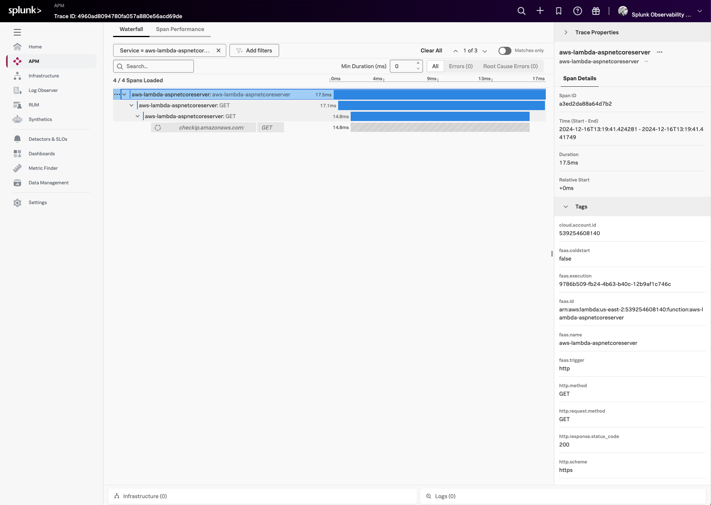
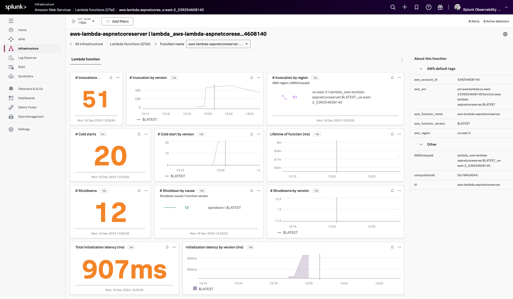

# Instrumenting an ASP.NET Core Web API AWS Lambda Function with OpenTelemetry

This example demonstrates how to instrument an AWS Lambda function written in ASP.NET Core (Amazon.Lambda.AspNetCoreServer) using OpenTelemetry, and then export the data to Splunk Observability Cloud. The example is using .NET 6 and the AWS Serverless Application Model (SAM) CLI to deploy the Lambda function and an associated API Gateway to access it.

## Prerequisites 

The following tools are required to deploy .NET functions into AWS Lambda: 

* An AWS account with permissions to create and execute Lambda functions
* Download and install the [.NET 6 SDK](https://dotnet.microsoft.com/en-us/download/dotnet/6.0)
* Download and install [AWS SAM](https://docs.aws.amazon.com/serverless-application-model/latest/developerguide/install-sam-cli.html)

## Application Overview

If you just want to build and deploy the example, feel free to skip this section. 

The application used here is a modified version of the "Hello World" example application that's part of the 
[AWS Quick Start templates](https://docs.aws.amazon.com/serverless-application-model/latest/developerguide/using-sam-cli-init.html). 

We added a `TracerProvider` method named `ConfigureSplunkTelemetry()` in the [Startup class](./src/HelloWorld/Startup.cs), and included code to 
assist with initializing the tracer. 

The tracer initialization is based on the example found in 
[Instrument your .NET AWS Lambda function for Splunk Observability Cloud](https://docs.splunk.com/observability/en/gdi/get-data-in/serverless/aws/otel-lambda-layer/instrumentation/dotnet-lambdas.html): 

```csharp

        private TracerProvider ConfigureSplunkTelemetry()
        {
            var serviceName = Environment.GetEnvironmentVariable("AWS_LAMBDA_FUNCTION_NAME") ?? "Unknown";
            var accessToken = Environment.GetEnvironmentVariable("SPLUNK_ACCESS_TOKEN")?.Trim();
            var realm = Environment.GetEnvironmentVariable("SPLUNK_REALM")?.Trim();

            ArgumentNullException.ThrowIfNull(accessToken, "SPLUNK_ACCESS_TOKEN");
            ArgumentNullException.ThrowIfNull(realm, "SPLUNK_REALM");

            var builder = Sdk.CreateTracerProviderBuilder()
                // Instrumentations
                .AddHttpClientInstrumentation()
                .AddAspNetCoreInstrumentation()
                .AddAWSInstrumentation()
                // Disable AWS X-Ray context extraction to prevent conflicts
                .AddAWSLambdaConfigurations(opts => opts.DisableAwsXRayContextExtraction = true)
                // Sampling
                .SetSampler(new AlwaysOnSampler())
                // Resource Configuration
                .ConfigureResource(resourceBuilder =>
                {
                    resourceBuilder
                        .AddService(serviceName, serviceVersion: "1.0.0")
                        .AddAWSEBSDetector();
                })
                // Exporter Configuration
                .AddOtlpExporter();

            return builder.Build();
        }
```

The `TracerProvider` is configured and registered as a singleton in the `ConfigureServices()` method for potential reuse elsewhere in the application.

```csharp        
      public void ConfigureServices(IServiceCollection services)
      {
          ...

          // Configure OpenTelemetry TracerProvider
          TracerProvider tracerProvider = ConfigureSplunkTelemetry();

          // Register TracerProvider as a singleton if needed elsewhere
          services.AddSingleton(tracerProvider);
      }
```

In the `LambdaEntryPoint.cs` class the `PostCreateWebHost()` method is used to resolve the `TracerProvider` that was instantiated in the `Startup.cs` class

```csharp
        protected override void PostCreateWebHost(IWebHost webHost)
        {
            // Now that the host is fully built by the framework,
            // we can resolve the TracerProvider from DI.
            _tracerProvider = webHost.Services.GetRequiredService<TracerProvider>();
        }
```

Finally, we override the `FunctionHandlerAsync()` method and use the `AWSLambdaWrapper.TraceAsync()` method to wrap the lambda entry point function which will instrument the call with OpenTelemetry. 

```csharp
        public override async Task<APIGatewayHttpApiV2ProxyResponse> FunctionHandlerAsync(
            APIGatewayHttpApiV2ProxyRequest request, ILambdaContext lambdaContext)
        {
            // Use AWSLambdaWrapper.TraceAsync now that we have _tracerProvider
            return await AWSLambdaWrapper.TraceAsync(_tracerProvider, base.FunctionHandlerAsync, request, lambdaContext);
        }
```

These code changes required a number of packages to be added to the HelloWorld.csproj file: 

````
  <ItemGroup>
    ...
    <PackageReference Include="OpenTelemetry" Version="1.10.0" />
    <PackageReference Include="OpenTelemetry.Exporter.OpenTelemetryProtocol" Version="1.10.0" />
    <PackageReference Include="OpenTelemetry.Instrumentation.AspNetCore" Version="1.10.1" />
    <PackageReference Include="OpenTelemetry.Instrumentation.AWS" Version="1.10.0-beta.1" />
    <PackageReference Include="OpenTelemetry.Instrumentation.AWSLambda" Version="1.10.0-beta.1" />
    <PackageReference Include="OpenTelemetry.Instrumentation.Http" Version="1.10.0" />
    <PackageReference Include="OpenTelemetry.Resources.AWS" Version="1.5.0-beta.1" />
  </ItemGroup>
````

The provided template.yaml.base file was then updated to use `LambdaEntryPoint` and `FunctionHandlerAsync` as the handler
rather than the default `FunctionHandler`: 

````
Resources:
  HelloWorldFunction:
    Type: AWS::Serverless::Function
    Properties:
      CodeUri: ./src/HelloWorld/
      Handler: HelloWorld::HelloWorld.LambdaEntryPoint::FunctionHandlerAsync
````

We also added the **SPLUNK_ACCESS_TOKEN**, **SPLUNK_REALM**, **OTEL_RESOURCE_ATTRIBUTES** environment variables to the 
template.yaml.base file, as well as a layer for the Splunk Observability Collector. 

## Build and Deploy

Open a command line terminal and navigate to the root of the directory.  
For example: 

````
cd ~/splunk-opentelemetry-examples/instrumentation/dotnet/aws-lambda-aspnetcoreserver
````

### Provide your AWS credentials

````
export AWS_ACCESS_KEY_ID="<put the access key ID here>"
export AWS_SECRET_ACCESS_KEY="<put the secret access key here>"
export AWS_SESSION_TOKEN="<put the session token here>"
````

### Add the Splunk OpenTelemetry Collector and Metrics Extension layers

Our example deploys the Splunk distribution of the OpenTelemetry collector
to a separate layer within the lambda function.  Lookup the ARN for your 
region in Step 6 in [this document](https://docs.splunk.com/observability/en/gdi/get-data-in/serverless/aws/otel-lambda-layer/instrumentation/lambda-language-layers.html#install-the-aws-lambda-layer-for-your-language). 

Let's make a copy of the template.yaml.base file: 

````
cp template.yaml.base template.yaml
````

Then, open the template.yaml file and add the ARN there.  For example, 
here's the ARN for us-west-2: 

````
      Layers:
        - arn:aws:lambda:us-west-2:254067382080:layer:splunk-apm-collector:170
````

Optionally, we can also add the Splunk Metrics Extension Layer to the template.yaml file.
Lookup the ARN for your
region in Step 7 in [this document](https://docs.splunk.com/observability/en/gdi/get-data-in/serverless/aws/otel-lambda-layer/instrumentation/lambda-language-layers.html#install-the-aws-lambda-layer-for-your-language).

````
      Layers:
        - arn:aws:lambda:us-west-2:254067382080:layer:splunk-apm-collector:170
        - arn:aws:lambda:us-west-2:254067382080:layer:splunk-lambda-metrics:170
````

### Add the Splunk Observability Cloud Access Token and Realm

We'll also need to specify the realm and access token for the target
Splunk Observability Cloud environment.  This goes in the template.yaml
file as well: 

````
  Environment: 
    Variables:
      SPLUNK_ACCESS_TOKEN: <access token>
      SPLUNK_REALM: us1
      OTEL_RESOURCE_ATTRIBUTES: deployment.environment=test
````

### Build the SAM Function

Next, we'll build the function using SAM: 

````
sam build
````
### Deploy the SAM Function

Then deploy it: 

````
sam deploy --guided
````

You'll be asked a number of questions along the way.  Here are sample responses, 
but you should provide the desired stack name and AWS region for your lambda 
function. 

````
Setting default arguments for 'sam deploy'
=========================================
Stack Name [sam-app]: aws-lambda-aspnetcoreserver
AWS Region [eu-west-1]: us-west-2
#Shows you resources changes to be deployed and require a 'Y' to initiate deploy
Confirm changes before deploy [y/N]: y
#SAM needs permission to be able to create roles to connect to the resources in your template
Allow SAM CLI IAM role creation [Y/n]: y
#Preserves the state of previously provisioned resources when an operation fails
Disable rollback [y/N]: n
HelloWorldFunction has no authentication. Is this okay? [y/N]: y
Save arguments to configuration file [Y/n]: y
SAM configuration file [samconfig.toml]: 
SAM configuration environment [default]: 
````

It will take a few moments for SAM to create all of the objects necessary to 
support your lambda function.  Once it's ready, it will provide you with an API 
Gateway Endpoint URL that uses the following format: 

````
https://${ServerlessRestApi}.execute-api.${AWS::Region}.amazonaws.com/Prod/hello/
````

### Test the SAM Function

Use the API Gateway Endpoint URL provided in the previous step to test the SAM function. 
You should see a response such as the following: 

````
{"message":"hello world","location":"54.177.68.123"}
````

### View Traces in Splunk Observability Cloud

After a minute or so, you should start to see traces for the lambda function
appearing in Splunk Observability Cloud: 



### View Metrics in Splunk Observability Cloud

If you added the Splunk Metrics Extension Layer, you'll also see metrics for your
lambda function by navigating to Infrastructure -> Lambda functions (OTel) and 
then selecting your lambda function: 


