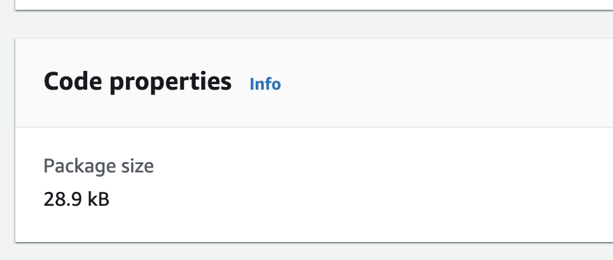

# Instrumenting a .NET AWS Lambda Function with OpenTelemetry using a Custom layer

This example builds on [aws-lambda](../aws-lambda/), but packages the `SplunkTelemetryConfigurator`
helper class as a separate layer.  

This reduces the size of the .zip file that needs to be uploaded with each Lambda function, and 
allows most of the OpenTelemetry-related instrumentation logic to be managed as a separate component.  
This helps to minimize changes to Lambda functions when the instrumentation logic changes. 

## Prerequisites 

The following tools are required to deploy .NET functions into AWS Lambda: 

* An AWS account with permissions to create and execute Lambda functions
* Download and install the [.NET 8 SDK](https://dotnet.microsoft.com/en-us/download/dotnet/8.0)
* Download and install [AWS SAM](https://docs.aws.amazon.com/serverless-application-model/latest/developerguide/install-sam-cli.html)

## Installation Steps 

### Install Lambda CLI Extensions

````
dotnet tool install -g Amazon.Lambda.Tools
````

### Build a NuGet Package 

Execute the following command to build a NuGet package for the 
OpenTelemetry instrumentation logic: 

````
cd splunk-opentelemetry-examples/instrumentation/dotnet/aws-lambda-with-custom-layer/src/SplunkOpenTelemetryLambdaHelper
dotnet pack 
````

If successful, you should see a message such as: 

````
Successfully created package '/Code/splunk-opentelemetry-examples/instrumentation/dotnet/aws-lambda-with-custom-layer/src/SplunkOpenTelemetryLambdaHelper/bin/Release/SplunkOpenTelemetryLambdaHelper.1.0.0.nupkg'.
````

### Create an S3 bucket

Create an S3 bucket to be used for your custom Lambda layer:

````
aws s3api create-bucket --bucket <Bucket Name> --region <Region> --create-bucket-configuration LocationConstraint=<Region>
````

Substitute the appropriate values for the bucket and region. In my case, I used the following: 

````
aws s3api create-bucket --bucket splunk-opentelemetry-lambda-layer-example --region us-west-1 --create-bucket-configuration LocationConstraint=us-west-1
````

It should return something like the following: 

````
{
    "Location": "http://splunk-opentelemetry-lambda-layer-example.s3.amazonaws.com/"
}
````

### Create an Empty Project

Next, we created an empty project named [SplunkOpenTelemetryLambdaHelper](./src/SplunkOpenTelemetryLambdaHelper). 
This project only includes a .csproj file, which references the NuGet package we created and any other 
dependencies used by our Lambda function. We'll use this project in the next step to publish the Lambda layer.

### Publish the Lambda Layer

We'll use the following command to publish our Lambda layer: 

````
cd splunk-opentelemetry-examples/instrumentation/dotnet/aws-lambda-with-custom-layer/
dotnet lambda publish-layer SplunkOpenTelemetryLambdaLayer -sb <Bucket Name> --layer-type runtime-package-store --package-manifest ./src/SplunkOpenTelemetryLambdaLayer/SplunkOpenTelemetryLambdaLayer.csproj --framework net8.0 --region <Region>
````

Substitute the appropriate values for the bucket and region. In my case, I used the following: 

````
cd splunk-opentelemetry-examples/instrumentation/dotnet/aws-lambda-with-custom-layer/
dotnet lambda publish-layer SplunkOpenTelemetryLambdaLayer -sb splunk-opentelemetry-lambda-layer-example --layer-type runtime-package-store --package-manifest ./src/SplunkOpenTelemetryLambdaLayer/SplunkOpenTelemetryLambdaLayer.csproj --framework net8.0 --region us-west-1
````

Note that we're referencing the .csproj file for the Lambda function, rather than the .csproj file 
for the helper project.  This is because we need to use a project that references the helper project 
when creating the layer, to ensure the layer includes SplunkOpenTelemetryLambdaLayer as a dependency. 

It should respond with something like the following: 

````
Upload complete to s3://splunk-opentelemetry-lambda-layer-example/SplunkOpenTelemetryLambdaLayer-638665871802266230/packages.zip
Layer publish with arn arn:aws:lambda:us-west-1:539254608140:layer:SplunkOpenTelemetryLambdaLayer:4
````

Make a note of the ARN as we'll need it below. 

### Add the Splunk OpenTelemetry Collector and Metrics Extension layers

Our example deploys the Splunk distribution of the OpenTelemetry collector
to a separate layer within the lambda function.  Lookup the ARN for your
region in Step 6 in [this document](https://docs.splunk.com/observability/en/gdi/get-data-in/serverless/aws/otel-lambda-layer/instrumentation/lambda-language-layers.html#install-the-aws-lambda-layer-for-your-language).

Let's make a copy of the template.yaml.base file:

````
cp template.yaml.base template.yaml
````

Then, open the template.yaml file and add the ARN there.  For example,
here's the ARN for us-west-1:

````
      Layers:
        - arn:aws:lambda:us-west-1:254067382080:layer:splunk-apm-collector:10
````

Optionally, we can also add the Splunk Metrics Extension Layer to the template.yaml file.
Lookup the ARN for your
region in Step 7 in [this document](https://docs.splunk.com/observability/en/gdi/get-data-in/serverless/aws/otel-lambda-layer/instrumentation/lambda-language-layers.html#install-the-aws-lambda-layer-for-your-language).

````
      Layers:
        - arn:aws:lambda:us-west-1:254067382080:layer:splunk-apm-collector:10
        - arn:aws:lambda:us-west-1:254067382080:layer:splunk-lambda-metrics:10
````

### Add the Splunk Observability Cloud Access Token and Realm

We'll also need to specify the realm and access token for the target
Splunk Observability Cloud environment.  This goes in the template.yaml
file as well:

````
  Environment: 
    Variables:
      SPLUNK_ACCESS_TOKEN: <access token>
      SPLUNK_REALM: us1
      OTEL_RESOURCE_ATTRIBUTES: deployment.environment=test
````

### Update the Lambda Function 

Next, we want to update the Lambda function to reference the NuGet package we
created.  This is already done, and the steps followed were to first create a
NuGet.config file that references the directory where the local package
was created:

````
<?xml version="1.0" encoding="utf-8"?>
<configuration>
  <packageSources>
    <add key="local-packages" value="../SplunkOpenTelemetryLambdaLayer/bin/Release" />
  </packageSources>
</configuration>
````

Then we modified the HelloWorld.csproj file to reference the NuGet package:

````
  <ItemGroup>
    ...
    <PackageReference Include="SplunkOpenTelemetryLambdaLayer" Version="1.0.0" />
  </ItemGroup>
````

We also want to modify the template.yaml file to include the Lambda layer: 

````
      Layers:
        - arn:aws:lambda:us-west-1:539254608140:layer:SplunkOpenTelemetryLambdaLayer:4
        - ...
````

### Build and Deploy Lambda Function

We can build the Lambda function with the following command: 

````
cd splunk-opentelemetry-examples/instrumentation/dotnet/aws-lambda-with-custom-layer/src/HelloWorld
dotnet build
````

We can then deploy the Lambda function with the following command: 

````
cd splunk-opentelemetry-examples/instrumentation/dotnet/aws-lambda-with-custom-layer/
dotnet lambda deploy-serverless --region <MY_REGION> -t template.yaml -sb <MY_BUCKET_NAME>
````

My exact command was: 

````
cd splunk-opentelemetry-examples/instrumentation/dotnet/aws-lambda-with-custom-layer/
dotnet lambda deploy-serverless --region us-west-1 -t template.yaml -sb splunk-opentelemetry-lambda-layer-example
````

When prompted, I used `aws-lambda-dotnet-custom-layers` for the CloudFormation stack name. 

Note that the `DOTNET_SHARED_STORE` environment variable was automatically added to the Lambda function 
and set to `/opt/dotnetcore/store/`: 


This tells the .NET Core runtime in Lambda where to look for the NuGet assemblies from the layer.

Note also that the size of the Lambda function has been reduced from 3.4 MB to just 29 kB, since the bulk of the 
assemblies it depends on have been moved to the layer: 



When we invoke the Lambda function, we can see that traces have been captured in Splunk Observability Cloud, 
which include the tag that was added via the SplunkTelemetryConfigurator class: 

