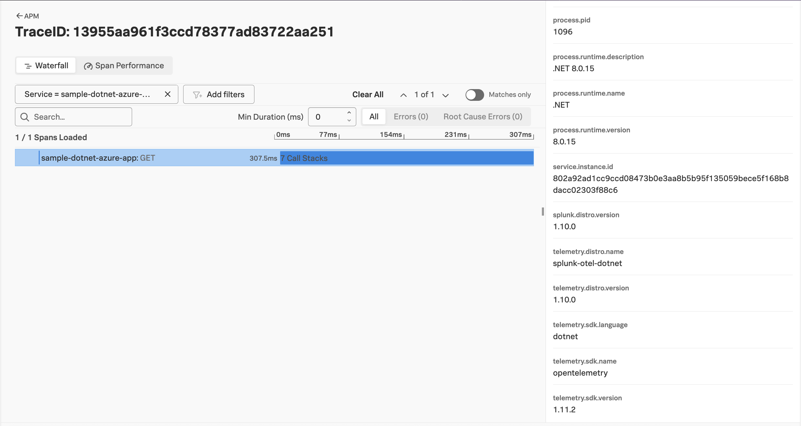
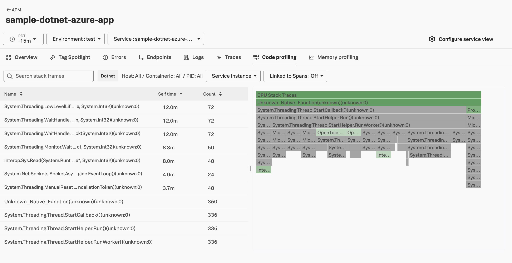
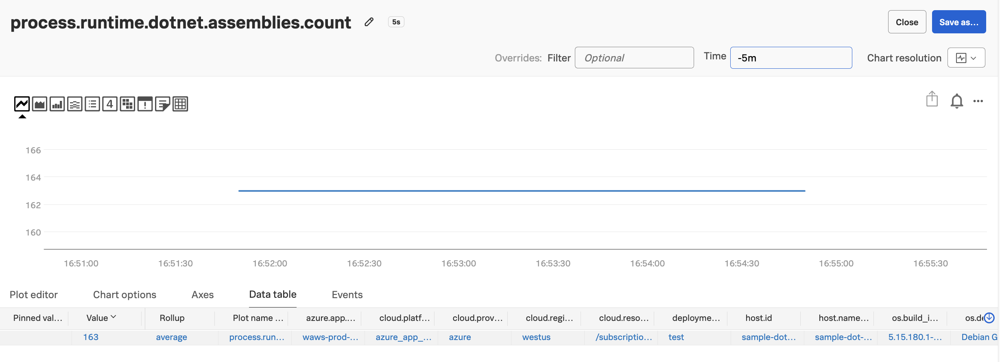

# Instrumenting a .NET Application on Azure App Service with OpenTelemetry

This example demonstrates how to instrument a .NET Application on Azure
App  Service using OpenTelemetry,
and export traces, metrics, and logs to a collector running in Azure, which will then
export that data to Splunk.

The example application was generated using the instructions provided by 
[Quickstart: Deploy an ASP.NET web app](https://learn.microsoft.com/en-us/azure/app-service/quickstart-dotnetcore?tabs=net80&pivots=development-environment-cli). 

## Prerequisites

The following tools are required to build and deploy the Java application to Azure:

* The latest .NET v8 SDK 
* An Azure account with permissions to create and execute Azure web applications
* [Azure CLI](https://learn.microsoft.com/en-us/cli/azure/install-azure-cli)

## Splunk Distribution of the OpenTelemetry Collector

For this example, we deployed the Splunk Distribution of the OpenTelemetry Collector onto a virtual machine
in Azure using Gateway mode, and ensured it's accessible to our Azure function.

We configured it with the `SPLUNK_HEC_TOKEN` and `SPLUNK_HEC_URL` environment variables, so that it
exports logs to our Splunk Cloud instance.

Please refer to [Install the Collector using packages and deployment tools](https://docs.splunk.com/observability/en/gdi/opentelemetry/install-the-collector.html#collector-package-install)
for collector installation instructions.

## Authenticate with Azure

Open a command line terminal and use the following command to authenticate with Azure:

``` bash
az login
```

## Deploy the .NET application to Azure

Navigate to the application directory:

``` bash
cd ~/splunk-opentelemetry-examples/instrumentation/dotnet/azure-app-service/MyFirstAzureWebApp
```

Then deploy the application to Azure:

> Note: substitute an application name that's globally unique in Azure, along with the desired 
> Azure region

``` bash
az webapp up --sku P1v2 --name <application name> --os-type linux --location <azure region> 
```

## Add OpenTelemetry Environment Variables

Next, we'll set the following environment variables, which tells the OpenTelemetry SDK
what data to collect and where to send it:

> Note: remember to substitute the URL for your collector

``` bash
az webapp config appsettings set --name <app_name> \
    --resource-group <resource_group> \
    --settings \
        OTEL_SERVICE_NAME='azure-dotnet-web-app' \
        OTEL_RESOURCE_ATTRIBUTES='deployment.environment=test' \
        OTEL_EXPORTER_OTLP_ENDPOINT='http(s)://<collector URL>:4318' \
        SPLUNK_METRICS_ENABLED=true \
        SPLUNK_PROFILER_ENABLED=true \
        SPLUNK_PROFILER_MEMORY_ENABLED=true 
```

## Test the Application

Point your browser to `http://<appName>.azurewebsites.net` to test the application.

> Note: you'll need to substitute your application name into the above URL, which was provided as
> an output from the earlier command used to deploy the application.

You should see output such as the following:

````
.NET 💜 Azure
Example .NET app to Azure App Service.
````

### View Traces in Splunk Observability Cloud

After a minute or so, you should start to see traces for the Java application
appearing in Splunk Observability Cloud:



### View AlwaysOn Profiling Data in Splunk Observability Cloud

You should also see profiling data appear:



### View Metrics in Splunk Observability Cloud

Metrics are collected by the Splunk Distribution of OpenTelemetry .NET automatically.  
For example, the `process.runtime.dotnet.assemblies.count` metric shows us how many assemblies
are loaded by the .NET CLR used by our application:



### View Logs with Trace Context

The Splunk Distribution of OpenTelemetry .NET automatically adds trace context
to logs when `Microsoft.Extensions.Logging` is used. 

Here's an example log entry, which includes the trace_id and span_id:

````

````

The OpenTelemetry Collector can be configured to export log data to
Splunk platform using the Splunk HEC exporter.  The logs can then be made
available to Splunk Observability Cloud using Log Observer Connect.  This will
provide full correlation between spans generated by .NET instrumentation
with metrics and logs. 