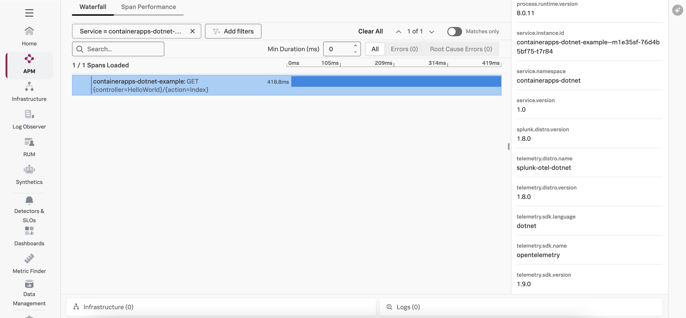

# Instrumenting a .NET Azure Container App with OpenTelemetry (without the collector)

This example demonstrates how to instrument an serverless Azure container app written in
.NET using OpenTelemetry, and then export the data to Splunk Observability
Cloud.  We'll use .NET 8 for this example.

The example doesn't require an OpenTelemetry collector, but instead sends traces directly 
to Splunk Observability Cloud. To see an example with the collector, which includes metrics 
and profiling data, please see [this example](../azure-container-apps). 

## Prerequisites

The following tools are required to deploy .NET container apps:

* An Azure account with permissions to create and execute Azure container apps
* Azure CLI

## About the Docker image

For this example, we'll use the [Hello World .NET application](../linux/README.md).
The [Kubernetes example](../k8s/README.md) explains how we created the Docker
image that we'll be using.

## Setup Azure CLI

Execute the following steps to login with the Azure CLI, ensure it has the container app extension, and register the `Microsoft.App` and `Microsoft.OperationalInsights` namespaces,
as described in [Quickstart: Deploy your first container app with containerapp up](https://learn.microsoft.com/en-us/azure/container-apps/get-started?tabs=bash):

``` bash
az login
az upgrade
az extension add --name containerapp --upgrade
az provider register --namespace Microsoft.App
az provider register --namespace Microsoft.OperationalInsights
```

## Deploy the Azure Container App

Execute the following command to deploy the Azure container app, substituting the IP address or
domain name for your OpenTelemetry collector:

``` bash
az containerapp up \
  --name containerapps-dotnet-direct \
  --resource-group containerapps-dotnet \
  --location westus \
  --environment 'containerapps-dotnet' \
  --image ghcr.io/splunk/sampledotnetapp:1.0 \
  --target-port 8080 \
  --env-vars OTEL_SERVICE_NAME="containerapps-dotnet-direct" OTEL_RESOURCE_ATTRIBUTES="deployment.environment=test,service.version=1.0" \
  --ingress external \
  --query properties.configuration.ingress.fqdn
```

## Add the OpenTelemetry Agent

Azure provides the ability to deploy an OpenTelemetry collector with an Azure container app 
as a sidecar container.  See [Collect and read OpenTelemetry data in Azure Container Apps (preview)](https://learn.microsoft.com/en-us/azure/container-apps/opentelemetry-agents) 
for details. 

We can configure the collector to send traces to Splunk Observability Cloud as follows (substitute your 
target realm and access token): 

``` bash
az containerapp env telemetry otlp add \
  --resource-group containerapps-dotnet \
  --name containerapps-dotnet \
  --otlp-name "otlp1" \
  --endpoint "ingest.${SPLUNK_REALM}.signalfx.com:443" \
  --insecure false \
  --headers "X-SF-Token=${SPLUNK_ACCESS_TOKEN}" \
  --enable-open-telemetry-traces true
```

## Test the Azure Container App

Copy the function URL from the output of the command above, which should be something like the following:

````
Browse to your container app at: http://<container app name>.livelydune-678049b5.westus.azurecontainerapps.io 
````

Then point your browser to that URL, it should return:

````
Hello, World! 
````

## View Traces in Splunk Observability Cloud

After a minute or so, you should start to see traces for the container app
appearing in Splunk Observability Cloud:



## Add Trace Context to Logs

Logs generated by an Azure function get sent to Application Insights.
Various methods exist for ingesting logs into Splunk platform from Application Insights,
such as the
[Splunk Add-on for Microsoft Cloud Services](https://splunkbase.splunk.com/app/3110).

Once the logs are in Splunk platform, they can be made available to
Splunk Observability Cloud using Log Observer Connect.

In the following example,
we can see that the trace context was injected successfully into the logs
using the custom logging changes described above:

````
{
    event_id: 0
    log_level: information
    category: HelloWorldController
    message: Processing a request...
    timestamp: '2025-03-26T16:50:23.6148962Z'
    service.name: containerapps-dotnet-direct
    severity: INFO
    span_id: f18bd17074a875cc
    trace_id: 7f5feabdd707fb13cef53b6b54eacbab
    parent_id: '0000000000000000'
    tag_server.address: containerapps-dotnet-direct.livelydune-678049b5.westus.azurecontainerapps.io
    tag_http.request.method: GET
    tag_url.scheme: http
    tag_url.path: /
    tag_network.protocol.version: '1.1'
    tag_user_agent.original: >-
      Mozilla/5.0 (Macintosh; Intel Mac OS X 10_15_7) AppleWebKit/537.36 (KHTML,
      like Gecko) Chrome/134.0.0.0 Safari/537.36
    ConnectionId: 0HNBCGOTGLRIO
    RequestId: '0HNBCGOTGLRIO:00000004'
    RequestPath: /
    ActionId: 6b2b9847-cc1a-4a65-84ce-69abb0c6b17f
    ActionName: HelloWorldController.Index (HelloWorld)
}
````

This will ensure full correlation between traces generated by the OpenTelemetry instrumentation
with metrics and logs. 