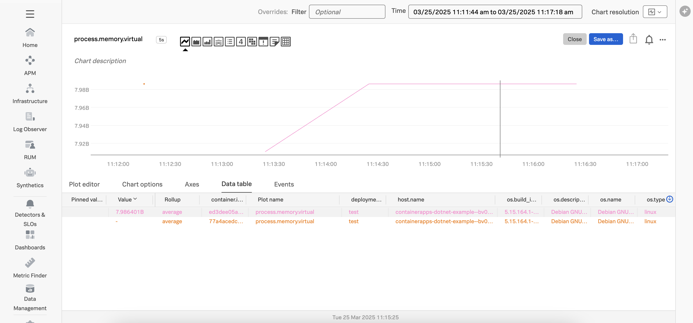

# Instrumenting a .NET Azure Container App with OpenTelemetry

This example demonstrates how to instrument an serverless Azure container app written in
.NET using OpenTelemetry, and then export the data to Splunk Observability
Cloud.  We'll use .NET 8 for this example. 

## Prerequisites

The following tools are required to deploy .NET container apps:

* An Azure account with permissions to create and execute Azure container apps
* Azure CLI 
* An OpenTelemetry collector that's accessible to the Azure function

## Splunk Distribution of the OpenTelemetry Collector

For this example, we deployed the Splunk Distribution of the OpenTelemetry Collector onto a virtual machine
in Azure using Gateway mode, and ensured it's accessible to our Azure function.

Please refer to [Install the Collector using packages and deployment tools](https://docs.splunk.com/observability/en/gdi/opentelemetry/install-the-collector.html#collector-package-install)
for collector installation instructions.

## About the Docker image

For this example, we'll use the [Hello World .NET application](../linux/README.md). 
The [Kubernetes example](../k8s/README.md) explains how we created the Docker 
image that we'll be using. 

## Setup Azure CLI

Execute the following steps to login with the Azure CLI, ensure it has the container app extension, and register the `Microsoft.App` and `Microsoft.OperationalInsights` namespaces, 
as described in [Quickstart: Deploy your first container app with containerapp up](https://learn.microsoft.com/en-us/azure/container-apps/get-started?tabs=bash): 

``` bash
az login
az upgrade
az extension add --name containerapp --upgrade
az provider register --namespace Microsoft.App
az provider register --namespace Microsoft.OperationalInsights
```

## Deploy the Azure Container App

Execute the following command to deploy the Azure container app, substituting the IP address or 
domain name for your OpenTelemetry collector: 

``` bash
az containerapp up \
  --name containerapps-dotnet-example \
  --resource-group containerapps-dotnet \
  --location westus \
  --environment 'containerapps-dotnet' \
  --image ghcr.io/splunk/sampledotnetapp:1.0 \
  --target-port 8080 \
  --env-vars OTEL_SERVICE_NAME="containerapps-dotnet-example" OTEL_RESOURCE_ATTRIBUTES="deployment.environment=test,service.version=1.0" OTEL_EXPORTER_OTLP_ENDPOINT="http://<collector IP>:4318" OTEL_LOGS_EXPORTER="none" \
  --ingress external \
  --query properties.configuration.ingress.fqdn
```

## Test the Azure Container App

Copy the function URL from the output of the command above, which should be something like the following: 

````
Browse to your container app at: http://<container app name>.livelydune-678049b5.westus.azurecontainerapps.io 
````

Then point your browser to that URL, it should return:

````
Hello, World! 
````

## View Traces in Splunk Observability Cloud

After a minute or so, you should start to see traces for the container app
appearing in Splunk Observability Cloud:


## View Metrics in Splunk Observability Cloud

Metrics are collected by the Splunk Distribution of OpenTelemetry .NET automatically.  
For example, the `process.memory.virtual` metric shows us the size of the
heap used by each generation in the CLR:



## Add Trace Context to Logs

Logs generated by an Azure function get sent to Application Insights.
Various methods exist for ingesting logs into Splunk platform from Application Insights,
such as the
[Splunk Add-on for Microsoft Cloud Services](https://splunkbase.splunk.com/app/3110).

Once the logs are in Splunk platform, they can be made available to
Splunk Observability Cloud using Log Observer Connect.

In the following example,
we can see that the trace context was injected successfully into the logs
using the custom logging changes described above:

````
{
  "event_id": 0,
  "log_level": "information",
  "category": "HelloWorldController",
  "message": "Processing a request...",
  "timestamp": "2025-03-25T18:20:14.5916362Z",
  "service.name": "containerapps-dotnet-example",
  "severity": "INFO",
  "span_id": "b938c67d8e4e115f",
  "trace_id": "4f1d6d48a04a5e6ea9d029e955bccdc3",
  "parent_id": "0000000000000000",
  "tag_server.address": "containerapps-dotnet-example.livelydune-678049b5.westus.azurecontainerapps.io",
  "tag_http.request.method": "GET",
  "tag_url.scheme": "http",
  "tag_url.path": "/",
  "tag_network.protocol.version": "1.1",
  "tag_user_agent.original": "Mozilla/5.0 (Macintosh; Intel Mac OS X 10_15_7) AppleWebKit/537.36 (KHTML, like Gecko) Chrome/134.0.0.0 Safari/537.36",
  "ConnectionId": "0HNBBP6FTP38O",
  "RequestId": "0HNBBP6FTP38O:00000003",
  "RequestPath": "/",
  "ActionId": "4528c4b1-cd44-4be3-b9bf-687edf297c1e",
  "ActionName": "HelloWorldController.Index (HelloWorld)"
}
````

This will ensure full correlation between traces generated by the OpenTelemetry instrumentation
with metrics and logs. 