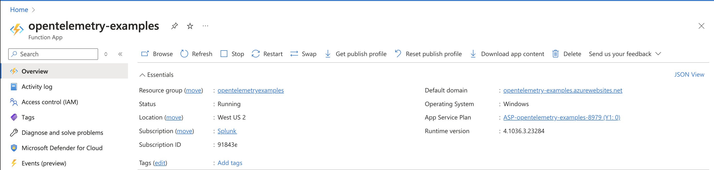
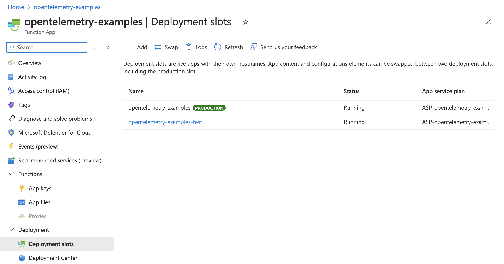
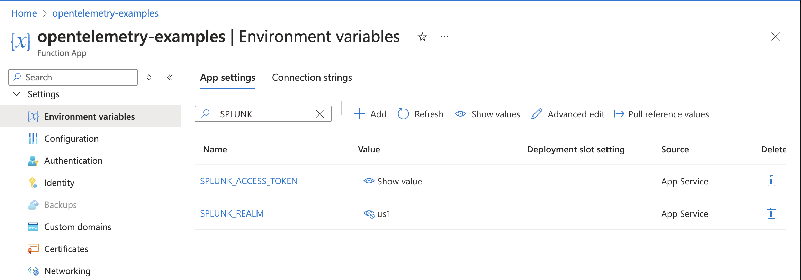
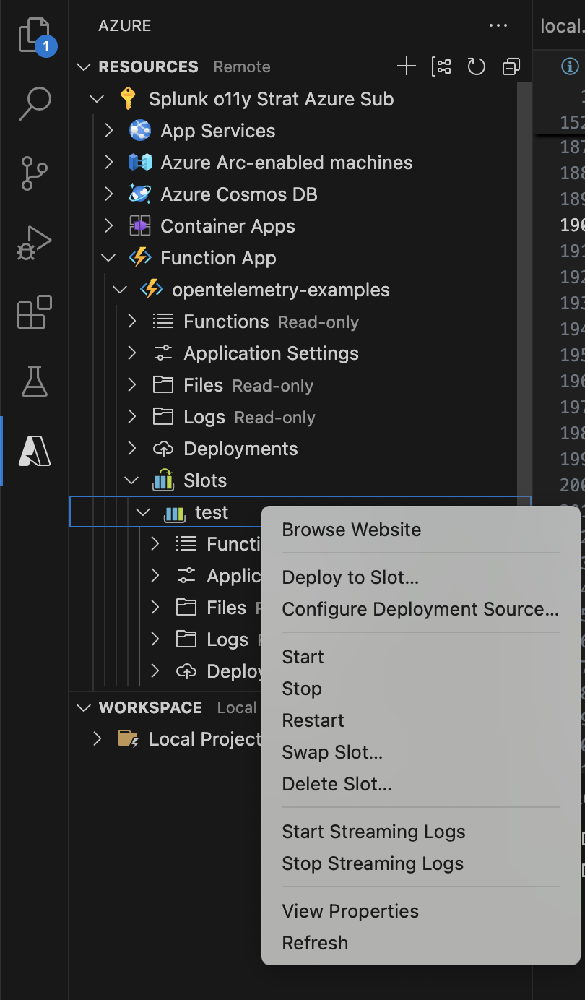
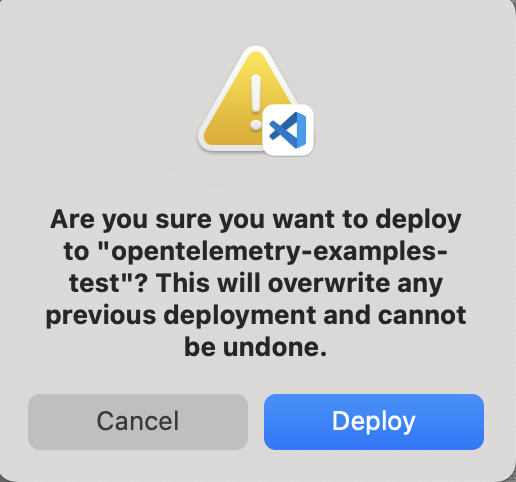
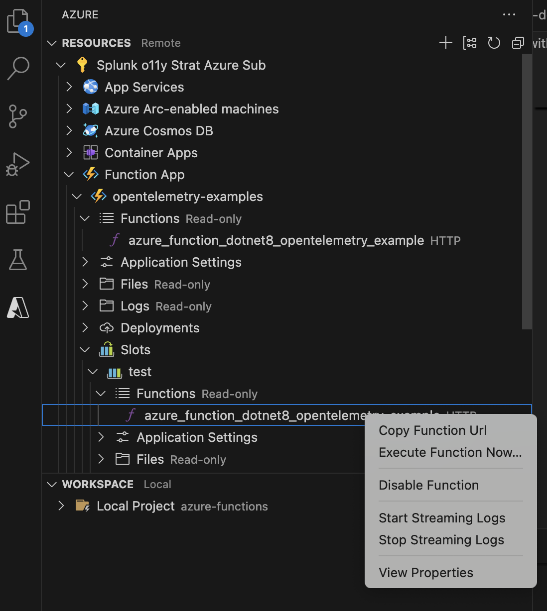
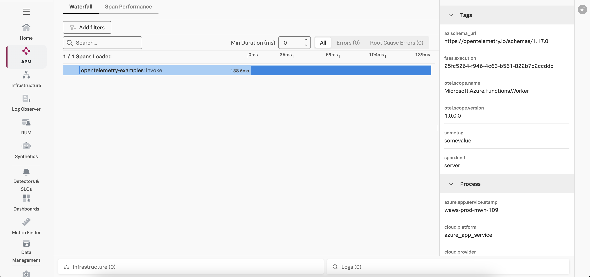

# Instrumenting a .NET Azure Function with OpenTelemetry

This example demonstrates how to instrument an serverless Azure function written in
.NET using OpenTelemetry, and then export the data to Splunk Observability 
Cloud.  We'll use .NET 8 for this example, but the steps for .NET 6 are 
similar.   

## Prerequisites 

The following tools are required to deploy .NET functions into AWS Lambda: 

* An Azure account with permissions to create and execute Azure functions
* [Visual Studio Code](https://code.visualstudio.com/)
* Download and install the [.NET 8 SDK](https://dotnet.microsoft.com/en-us/download/dotnet/8.0)
* Azure Functions extension for Visual Studio Code (installed using Visual Studio Code)

## Application Overview

If you just want to build and deploy the example, feel free to skip this section. 

The application used for this example is a simple Hello World application. 

We added a helper class named [SplunkTelemetryConfiguration](./SplunkTelemetryConfigurator.cs), and included code to 
assist with initializing the tracer, as well as a custom logger to inject the trace context. 

The tracer initialization is based on the example found in 
[Instrument .NET Azure functions for Splunk Observability Cloud](https://docs.splunk.com/observability/en/gdi/get-data-in/serverless/azure/instrument-azure-functions-dotnet.html): 

````
public static TracerProvider ConfigureSplunkTelemetry()
{
    // Get environment variables from function configuration
    // You need a valid Splunk Observability Cloud access token and realm
    var serviceName = Environment.GetEnvironmentVariable("WEBSITE_SITE_NAME") ?? "Unknown";
    var accessToken = Environment.GetEnvironmentVariable("SPLUNK_ACCESS_TOKEN")?.Trim();
    var realm = Environment.GetEnvironmentVariable("SPLUNK_REALM")?.Trim();

    ArgumentNullException.ThrowIfNull(accessToken, "SPLUNK_ACCESS_TOKEN");
    ArgumentNullException.ThrowIfNull(realm, "SPLUNK_REALM");

    var builder = Sdk.CreateTracerProviderBuilder()
    // Use Add[instrumentation-name]Instrumentation to instrument missing services
    // Use Nuget to find different instrumentation libraries
    .AddHttpClientInstrumentation(opts =>
    {
        // This filter prevents background (parent-less) http client activity
        opts.FilterHttpWebRequest = req => Activity.Current?.Parent != null;
        opts.FilterHttpRequestMessage = req => Activity.Current?.Parent != null;
    })
    // Use AddSource to add your custom DiagnosticSource source names
    //.AddSource("My.Source.Name")
    // Creates root spans for function executions
    .AddSource("Microsoft.Azure.Functions.Worker")
    .SetSampler(new AlwaysOnSampler())
    .ConfigureResource(configure => configure
        .AddService(serviceName: serviceName, serviceVersion: "1.0.0")
        // See https://github.com/open-telemetry/opentelemetry-dotnet-contrib/tree/main/src/OpenTelemetry.Resources.Azure
        // for other types of Azure detectors
        .AddAzureAppServiceDetector())
    .AddOtlpExporter(opts =>
    {
        opts.Endpoint = new Uri($"https://ingest.{realm}.signalfx.com/v2/trace/otlp");
        opts.Protocol = OtlpExportProtocol.HttpProtobuf;
        opts.Headers = $"X-SF-TOKEN={accessToken}";
    }) 
    // Add the console exporter, which is helpful for debugging as the 
    // spans get written to the console but should be removed in production
    .AddConsoleExporter();

    return builder.Build()!;
}
````

The custom logger injects the trace context as follows: 

````
   public static ILogger<T> ConfigureLogger<T>()
   {
       var loggerFactory = LoggerFactory.Create(logging =>
       {
           logging.ClearProviders(); // Clear existing providers
           logging.Configure(options =>
           {
               options.ActivityTrackingOptions = ActivityTrackingOptions.SpanId
                               | ActivityTrackingOptions.TraceId
                               | ActivityTrackingOptions.ParentId
                               | ActivityTrackingOptions.Baggage
                               | ActivityTrackingOptions.Tags;
           }).AddConsole(options =>
           {
               options.FormatterName = "splunkLogsJson";
           });
           logging.AddConsoleFormatter<SplunkTelemetryConsoleFormatter, ConsoleFormatterOptions>();
       });

       return loggerFactory.CreateLogger<T>();
   }
````

The [Program.cs file](./Program.cs) was then modified to configure 
OpenTelemetry using the helper class as follows: 

````
using OpenTelemetry.Trace;
using SplunkTelemetry;

var tracerProvider = SplunkTelemetryConfigurator.ConfigureSplunkTelemetry();

var host = new HostBuilder()
   .ConfigureFunctionsWorkerDefaults()
   .ConfigureServices(services => services.AddSingleton(tracerProvider))
   .Build();
````

And then the [Azure function](./azure_function_dotnet8_opentelemetry_example.cs) was modified to configure 
the logger used by the application: 
````
    public azure_function_dotnet8_opentelemetry_example(ILogger<azure_function_dotnet8_opentelemetry_example> logger)
    {
        _logger = SplunkTelemetryConfigurator.ConfigureLogger<azure_function_dotnet8_opentelemetry_example>();
    }
````

These code changes required a number of packages to be added to the azure-functions.csproj file: 

````
  <ItemGroup>
    ...
    <PackageReference Include="OpenTelemetry" Version="1.10.0" />
    <PackageReference Include="OpenTelemetry.Exporter.OpenTelemetryProtocol" Version="1.10.0" />
    <PackageReference Include="OpenTelemetry.Exporter.Console" Version="1.10.0" />
    <PackageReference Include="OpenTelemetry.Instrumentation.Http" Version="1.10.0" />
    <PackageReference Include="OpenTelemetry.Resources.Azure" Version="1.0.0-beta.9" />
  </ItemGroup>
````

The `local.settings.json` file was then updated to include the Splunk realm and access token which is
used for local testing: 

````
{
  "IsEncrypted": false,
  "Values": {
    "AzureWebJobsStorage": "",
    "FUNCTIONS_WORKER_RUNTIME": "dotnet-isolated", 
    "SPLUNK_REALM": "<Splunk Realm i.e. us0, us1, eu0, etc. >", 
    "SPLUNK_ACCESS_TOKEN": "<Splunk Observability Cloud Access Token>"
  }
}
````

## Build and Deploy

Open the following project using Visual Studio Code: 

````
splunk-opentelemetry-examples/instrumentation/dotnet/azure-functions
````

### Create a Function App in Azure 

Create a Function App in Azure if you don't already have one.  For my example, 
I used `opentelemetry-examples` as the function name, and used the region of “West US 2” 
with .NET 8 isolated as the runtime. 



### Create a Deployment Slot (Optional) 

By default, Azure will use a deployment slot named "Production" for an Azure Function App. 
This results in OpenTelemetry using a `deployment.environment` setting of "Production" as well, 
which may not be desired. 

To use a different `deployment.environment` value, we can create a different deployment slot instead. 

In my example, I created a deployment slot named "test". 



### Set Environment Variables 

To allow OpenTelemetry to send trace data to Splunk Observability Cloud, 
we need to set the SPLUNK_REALM and SPLUNK_ACCESS_TOKEN environment variables 
for our Azure Function App: 



### Build and Deploy the Azure Function

In the Azure section of Visual Studio Code, right click on the deployment slot of interest 
and select `Deploy to Slot`. 



It will ask you to confirm: 



### Test the Azure Function

Copy the function URL from the Azure function: 



Then point your browser to that URL, it should return: 

````
Hello, World! 
````

### View Traces in Splunk Observability Cloud

After a minute or so, you should start to see traces for the lambda function
appearing in Splunk Observability Cloud: 



### Add Trace Context to Logs

Logs generated by an Azure function get sent to Application Insights.
Various methods exist for ingesting logs into Splunk platform from Application Insights,
such as the 
[Splunk Add-on for Microsoft Cloud Services](https://splunkbase.splunk.com/app/3110).

Once the logs are in Splunk platform, they can be made available to
Splunk Observability Cloud using Log Observer Connect.

In the following example, 
we can see that the trace context was injected successfully into the logs 
using the custom logging changes described above: 

````
{
  "event_id": 0,
  "log_level": "information",
  "category": "example.azure_function_dotnet8_opentelemetry_example",
  "message": "C# HTTP trigger function processed a request.",
  "timestamp": "2024-12-03T23:18:17.2770657Z",
  "service.name": "opentelemetry-examples",
  "severity": "INFO",
  "span_id": "c6667cb0450822dd",
  "trace_id": "c5580e362f333788634779f64220a087",
  "parent_id": "2c06698f7f40edb8",
  "tag_az.schema_url": "https://opentelemetry.io/schemas/1.17.0",
  "tag_faas.execution": "25fc5264-f946-4c63-b561-822b7c2ccddd"
}
````

This will ensure full correlation between traces generated by the OpenTelemetry instrumentation
with metrics and logs. 