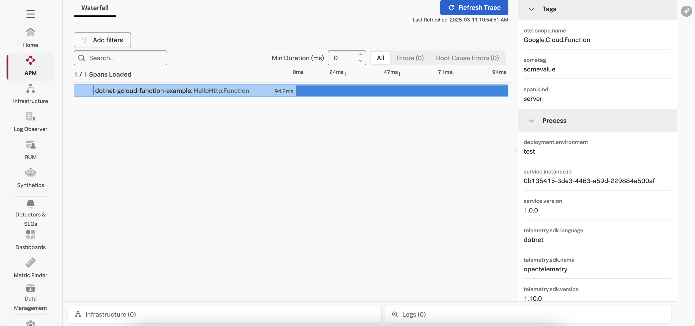

# Instrumenting a .NET Google Cloud Run Function with OpenTelemetry

This example demonstrates how to instrument an serverless Google Cloud Run function written in
.NET using OpenTelemetry, and then export the data to Splunk Observability
Cloud.  We'll use .NET v8 for this example, but the steps for other .NET versions are
similar.

## Prerequisites

The following tools are required to deploy .NET Google Cloud Run functions:

* An Google Cloud Platform account with permissions to create and execute Google Cloud Run functions
* An OpenTelemetry collector that's accessible to the Google Cloud Run function
* [gCloud CLI](https://cloud.google.com/sdk/docs/install)

## Splunk Distribution of the OpenTelemetry Collector

For this example, we deployed the Splunk Distribution of the OpenTelemetry Collector onto a virtual machine
in GCP using Gateway mode, and ensured it's accessible to our Google Cloud Run function.

We configured it with the `SPLUNK_HEC_TOKEN` and `SPLUNK_HEC_URL` environment variables, so that it
exports logs to our Splunk Cloud instance.

Please refer to [Install the Collector using packages and deployment tools](https://docs.splunk.com/observability/en/gdi/opentelemetry/install-the-collector.html#collector-package-install)
for collector installation instructions.

## Application Overview

If you just want to build and deploy the example, feel free to skip this section.

The application used for this example is a simple Hello World application.

We added a helper class named [SplunkTelemetryConfiguration](./src/SplunkTelemetryConfigurator.cs), and included code to assist with initializing the OpenTelemetry SDK:

````
    public static TracerProvider ConfigureSplunkTelemetry()
    {
        // Get environment variables from function configuration
        var serviceName = Environment.GetEnvironmentVariable("OTEL_SERVICE_NAME") ?? "Unknown";
        var otelExporterEndpoint = Environment.GetEnvironmentVariable("OTEL_EXPORTER_OTLP_ENDPOINT") ?? "Unknown";
        var otelResourceAttributes = Environment.GetEnvironmentVariable("OTEL_RESOURCE_ATTRIBUTES") ?? "Unknown";

        ArgumentNullException.ThrowIfNull(serviceName, "OTEL_SERVICE_NAME");
        ArgumentNullException.ThrowIfNull(otelExporterEndpoint, "OTEL_EXPORTER_OTLP_ENDPOINT");
        ArgumentNullException.ThrowIfNull(otelResourceAttributes, "OTEL_RESOURCE_ATTRIBUTES");

        var builder = Sdk.CreateTracerProviderBuilder()
        // Use Add[instrumentation-name]Instrumentation to instrument missing services
        // Use Nuget to find different instrumentation libraries
        .AddHttpClientInstrumentation(opts =>
        {
            // This filter prevents background (parent-less) http client activity
            opts.FilterHttpWebRequest = req => Activity.Current?.Parent != null;
            opts.FilterHttpRequestMessage = req => Activity.Current?.Parent != null;
        })
        // Use AddSource to add a custom DiagnosticSource source name
        .AddSource("Google.Cloud.Function")
        .SetSampler(new AlwaysOnSampler())
        // Add resource attributes to all spans
        .SetResourceBuilder(
           ResourceBuilder.CreateDefault()
           .AddService(serviceName: serviceName, serviceVersion: "1.0.0")
            // TODO: add the Gcp Detector once it's available as a NuGet package
            // See https://github.com/open-telemetry/opentelemetry-dotnet-contrib/tree/main/src/OpenTelemetry.Resources.Gcp
            //.AddGcpDetector())
        )
        .AddOtlpExporter(opts =>
        {
            opts.Endpoint = new Uri($"{otelExporterEndpoint}/v1/traces");
            opts.Protocol = OtlpExportProtocol.HttpProtobuf;
        })
        // Add the console exporter, which is helpful for debugging as the 
        // spans get written to the console but should be removed in production
        .AddConsoleExporter();

      return builder.Build()!;
   }
````

It requires the following dependencies to be added to the [HelloHttp.csproj](./src/HelloHttp.csproj) file:

````
   <PackageReference Include="OpenTelemetry" Version="1.10.0" />
   <PackageReference Include="OpenTelemetry.Exporter.OpenTelemetryProtocol" Version="1.10.0" />
   <PackageReference Include="OpenTelemetry.Exporter.Console" Version="1.10.0" />
   <PackageReference Include="OpenTelemetry.Instrumentation.Http" Version="1.10.0" />
````

The custom logger injects the trace context as follows:

````
   public static ILogger<T> ConfigureLogger<T>()
   {
       var loggerFactory = LoggerFactory.Create(logging =>
       {
           logging.ClearProviders(); // Clear existing providers
           logging.Configure(options =>
           {
               options.ActivityTrackingOptions = ActivityTrackingOptions.SpanId
                               | ActivityTrackingOptions.TraceId
                               | ActivityTrackingOptions.ParentId
                               | ActivityTrackingOptions.Baggage
                               | ActivityTrackingOptions.Tags;
           }).AddConsole(options =>
           {
               options.FormatterName = "splunkLogsJson";
           });
           logging.AddConsoleFormatter<SplunkTelemetryConsoleFormatter, ConsoleFormatterOptions>();
       });

       return loggerFactory.CreateLogger<T>();
   }
````

The [Function.cs](./src/Function.cs) file was then modified to include a Startup class to configure 
the `TracerProvider`: 

````
    public class Startup : FunctionsStartup
    {
        // Virtual methods in the base class are overridden
        // here to perform customization.
        public override void ConfigureServices(WebHostBuilderContext context, IServiceCollection services)
        {
            ILogger _logger = SplunkTelemetryConfigurator.ConfigureLogger<Function>();
            _logger.LogInformation("Configuring a tracer provider");
             TracerProvider tracerProvider =  SplunkTelemetryConfigurator.ConfigureSplunkTelemetry();

            // Add the tracer provider to the service collection.
            services.AddSingleton(tracerProvider);
        }
    }
````

Then the Function included in the [Function.cs](./src/Function.cs) was modified to use the 
`SplunkTelemetryConfigurator` as follows: 

````
   [FunctionsStartup(typeof(Startup))]
    public class Function : IHttpFunction
    {
        private readonly ILogger _logger = SplunkTelemetryConfigurator.ConfigureLogger<Function>();

        public async Task HandleAsync(HttpContext context)
        {
            HttpRequest request = context.Request;

            using (var activity = SplunkTelemetryConfigurator.StartActivity(request, context))
            {
                _logger.LogInformation("C# HTTP trigger function received a request.");

                // Check URL parameters for "name" field
                // "world" is the default value
                string name = ((string) request.Query["name"]) ?? "world";

                SplunkTelemetryConfigurator.AddSpanAttributes(request, context);

                var response = context.Response;
                response.StatusCode = 200;
                await response.WriteAsync($"Hello {name}!");
                SplunkTelemetryConfigurator.FinishActivity(response, activity);
            }
        }
    }
````

## Build and Deploy

Open a terminal and navigate to the following directory:

````
splunk-opentelemetry-examples/instrumentation/dotnet/google-cloud-functions
````

### Initialize the gCloud CLI

If you haven't already done so, [install](https://cloud.google.com/sdk/docs/install)
and [initialize](https://cloud.google.com/sdk/docs/initializing) the gcloud CLI.

### Build and Deploy the Google Cloud Run Function

Use the following command to deploy the Google Cloud Run function, substituting the
[region](https://cloud.google.com/functions/docs/locations)
that's best for you.  To allow OpenTelemetry to send trace data to Splunk Observability Cloud,
we also need to set the `OTEL_EXPORTER_OTLP_ENDPOINT`, `OTEL_SERVICE_NAME`, and `DEPLOYMENT_ENVIRONMENT`
environment variables as part of the gcloud deploy command:

```bash
gcloud functions deploy dotnet-gcloud-function-example \
    --gen2 \
    --region=us-central1 \
    --runtime=dotnet8 \
    --source=./src \
    --entry-point=HelloHttp.Function \
    --trigger-http \
    --set-env-vars OTEL_SERVICE_NAME=dotnet-gcloud-function-example,OTEL_EXPORTER_OTLP_ENDPOINT=http://<collector IP address>:4318,OTEL_RESOURCE_ATTRIBUTES='deployment.environment=test'
```

Answer "y" to the following question when asked:

````
Allow unauthenticated invocations of new function [dot-gcloud-function-example]? (y/N)? 
````

If the function is created successfully, it should provide you with a URL such as the following:

````
https://us-central1-gcp-<account name>.cloudfunctions.net/dotnet-gcloud-function-example
````

### Test the Google Cloud Run Function

Take the URL provided by the gcloud CLI above and enter it into your browser. It should return:

````
Hello World! 
````

### View Traces in Splunk Observability Cloud

After a minute or so, you should start to see traces for the serverless function
appearing in Splunk Observability Cloud:



### Add Trace Context to Logs

Logs generated by a Google Cloud Run function get sent to Google Cloud Logging.
Various methods exist for streaming logs into Splunk platform from Google Cloud Logging,
as described in
[Stream logs from Google Cloud to Splunk](https://cloud.google.com/architecture/stream-logs-from-google-cloud-to-splunk).

Once the logs are in Splunk platform, they can be made available to
Splunk Observability Cloud using Log Observer Connect.

Here's an example log entry, which includes the trace_id and span_id:

````
jsonPayload: {
    category: "HelloHttp.Function"
    event_id: 0
    log_level: "information"
    message: "C# HTTP trigger function received a request."
    parent_id: "d887ed72a94d5303"
    service.name: "dotnet-gcloud-function-example"
    span_id: "4236cc2cfad64511"
    timestamp: "2025-03-11T17:46:13.2514391Z"
    trace_id: "0088d10dfe845800089c492bba74c1df"
}
````

We can see that the log entry includes a trace_id and span_id, which allows us to correlate
logs with traces. 