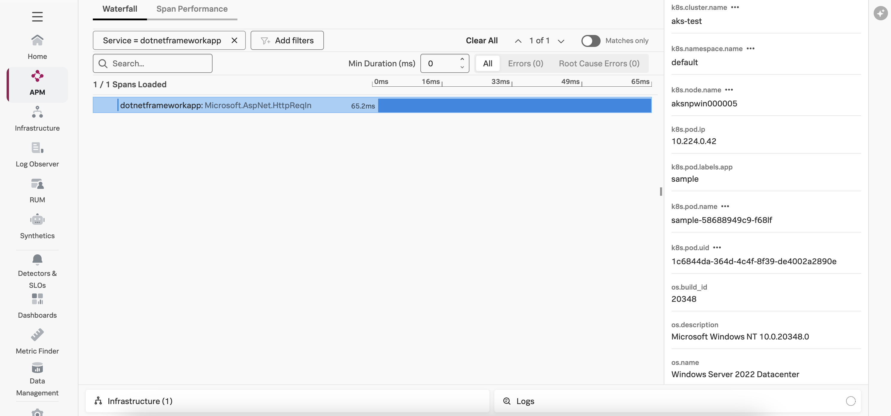
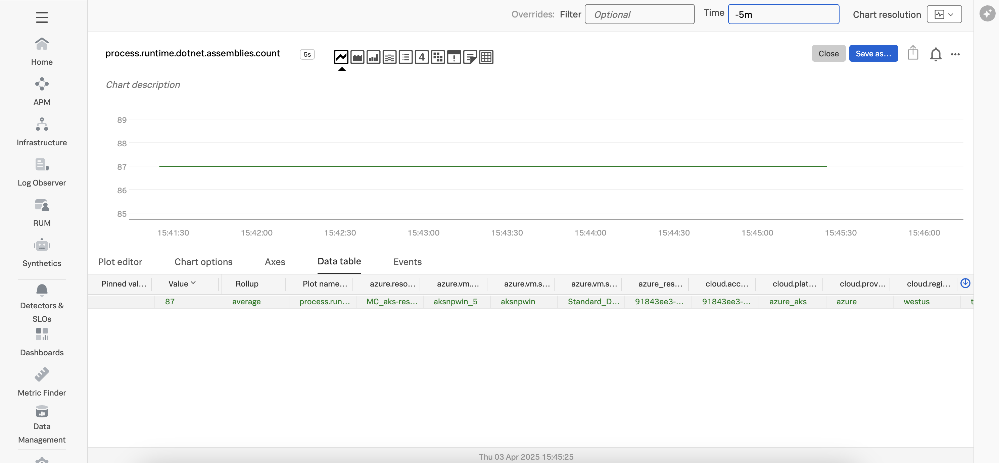

# Instrumenting a .NET Framework Application on K8s Windows Nodes with OpenTelemetry

This example demonstrates how to instrument a .NET Framework Application 
that runs in Kubernetes on Windows nodes with OpenTelemetry.  The example will export traces, metrics, 
and logs to a local collector, which will then
export that data to Splunk. We'll use .NET Framework 4.8 for this example.

## Prerequisites

The following tools are required to build and execute the .NET Framework application:

* A Kubernetes cluster with at least one Windows node 
* Windows machine with the following installed: 
  * Git command line tools
  * Docker
  * [.NET Framework 4.8](https://dotnet.microsoft.com/en-us/download/dotnet-framework/net48)

## Deploy the Splunk OpenTelemetry Collector

This example requires the Splunk Distribution of the OpenTelemetry collector to
be running on each node of the K8s cluster, including the Windows nodes. 
See [Using the Splunk Distribution of OpenTelemetry Collector for Kubernetes with Windows Nodes](../../../collector/k8s-with-windows-nodes) 
for example of how to configure the OpenTelemetry collector in this environment. 

## About the Docker image

For this example, we'll use the 
[ASP.NET Docker Sample](https://github.com/microsoft/dotnet-framework-docker/tree/main/samples/aspnetapp) 
application from Microsoft.

To run the application in K8s, we've built a Docker image for the application using 
a custom [Dockerfile](./Dockerfile).  This Dockerfile includes the following lines
to install the Splunk distribution of OpenTelemetry .NET: 

``` dockerfile
RUN powershell.exe -Command \
  $module_url = 'https://github.com/signalfx/splunk-otel-dotnet/releases/latest/download/Splunk.OTel.DotNet.psm1'; \
  $download_path = Join-Path $env:temp 'Splunk.OTel.DotNet.psm1'; \
  Invoke-WebRequest -Uri $module_url -OutFile $download_path ; \
  Import-Module $download_path ; \
  Install-OpenTelemetryCore ; \
  Register-OpenTelemetryForIIS ; \
  $env:OTEL_RESOURCE_ATTRIBUTES='deployment.environment=test'
```

We also add a custom value to the Windows registry to work around the issue 
described [here](https://github.com/open-telemetry/opentelemetry-dotnet-instrumentation/blob/main/docs/troubleshooting.md#iis---loading-this-assembly-would-produce-a-different-grant-set-from-other-instances), 
though this isn't required for all applications: 

``` dockerfile
RUN REG ADD HKLM\SOFTWARE\Microsoft\.NETFramework /v LoaderOptimization /t REG_DWORD /d 1
```

## Build the Docker image (optional)

We've already built the Docker image for this application, so feel free to skip
this section unless you want to use your own image.

To build the image, run the following command from the `splunk-opentelemetry-examples/instrumentation/dotnet/k8s-windows` directory:

```
docker build --pull -t aspnetapp .
```

## Push the Docker image (optional)

We'll then need to push the Docker image to a repository that you have
access to, such as your Docker Hub account.  We've already done this for you,
so feel free to skip this step unless you'd like to use your own image.

Specifically, we've pushed the
image to GitHub's container repository using the following commands:

````
docker tag aspnetapp:latest ghcr.io/splunk/sampledotnetframeworkapp:1.0
docker image push ghcr.io/splunk/sampledotnetframeworkapp:1.0
````

See [Authenticating with a personal access token](https://docs.github.com/en/packages/working-with-a-github-packages-registry/working-with-the-container-registry#authenticating-with-a-personal-access-token-classic)
for details on how to authenticate with GitHub before pushing the image. For a Windows machine, 
you'll need to use the following command to authenticate: 

````
docker login ghcr.io -u USERNAME
````

And then enter your GitHub Personal Access Token (PAT) when prompted. 

## Deploy to Kubernetes

Now that we have our Docker image, we can deploy the application to
our Kubernetes cluster.  We'll do this by using the following
kubectl command to deploy the dotnetframeworkapp.yaml manifest file:

````
cd ~/splunk-opentelemetry-examples/instrumentation/dotnet/k8s-windows
kubectl apply -f ./dotnetframeworkapp.yaml
````

The `dotnetframeworkapp.yaml` manifest file sets the following
environment variables to configure how the .NET agent gathers and exports data to
the collector running within the cluster:

````
    env:
      - name: SPLUNK_OTEL_AGENT
        valueFrom:
          fieldRef:
            fieldPath: status.hostIP
      - name: OTEL_EXPORTER_OTLP_ENDPOINT
        value: "http://$(SPLUNK_OTEL_AGENT):4318"
      - name: OTEL_SERVICE_NAME
        value: "dotnetframeworkapp"
      - name: OTEL_RESOURCE_ATTRIBUTES
        value: "deployment.environment=test"
      - name: OTEL_LOGS_EXPORTER
        value: "none"
````

Note that we've set `OTEL_LOGS_EXPORTER` to `none` to avoid duplicate logs being exported,
as typically the file log receiver is used in Kubernetes to parse application logs, and
having both enabled would result in duplicates.

## Test the Application

Execute the `kubectl get svc sample` command, which should return something
like the following: 

````
NAME     TYPE           CLUSTER-IP     EXTERNAL-IP    PORT(S)        AGE
sample   LoadBalancer   10.0.135.214   13.88.45.251   80:30456/TCP   82s
````

Use the external IP address with your browser to access the application. 
For example:  http://13.88.45.251:80.  Click on the links at the top of the
application a few times to generate some traffic. 

## View Traces in Splunk Observability Cloud

After a minute or so, you should start to see traces for the .NET application
appearing in Splunk Observability Cloud:



## View Metrics in Splunk Observability Cloud

Metrics are collected by the Splunk Distribution of OpenTelemetry .NET automatically.  
For example, the `process.runtime.dotnet.assemblies.count` metric shows us the size of the
heap used by each generation in the CLR:



## View Logs with Trace Context

While this sample application doesn't generate any log output, the Splunk Distribution of
OpenTelemetry .NET automatically exports logs enriched with tracing context from any
application that uses logging API from:

* Microsoft.Extensions.Logging
* log4net

Application logs are enriched with tracing metadata and then exported to a local instance
of the OpenTelemetry Collector in OTLP format.

Refer to [Connect .NET trace data with logs using OpenTelemetry instrumentation](https://docs.splunk.com/observability/en/gdi/get-data-in/application/otel-dotnet/instrumentation/connect-traces-logs.html)
for further details. 
