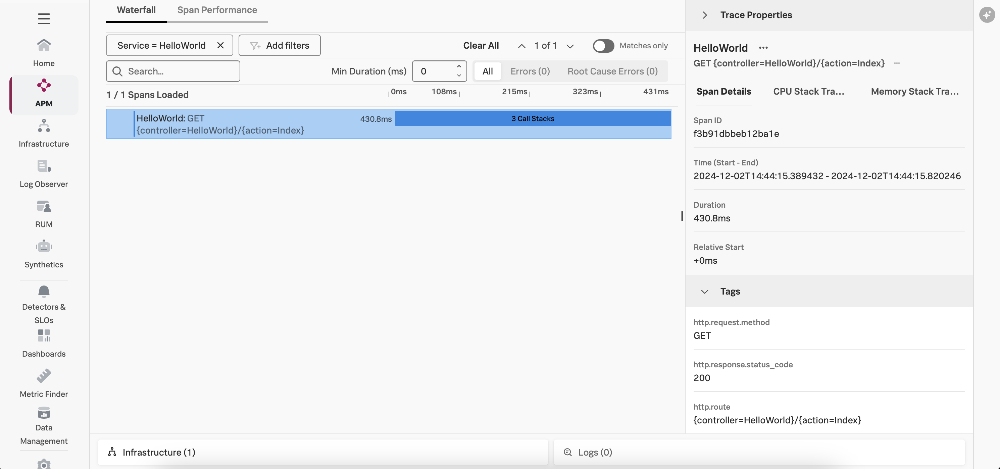
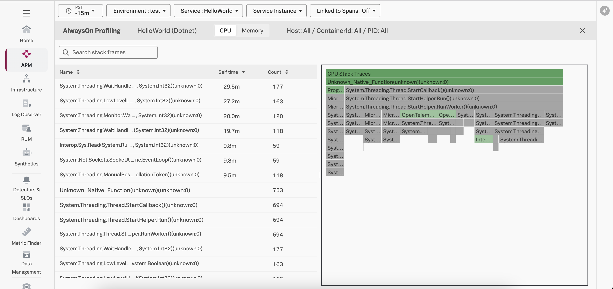
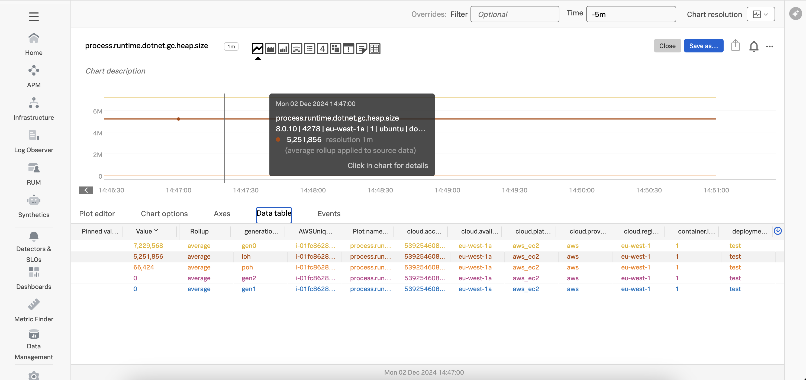

# Instrumenting a .NET Application with OpenTelemetry

This example demonstrates how to instrument a .NET Application using OpenTelemetry,
and export traces, metrics, and logs to a local collector, which will then
export that data to Splunk. We'll use .NET 8 for this example, but the steps
for earlier .NET versions are similar.

We'll show how the splunk-otel-dotnet-install.sh file can be downloaded and installed 
to instrument the application. 

Alternatively, you can add the `--with-instrumentation` command when starting the
collector on Linux, and have it automatically instrument any .NET applications
on the host with a specific annotation.  Please refer to
[Automatic discovery and configuration for back-end applications in Linux](https://docs.splunk.com/observability/en/gdi/opentelemetry/automatic-discovery/linux/linux-backend.html)
for further details on this approach.

## Prerequisites

The following tools are required to build and execute the .NET application:

* .NET 8 SDK ([example](https://learn.microsoft.com/en-us/dotnet/core/install/linux-ubuntu-install?tabs=dotnet8&pivots=os-linux-ubuntu-2404))
* A Linux-compatible host (such as Ubuntu 24.04, or Mac OS)

## Deploy the Splunk OpenTelemetry Collector

This example requires the Splunk Distribution of the OpenTelemetry collector to
be running on the host and available via http://localhost:4318.  Follow the
instructions in [Install the Collector for Linux with the installer script](https://docs.splunk.com/observability/en/gdi/opentelemetry/collector-linux/install-linux.html#install-the-collector-using-the-installer-script)
to install the collector on your host.

## Build and Execute the Application

Open a command line terminal and navigate to the root of the directory.  
For example:

````
cd ~/splunk-opentelemetry-examples/instrumentation/dotnet/linux
````

### Build the application 

Next, we'll build the application:

````
dotnet build HelloWorld.csproj
````

### Download the latest splunk-otel-.NETagent.jar file

Let's download the latest splunk-otel-dotnet-install.sh file, which we'll use
to instrument our .NET application:

````
curl -sSfL https://github.com/signalfx/splunk-otel-dotnet/releases/latest/download/splunk-otel-dotnet-install.sh -O
````

Then we'll install the distribution (specify x64 or arm64 for the ARCHITECTURE environment variable, 
as appropriate for your environment): 

````
ARCHITECTURE=x64 sh ./splunk-otel-dotnet-install.sh
````

Then we'll activate the instrumentation: 

````
. $HOME/.splunk-otel-dotnet/instrument.sh
````

Finally, we can set the deployment environment and enable profiling: 

````
export OTEL_RESOURCE_ATTRIBUTES='deployment.environment=test'
export SPLUNK_PROFILER_ENABLED=true
export SPLUNK_PROFILER_MEMORY_ENABLED=true
````

### Execute the application

Next, we'll execute the application as normal: 

````
dotnet ./bin/Debug/net8.0/HelloWorld.dll
````

Access the application by navigating your web browser to the following URL:

````
curl http://localhost:5000
````

It should respond with `Hello, World!`. 

### View Traces in Splunk Observability Cloud

After a minute or so, you should start to see traces for the .NET application
appearing in Splunk Observability Cloud:



### View AlwaysOn Profiling Data in Splunk Observability Cloud

You should also see profiling data appear:



### View Metrics in Splunk Observability Cloud

Metrics are collected by the Splunk Distribution of OpenTelemetry .NET automatically.  
For example, the `process.runtime.dotnet.gc.heap.size` metric shows us the size of the
heap used by each generation in the CLR:



### View Logs with Trace Context

We've included some custom code with this example to demonstrate how trace context can
be added to log entries.  You can find this code in the
SplunkTelemetryConfiguration.cs file:

````
   public static void ConfigureLogger(ILoggingBuilder logging)
   {
       logging.AddSimpleConsole(options =>
       {
           options.IncludeScopes = true;
       });

        logging.Configure(options =>
        {
            options.ActivityTrackingOptions = ActivityTrackingOptions.SpanId
                                               | ActivityTrackingOptions.TraceId
                                               | ActivityTrackingOptions.ParentId
                                               | ActivityTrackingOptions.Baggage
                                               | ActivityTrackingOptions.Tags;
        }).AddConsole(options =>
        {
           options.FormatterName = "splunkLogsJson";
        });

        logging.AddConsoleFormatter<SplunkTelemetryConsoleFormatter, ConsoleFormatterOptions>();
   }
````

We've included a custom log formatter in the same file, to customize the
application log format.

Here's an example of a log entry with trace context included: 

````
{"event_id":2,"log_level":"information","category":"Microsoft.AspNetCore.Hosting.Diagnostics","message":"Request finished HTTP/1.1 GET http://localhost:5000/ - 200 - text/plain;\u002Bcharset=utf-8 5.8052ms","timestamp":"2024-12-02T22:45:10.8549122Z","service.name":"Unknown","severity":"INFO","span_id":"8a65e822727a9696","trace_id":"8f460a0f96c9f13751bd67011687a106","parent_id":"0000000000000000","tag_server.address":"localhost","tag_server.port":5000,"tag_http.request.method":"GET","tag_url.scheme":"http","tag_url.path":"/","tag_network.protocol.version":"1.1","tag_user_agent.original":"curl/8.5.0","ConnectionId":"0HN8J4BCLDGH5","RequestId":"0HN8J4BCLDGH5:00000001","RequestPath":"/"}
````

The OpenTelemetry Collector can be configured to export log data to
Splunk platform using the Splunk HEC exporter.  The logs can then be made
available to Splunk Observability Cloud using Log Observer Connect.  This will
provide full correlation between spans generated by .NET instrumentation
with metrics and logs.
