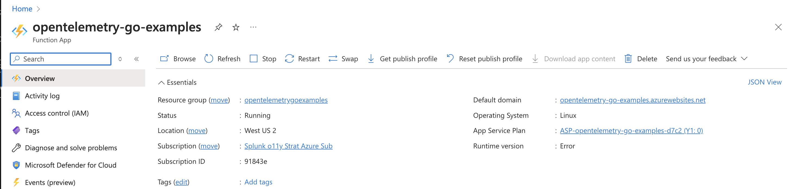
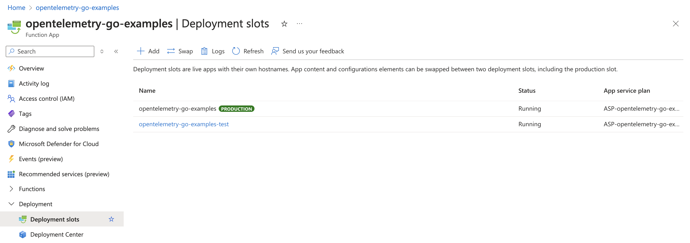
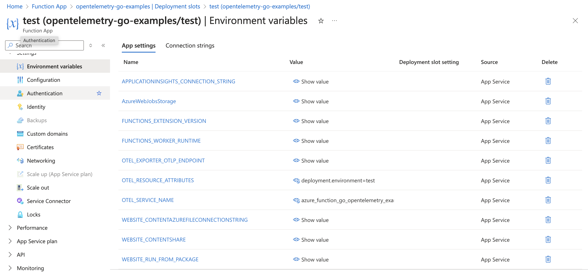
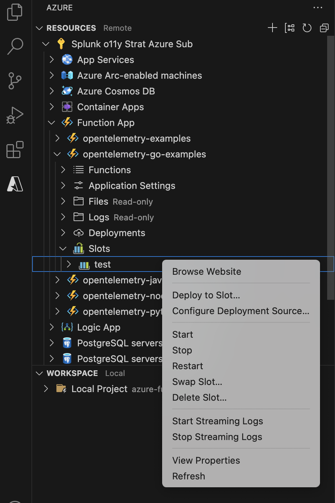
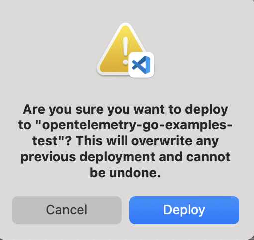
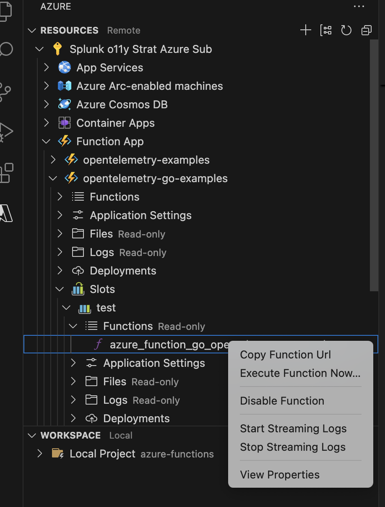
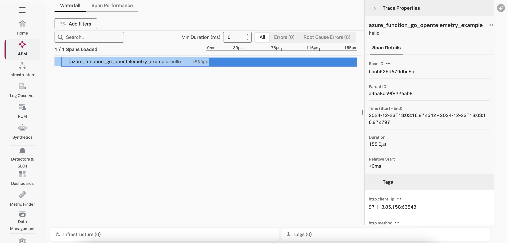

# Instrumenting a Go Azure Function with OpenTelemetry

This example demonstrates how to instrument an serverless Azure function written in
Go using OpenTelemetry, and then export the data to Splunk Observability 
Cloud.  We'll use Go v1.21.4 for this example, but the steps for other Go versions are 
similar.   

We'll use a custom handler for this example, which is based on 
[Quickstart: Create a Go or Rust function in Azure using Visual Studio Code](https://learn.microsoft.com/en-us/azure/azure-functions/create-first-function-vs-code-other). 

## Prerequisites 

The following tools are required to deploy Go Azure functions: 

* An Azure account with permissions to create and execute Azure functions
* [Visual Studio Code](https://code.visualstudio.com/)
* An OpenTelemetry collector that's accessible to the Azure function 
* Azure Functions extension for Visual Studio Code (installed using Visual Studio Code)

## Splunk Distribution of the OpenTelemetry Collector

For this example, we deployed the Splunk Distribution of the OpenTelemetry Collector onto a virtual machine 
in Azure using Gateway mode, and ensured it's accessible to our Azure function. 

We configured it with the `SPLUNK_HEC_TOKEN` and `SPLUNK_HEC_URL` environment variables, so that it 
exports logs to our Splunk Cloud instance. 

Please refer to [Install the Collector using packages and deployment tools](https://docs.splunk.com/observability/en/gdi/opentelemetry/install-the-collector.html#collector-package-install)
for collector installation instructions. 

## Application Overview (Optional)

If you just want to build and deploy the example, feel free to skip this section. 

The application used for this example is a simple Hello World application. 

To instrument the Go function with OpenTelemetry, we added the following code to the `main` function:

````
func main() {
	ctx := context.Background()

	sdk, err := distro.Run()
	if err != nil {
		panic(err)
	}
	// Flush all spans before the application exits
	defer func() {
		if err := sdk.Shutdown(context.Background()); err != nil {
			panic(err)
		}
	}()
    ...
	tracer = otel.Tracer("azure_function_go_opentelemetry_example")
	...
	listenAddr := ":8080"
	if val, ok := os.LookupEnv("FUNCTIONS_CUSTOMHANDLER_PORT"); ok {
		listenAddr = ":" + val
	}

	// Wrap the helloHandler function.
	handler := http.HandlerFunc(helloHandler)
	wrappedHandler := otelhttp.NewHandler(handler, "hello")
	http.Handle("/api/azure_function_go_opentelemetry_example", wrappedHandler)
	logger.Info(fmt.Sprintf("About to listen on %s. Go to https://127.0.0.1%s/", listenAddr, listenAddr))
	http.ListenAndServe(listenAddr, nil)
}
````

This activates the Splunk distribution of OpenTelemetry Go and instruments the HTTP handler.

### Install Go Modules (Optional)

We used the following commands to add the Go modules required to instrument this application
with OpenTelemetry.  Please note that these commands don't need to be executed again, but are
provided for reference in case you'd like to apply instrumentation to your own Azure function.

We generated a go.mod file by executing the following command:

````
go mod init example.com/helloworld
```` 

Our application uses the `net/http` package so we'll add that with the following command:

````
go get go.opentelemetry.io/contrib/instrumentation/net/http/otelhttp
````

Our application also uses [zap](https://github.com/uber-go/zap) for logging, so we'll add that
as well:

````
go get go.uber.org/zap
````

We then installed the Splunk distribution of OpenTelemetry Go with the following command:

````
go get github.com/signalfx/splunk-otel-go/distro
````

There's no need to run these commands again as you can use the `go.mod` file that
was already created.

For this example, we'll send metrics, traces, and logs to a collector running on another virtual machine in Azure.
The [local.settings.json](./local.settings.json) file was updated as follows: 

````
  "Values": {
    "AzureWebJobsStorage": "UseDevelopmentStorage=true",
    "FUNCTIONS_WORKER_RUNTIME": "node",
    "OTEL_EXPORTER_OTLP_ENDPOINT": "http://<Collector IP Address>:4317", 
    "OTEL_SERVICE_NAME": "azure-function-Go-opentelemetry-example", 
    "OTEL_RESOURCE_ATTRIBUTES": "deployment.environment=test" 
  }
```` 

## Build and Deploy

Open the following project using Visual Studio Code: 

````
splunk-opentelemetry-examples/instrumentation/Go/azure-functions
````

Then run the following command in a Visual Studio Code terminal to build the application: 

````
go build handler.go
````

To run the function locally, use: 

````
func start
````

Before we deploy the function to Azure, we need to compile the custom handler by
running the following command using the integrated terminal in VS Code: 

````
GOOS=linux GOARCH=amd64 go build handler.go
````

Note:  the above command is for Mac OS.  For other operating systems, please refer 
to [Compile the custom handler for Azure](https://learn.microsoft.com/en-us/azure/azure-functions/create-first-function-vs-code-other?tabs=go%2Cmacos#compile-the-custom-handler-for-azure)

### Create a Function App in Azure 

Create a Function App in Azure to host this new function. 

Using Visual Studio Code on Mac OS, press `Function + F1`, 
and then enter `Create new Function App in Azure (Advanced)` in the top menu bar.  The `Advanced` option is required so we can choose `Linux` as the target OS rather than the default of `Windows`, which won't work 
for this example. 

In my case, I used `opentelemetry-go-examples` as the function name, and used the region of “West US 2” 
with Go v1.21.4 as the runtime. 



### Create a Deployment Slot (Optional) 

By default, Azure will use a deployment slot named "Production" for an Azure Function App.  
In my example, I created a deployment slot named "test".



### Set Environment Variables 

To allow OpenTelemetry to send trace data to Splunk Observability Cloud, 
we need to set the `OTEL_EXPORTER_OTLP_ENDPOINT`, `OTEL_SERVICE_NAME`, 
and `OTEL_RESOURCE_ATTRIBUTES` environment variables 
for our Azure Function App: 



### Build and Deploy the Azure Function

In the Azure section of Visual Studio Code, right-click on the deployment slot of interest 
and select `Deploy to Slot`. 



It will ask you to confirm: 



### Test the Azure Function

Copy the function URL from the Azure function: 



Then point your browser to that URL, it should return: 

````
Hello, World! 
````

### View Traces in Splunk Observability Cloud

After a minute or so, you should start to see traces for the serverless function
appearing in Splunk Observability Cloud: 



### Add Trace Context to Logs

Logs generated by an Azure function get sent to Application Insights.
Various methods exist for ingesting logs into Splunk platform from Application Insights,
such as the
[Splunk Add-on for Microsoft Cloud Services](https://splunkbase.splunk.com/app/3110).

Once the logs are in Splunk platform, they can be made available to
Splunk Observability Cloud using Log Observer Connect.

In the following example, we can see that the trace context was injected successfully into the logs
using the custom logging changes added to [handler.go](./handler.go): 

````
{
	"level":"info",
	"ts":1735005796.872678,
	"caller":"azure-functions/handler.go:25",
	"msg":"In helloHandler()",
	"trace_id":"7be0d754758b93c87cb0d3964b95fd9b",
	"span_id":"bacb525d679dbe5c",
	"trace_flags":"01"
}
````

This will ensure full correlation between traces generated by the OpenTelemetry instrumentation
with metrics and logs. 