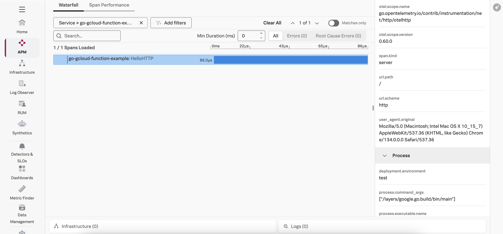

# Instrumenting a Go Google Cloud Run Function with OpenTelemetry (Work in Progress)

This example demonstrates how to instrument an serverless Google Cloud Run function written in
Golang using OpenTelemetry, and then export the data to Splunk Observability
Cloud.  We'll use Go 1.23 for this example, but the steps for other Go versions are
similar.

## Prerequisites

The following tools are required to deploy Go Google Cloud Run functions:

* An Google Cloud Platform account with permissions to create and execute Google Cloud Run functions
* An OpenTelemetry collector that's accessible to the Google Cloud Run function
* [gCloud CLI](https://cloud.google.com/sdk/docs/install)

## Splunk Distribution of the OpenTelemetry Collector

For this example, we deployed the Splunk Distribution of the OpenTelemetry Collector onto a virtual machine
in GCP using Gateway mode, and ensured it's accessible to our Google Cloud Run function.

We configured it with the `SPLUNK_HEC_TOKEN` and `SPLUNK_HEC_URL` environment variables, so that it
exports logs to our Splunk Cloud instance.

Please refer to [Install the Collector using packages and deployment tools](https://docs.splunk.com/observability/en/gdi/opentelemetry/install-the-collector.html#collector-package-install)
for collector installation instructions.

## Application Overview

If you just want to build and deploy the example, feel free to skip this section.

The application used for this example is a simple Hello World application.

### Install Go Modules (Optional)

We used the following commands to add the Go modules required to instrument this application
with OpenTelemetry.  Please note that these commands don't need to be executed again, but are
provided for reference in case you'd like to apply instrumentation to your own Azure function.

Our application uses the `net/http` package so we'll add that with the following command:

````
go get go.opentelemetry.io/contrib/instrumentation/net/http/otelhttp
````

Our application also uses [zap](https://github.com/uber-go/zap) for logging, so we'll add that
as well:

````
go get go.uber.org/zap
````

We then installed the Splunk distribution of OpenTelemetry Go with the following command:

````
go get github.com/signalfx/splunk-otel-go/distro
````

There's no need to run these commands again as you can use the `go.mod` file that
was already created.

## Build and Deploy

Open a terminal and navigate to the following directory:

````
splunk-opentelemetry-examples/instrumentation/go/google-cloud-functions
````

### Initialize the gCloud CLI

If you haven't already done so, [install](https://cloud.google.com/sdk/docs/install)
and [initialize](https://cloud.google.com/sdk/docs/initializing) the gcloud CLI.

### Build and Deploy the Google Cloud Run Function

Use the following command to deploy the Google Cloud Run function, substituting the
[region](https://cloud.google.com/functions/docs/locations)
that's best for you.  To allow OpenTelemetry to send trace data to Splunk Observability Cloud,
we also need to set the `OTEL_EXPORTER_OTLP_ENDPOINT`, `OTEL_SERVICE_NAME`, `OTEL_RESOURCE_ATTRIBUTES`,
and other environment variables as part of the gcloud deploy command:

```bash
gcloud functions deploy go-gcloud-function-example \
    --gen2 \
    --region=us-central1 \
    --runtime=go123 \
    --source=./src \
    --entry-point=HelloHTTP \
    --trigger-http \
    --set-env-vars OTEL_SERVICE_NAME=go-gcloud-function-example,OTEL_EXPORTER_OTLP_ENDPOINT=http://<collector IP address>:4317,OTEL_RESOURCE_ATTRIBUTES=deployment.environment=test
```

Answer "y" to the following question when asked:

````
Allow unauthenticated invocations of new function [python-gcloud-function-example]? (y/N)? 
````

If the function is created successfully, it should provide you with a URL such as the following:

````
https://us-central1-gcp-<account name>.cloudfunctions.net/python-gcloud-function-example
````

### Test the Google Cloud Run Function

Take the URL provided by the gcloud CLI above and enter it into your browser. It should return:

````
Hello World! 
````

### View Traces in Splunk Observability Cloud

After a minute or so, you should start to see traces for the serverless function
appearing in Splunk Observability Cloud:



Note that the bottom-right of the trace includes a button that links to the related log entries.

### Add Trace Context to Logs

Logs generated by a Google Cloud Run function get sent to Google Cloud Logging.
Various methods exist for streaming logs into Splunk platform from Google Cloud Logging,
as described in
[Stream logs from Google Cloud to Splunk](https://cloud.google.com/architecture/stream-logs-from-google-cloud-to-splunk).

Once the logs are in Splunk platform, they can be made available to
Splunk Observability Cloud using Log Observer Connect.

In this example, the Splunk distribution of OpenTelemetry Python also exports logs
to our collector using OTLP.

By following the link from the trace show above, we can see all of the log entries associated
with this trace:


We can see that the log entry includes a trace_id and span_id, which allows us to correlate
logs with traces. 