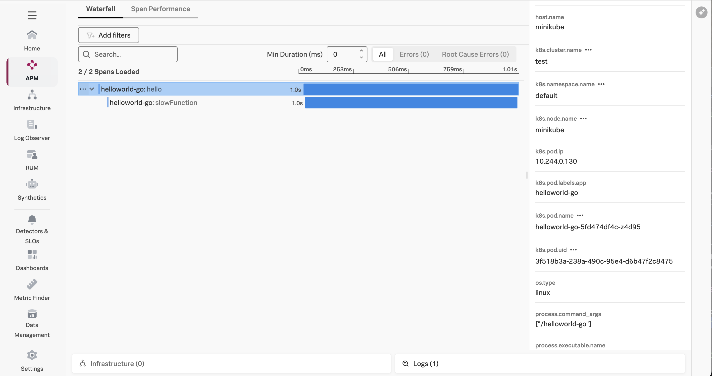
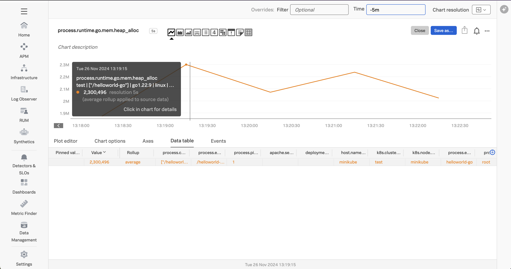
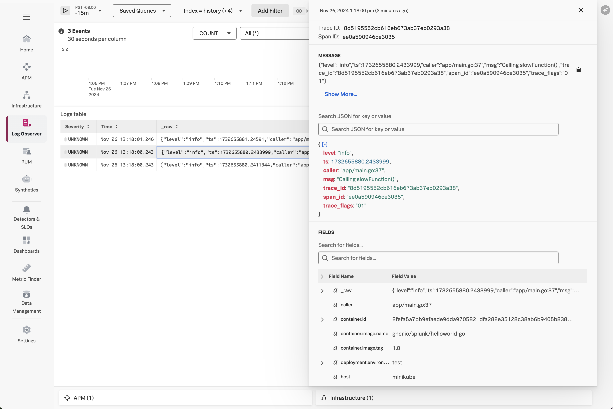

# Instrumenting a Go Application in Kubernetes with OpenTelemetry

This example uses the same sample application that is used in the
[go/linux](../linux) example.

## Prerequisites

The following tools are required to build and deploy the Go application and the
Splunk OpenTelemetry Collector:

* Docker
* Kubernetes
* Helm 3

## Deploy the Splunk OpenTelemetry Collector

This example requires the Splunk Distribution of the OpenTelemetry collector to
be running on the host and available within the Kubernetes cluster.  Follow the
instructions in [Install the Collector for Kubernetes using Helm](https://docs.splunk.com/observability/en/gdi/opentelemetry/collector-kubernetes/install-k8s.html)
to install the collector in your k8s cluster.

If you'd like to capture logs from
the Kubernetes cluster, ensure the HEC URL and HEC token are provided when the
collector is deployed.

Here's an example command that shows how to deploy the collector in Kubernetes using Helm:

````
helm install splunk-otel-collector --set="splunkObservability.accessToken=<Access Token>,clusterName=<Cluster Name>,splunkObservability.realm=<Realm>,gateway.enabled=false,splunkPlatform.endpoint=https://<HEC URL>:443/services/collector/event,splunkPlatform.token=<HEC token>,splunkPlatform.index=<Index>,splunkObservability.profilingEnabled=true,environment=<Environment Name>" splunk-otel-collector-chart/splunk-otel-collector
````

You'll need to substitute your access token, realm, and other information.

## Build and Execute the Application

Open a command line terminal and navigate to the root of the directory.  
For example:

````
cd ~/splunk-opentelemetry-examples/instrumentation/go/linux
````

### Build the Docker image (optional)

To run the application in K8s, we'll need a Docker image for the application.
We've already built one, so feel free to skip this section unless you want to use
your own image.

You can use the following command to build the Docker image:

````
docker build --platform="linux/amd64" -t helloworld-go:1.0 .
````
Ensure that you use a machine with a linux/amd64 architecture to build the image, as there are issues
when the image is built with arm64 architecture.

If you'd like to test the Docker image locally you can use:

````
docker run -p 8080:8080 helloworld-go:1.0 
````

Then access the application by pointing your browser to `http://localhost:8080/hello`.

### Push the Docker image (optional)

We'll then need to push the Docker image to a repository that you have
access to, such as your Docker Hub account.  We've already done this for you,
so feel free to skip this step unless you'd like to use your own image.

Specifically, we've pushed the
image to GitHub's container repository using the following commands:

````
docker tag helloworld-go:1.0 ghcr.io/splunk/helloworld-go:1.0
docker push ghcr.io/splunk/helloworld-go:1.0
````

### Deploy to Kubernetes

Now that we have our Docker image, we can deploy the application to
our Kubernetes cluster.  We'll do this by using the following
kubectl command to deploy the helloworld.yaml manifest file:

````
kubectl apply -f ./helloworld.yaml
````

The helloworld.yaml manifest file adds to this
configuration by setting the following environment variables, to configure how the
Go instrumentation gathers and exports data to the collector running within the cluster:

````
  env:
    - name: PORT
      value: "8080"
    - name: NODE_IP
      valueFrom:
        fieldRef:
          fieldPath: status.hostIP
    - name: OTEL_EXPORTER_OTLP_ENDPOINT
      value: "http://$(NODE_IP):4317"
    - name: OTEL_SERVICE_NAME
      value: "helloworld-go"
````

To test the application, we'll need to get the Cluster IP:

````
kubectl describe svc helloworld-go | grep IP:
````

Then we can access the application by pointing our browser to `http://<IP Address>:81/hello`.

If you're testing with minikube then use the following command to connect to the service:

````
minikube service helloworld-go
````

The application should return "Hello, World!".

### View Traces in Splunk Observability Cloud

After a minute or so, you should start to see traces for the Go application
appearing in Splunk Observability Cloud:



Note that the trace has been decorated with Kubernetes attributes, such as `k8s.pod.name`
and `k8s.pod.uid`.  This allows us to retain context when we navigate from APM to
infrastructure data within Splunk Observability Cloud.

### View Metrics in Splunk Observability Cloud

Metrics are collected by the Splunk Distribution of OpenTelemetry Go automatically.  For example,
the `runtime.go.mem.heap_alloc` metric shows us the bytes of heap objects allocated by the  
Go process:



### View Logs with Trace Context

The OpenTelemetry Collector can be configured to export log data to
Splunk platform using the Splunk HEC exporter.  The logs can then be made
available to Splunk Observability Cloud using Log Observer Connect.  This will
provide full correlation between spans generated by Go instrumentation
with metrics and logs: 


