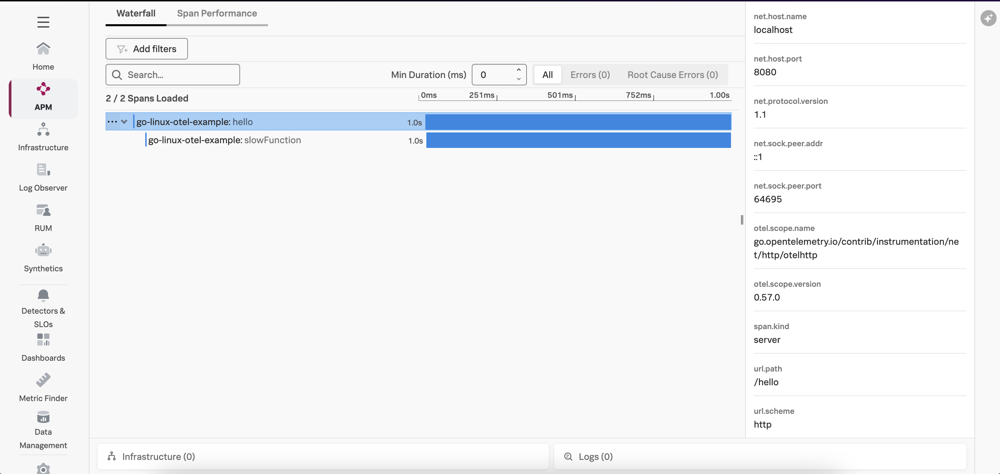
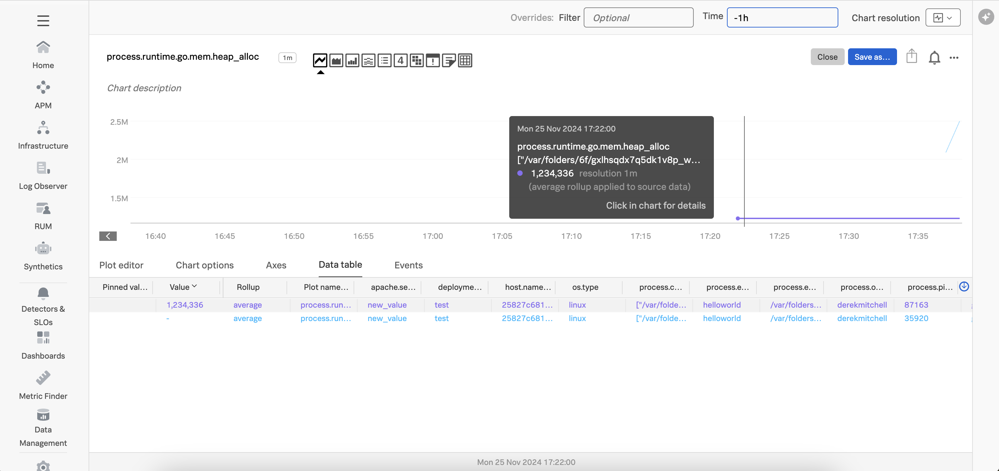

# Instrumenting a Go Application with OpenTelemetry

This example demonstrates how to instrument a Go Application using OpenTelemetry,
and export traces and metrics to a local collector, which will then
export that data to Splunk. We'll use Go 21.4 for this example, but the steps
for other Go versions are similar.

## Prerequisites

The following tools are required to build and execute the Go application:

* Go 21.4
* A Linux-compatible host (such as Ubuntu 24.04, or Mac OS)

## Deploy the Splunk OpenTelemetry Collector

This example requires the Splunk Distribution of the OpenTelemetry collector to
be running on the host and available via http://localhost:4317.  Follow the
instructions in [Install the Collector for Linux with the installer script](https://docs.splunk.com/observability/en/gdi/opentelemetry/collector-linux/install-linux.html#install-the-collector-using-the-installer-script)
to install the collector on your host.

## Build and Execute the Application

Open a command line terminal and navigate to the root of the directory.  
For example:

````
cd ~/splunk-opentelemetry-examples/instrumentation/go/linux
````

### Install Go Modules (Optional)

We used the following commands to add the Go modules required to instrument this application
with OpenTelemetry.  Please note that this doesn't need to be executed again, but is provided for reference in case
you'd like to apply instrumentation to your own application. 

We generated a go.mod file by executing the following command:

````
go mod init example.com/helloworld
```` 

Our application uses the `net/http` package so we'll add that with the following command: 

````
go get go.opentelemetry.io/contrib/instrumentation/net/http/otelhttp
````

Our application uses [zap](https://github.com/uber-go/zap) for logging, so we'll add that 
as well: 

````
go get go.uber.org/zap
````

We then installed the Splunk distribution of OpenTelemetry Go with the following command: 

````
go get github.com/signalfx/splunk-otel-go/distro
````

There's no need to run these commands again as you can use the `go.mod` file that
was already created.

### Configure the Splunk Distribution of OpenTelemetry Go

To configure the instrumentation, we've set the following environment variables:

````
export OTEL_SERVICE_NAME=go-linux-otel-example
export OTEL_RESOURCE_ATTRIBUTES='deployment.environment=test'
````

### Instrument the Go Function

To instrument the Go function with OpenTelemetry, we added the following code to the `main` function:

````
func main() {
    sdk, err := distro.Run()
    if err != nil {
      panic(err)
    }
    // Flush all spans before the application exits
    defer func() {
      if err := sdk.Shutdown(context.Background()); err != nil {
         panic(err)
      }
    }()

    logger, err = zap.NewProduction()
    if err != nil {
            panic(err)
    }
    defer logger.Sync()

    tracer = otel.Tracer("go-linux-otel-example")

    // Wrap the httpHandler function.
    handler := http.HandlerFunc(httpHandler)
    wrappedHandler := otelhttp.NewHandler(handler, "hello")
    http.Handle("/hello", wrappedHandler)

    // And start the HTTP serve.
    log.Fatal(http.ListenAndServe(":8080", nil))
}
````

This activates the Splunk distribution of OpenTelemetry Go and instruments the HTTP handler. 

We also created a logger using [zap](https://github.com/uber-go/zap), which we'll explain in more detail below.

### Customizations to Add Trace Context to Logs

Additional code is required in our example to ensure that the trace context,
which includes the trace_id and span_id attributes, is added to logs generated
by our application.  We followed the example in
[Connect Go trace data with logs for Splunk Observability Cloud](https://docs.splunk.com/observability/en/gdi/get-data-in/application/go/instrumentation/connect-traces-logs.html)
to implement this. 

It requires adding a helper function to extract the trace context from the context.Context object:

````
func withTraceMetadata(ctx context.Context, logger *zap.Logger) *zap.Logger {
        spanContext := trace.SpanContextFromContext(ctx)
        if !spanContext.IsValid() {
                // ctx does not contain a valid span.
                // There is no trace metadata to add.
                return logger
        }
        return logger.With(
                zap.String("trace_id", spanContext.TraceID().String()),
                zap.String("span_id", spanContext.SpanID().String()),
                zap.String("trace_flags", spanContext.TraceFlags().String()),
        )
}
````

We then use the helper function in the HTTP handler to create a custom logger:

````
func httpHandler(w http.ResponseWriter, r *http.Request) {
	ctx := r.Context()
    loggerWithTraceContext := withTraceMetadata(ctx, logger)
````

Now when we use the custom logger in the handler, the trace context will be added:

````
	loggerWithTraceContext.Info("In httpHandler()")
````

### Execute the application

Let's execute the application as follows: 

````
go run . 
````

Access the application by navigating your web browser to the following URL:

````
http://localhost:8080/hello
````

You should receive the following response:

````
Hello, World! 
````

### View Traces in Splunk Observability Cloud

After a minute or so, you should start to see traces for the Go application
appearing in Splunk Observability Cloud:



### View Metrics in Splunk Observability Cloud

Metrics are collected by the Splunk Distribution of OpenTelemetry Go automatically.  For example,
the `runtime.go.mem.heap_alloc` metric shows us the bytes of heap objects allocated by the  
Go process:



### View Logs with Trace Context

Here's an example log entry, which includes the trace_id and span_id:

````
{"level":"info","ts":1732584935.7759821,"caller":"linux/main.go:33","msg":"In httpHandler()","trace_id":"8f4b96dc8eaf4c62c9b4d9df936f585a","span_id":"6efb1226f4da37da","trace_flags":"01"}
````

The OpenTelemetry Collector can be configured to export log data to
Splunk platform using the Splunk HEC exporter.  The logs can then be made
available to Splunk Observability Cloud using Log Observer Connect.  This will
provide full correlation between spans generated by Go instrumentation
with metrics and logs. 