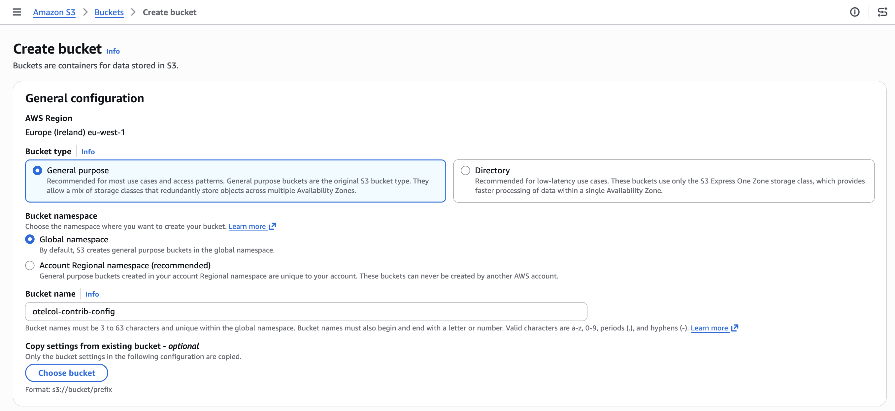
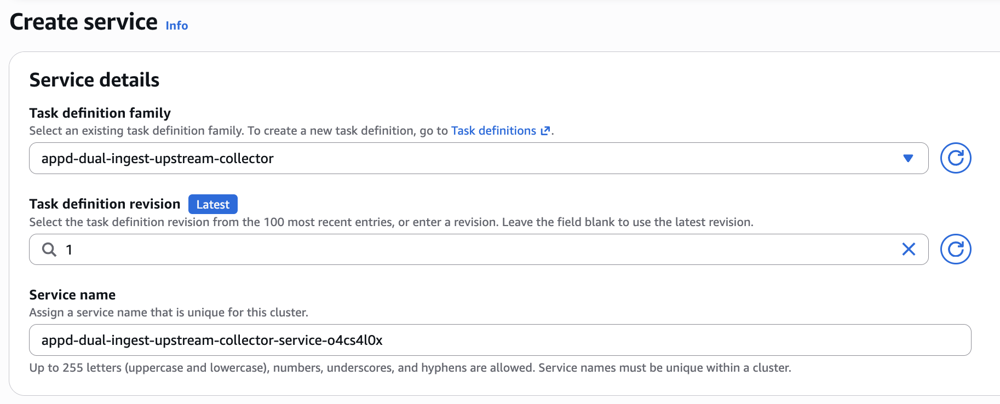
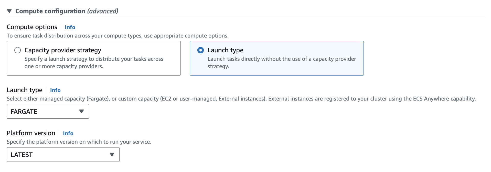
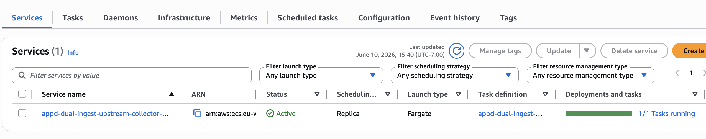
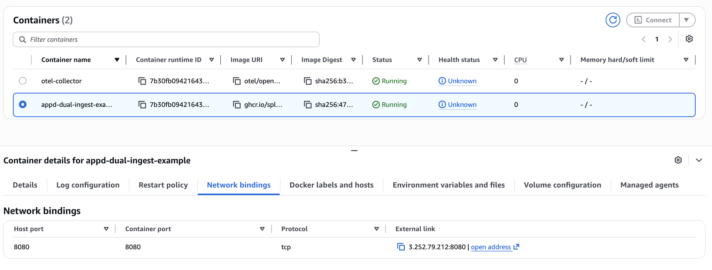

# Instrumenting a Java Application in Amazon ECS with AppD Dual Ingest using the Upstream OpenTelemetry Collector

[Instrumenting a Java Application in Amazon ECS with AppD Dual Ingest](../aws-ecs-appd-dual-ingest/README.md) 
showed how to instrument a Java application running in 
Amazon ECS with the AppDynamics Java agent. Dual ingest mode is enabled 
to send data to both the AppDynamics controller, as well as an 
OpenTelemetry Collector installed as an ECS sidecar task. The collector 
then sends the data to Splunk Observability Cloud. 

This example shows how to do this using the [OpenTelemetry Collector Contrib Distro](https://github.com/open-telemetry/opentelemetry-collector-releases/tree/main/distributions/otelcol-contrib) 
of the collector rather than the Splunk distro. 

We'll demonstrate how to deploy the Java application and OpenTelemetry collector
using ECS Fargate, however EC2 is similar.

## Prerequisites

The following tools are required to build and deploy the Java application and the
Splunk OpenTelemetry Collector:

* Docker
* An AWS account with an ECS cluster and appropriate permissions 
* A Splunk Observability Cloud org with an access token 
* An AppDynamics SaaS tenant 

## Prepare the Application Image (optional)

We've already built an application image for this example. 

Refer to [Instrumenting a Java Application in Amazon ECS with AppD Dual Ingest](../aws-ecs-appd-dual-ingest/README.md) 
if you'd like to build the application image yourself. 

## Upload the Collector Configuration to S3

Using the OpenTelemetry Collector Contrib distro with Splunk Observability Cloud requires 
custom configuration, which can be found [here](https://raw.githubusercontent.com/signalfx/splunk-otel-collector/main/cmd/otelcol/config/collector/upstream_agent_config.yaml). 

For this example, we've taken the sample configuration for the collector contrib, and merged it 
with the [Fargate configuration](https://raw.githubusercontent.com/signalfx/splunk-otel-collector/main/cmd/otelcol/config/collector/fargate_config.yaml) 
which uses the Splunk distro of the collector. 

The result can be found in the file named [upstream_config_ecs_fargate.yaml](./upstream_config_ecs_fargate.yaml). 

For this example, we'll upload this OpenTelemetry Collector configuration file to an S3 bucket. 

Using the AWS Console, ensure you're in the region where you plan to deploy the ECS task. 
Then, navigate to **S3** and click on the **Create bucket** button. 

Give the bucket a name such as `otelcol-contrib-config`: 



Set the desired security settings then click the **Create bucket** button.

Next, upload the [upstream_config_ecs_fargate.yaml](./upstream_config_ecs_fargate.yaml) file
to your S3 bucket. Make a note of the S3 URI for this file, which will be something 
like `s3://otelcol-contrib-config/upstream_config_ecs_fargate.yaml`

## Create an IAM Roles

### Create the ECS Task Role

Next, we need to ensure that our ECS task has the ability to read the collector configuration 
from S3. To do this, we can create a new IAM role called `ecsTaskRole`. 

In the AWS console, navigate to **IAM**. Then click **Roles** and **Create Role**.  

Select `AWS Service` as the **Trusted Entity Type**. For **Service or use case**, 
choose **Elastic Container Service**, and then choose the **Elastic Container Service Task** use case.

Click **Next**, then add the `AmazonS3ReadOnlyAccess` permission policy. For production, we'd want to use a
more restrictive role, giving access only to the S3 buckets needed. 

Click **Next** then give the role a name such as `ecsTaskRole` and click **Create Role**. 

### Create the ECS Task Execution Role

Follow the steps above to create another new IAM role called `ecsTaskExecutionRole` with
the following permissions policies: 

* `AmazonECSTaskExecutionRolePolicy`

## Update the ECS Task Definition 

The next step is to update the ECS Task definition for our application. 

For our application container, we first need to add several environment variables: 

````
   "environment": [
       {
           "name": "APPD_APP_NAME",
           "value": "aws-ecs-appd-dual-ingest-example"
       },
       {
           "name": "APPD_TIER_NAME",
           "value": "OrderService"
       },
       {
           "name": "APPD_NODE_NAME",
           "value": "OrderService-Node"
       },       {
           "name": "APPD_CONTROLLER_HOST",
           "value": "your_appd_controller_host"
       },
       {
           "name": "APPD_ACCOUNT_NAME",
           "value": "your_appd_account_name"
       },
       {
           "name": "APPD_ACCESS_KEY",
           "value": "your_appd_access_key"
       },
       {
            "name": "OTEL_SERVICE_NAME",
            "value": "OrderService"
       },
       {
           "name": "OTEL_RESOURCE_ATTRIBUTES",
           "value": "service.namespaceaws-ecs-appd-dual-ingest-example,deployment.environment=aws-ecs-appd-dual-ingest-example,deployment.environment.name=aws-ecs-appd-dual-ingest-example"
       }
   ],
````

We then need to add a second container to the ECS task definition for the 
Splunk distribution of the OpenTelemetry Collector. Update the command to 
use your S3 URI: 

````
   "name": "otel-collector",
   "image": "otel/opentelemetry-collector-contrib:latest",
   "cpu": 0,
   "portMappings": [],
   "essential": true,
   "command": ["--config=s3://otelcol-contrib-config.s3.eu-west-1.amazonaws.com/upstream_config_ecs_fargate.yaml"],
   "environment": [
                {
                    "name": "SPLUNK_ACCESS_TOKEN",
                    "value": "<Access Token>"
                },
                {
                    "name": "SPLUNK_API_URL",
                    "value": "https://api.us1.observability.splunkcloud.com"
                },
                {
                    "name": "SPLUNK_REALM",
                    "value": "us1"
                },
                {
                    "name": "SPLUNK_MEMORY_LIMIT_MIB",
                    "value": "512"
                },
                {
                    "name": "SPLUNK_LISTEN_INTERFACE",
                    "value": "0.0.0.0"
                },
                {
                    "name": "SPLUNK_INGEST_URL",
                    "value": "https://ingest.us1.observability.splunkcloud.com"
                }
````

We've prepared a [task-definition.json](./task-definition.json) file that you can 
use as an example.  Open this file for editing, and update environment variables as 
required for your environment. 

## Deploy to Amazon ECS 

We have what we need now to deploy our task definition to Amazon ECS. 

So navigate to the AWS console and go to the Amazon Elastic Container Service page.  Assuming
that you've already got an ECS cluster setup, click on Task definitions and then 
Create a new task definition from JSON.  Copy and paste your task-definition.json file as
in the following screenshot: 


Once the task definition is created successfully, navigate to the ECS cluster 
where you'd like to deploy the application, then create a new service:



Specify "FARGATE" as the launch type: 



While this goes beyond the scope of this example, you may need to configure 
the networking details for the service, such as the VPC and subnet it belongs to, 
as well as the security group to allow traffic on port 8080.  We'll configure 
the service to use a public IP address and put it in a public subnet for our testing, 
though in production it would be better to put a load balancer in front of the service. Refer to
[Connect Amazon ECS applications to the internet](https://docs.aws.amazon.com/AmazonECS/latest/developerguide/networking-outbound.html) for
further details.

It will take a few minutes to deploy the service.  But once it's up and running, 
it should look like this in the AWS console: 



Let's get the IP address for the application container: 



If you're using a load balancer for your deployment, then use the load balancer IP instead. 

Using the command line terminal, set the ECS IP address in an environment variable: 

```bash
export ECS_IP_ADDRESS=your_ecs_ip_address
```

Then run the following commands a few times to generate application load: 

```bash
curl -s http://${ECS_IP_ADDRESS}:8080/order
curl -s http://${ECS_IP_ADDRESS}:8080/inventory/check
```

## View Trace Data

Refer to [Instrumenting a Java Application in Amazon ECS with AppD Dual Ingest](../aws-ecs-appd-dual-ingest/README.md) 
for an example of what the APM Data looks like in AppDynamics, and what the trace data should look like 
in Splunk Observability Cloud. The resulting data is the same, regardless of which distro of the 
OpenTelemetry collector is used. 
