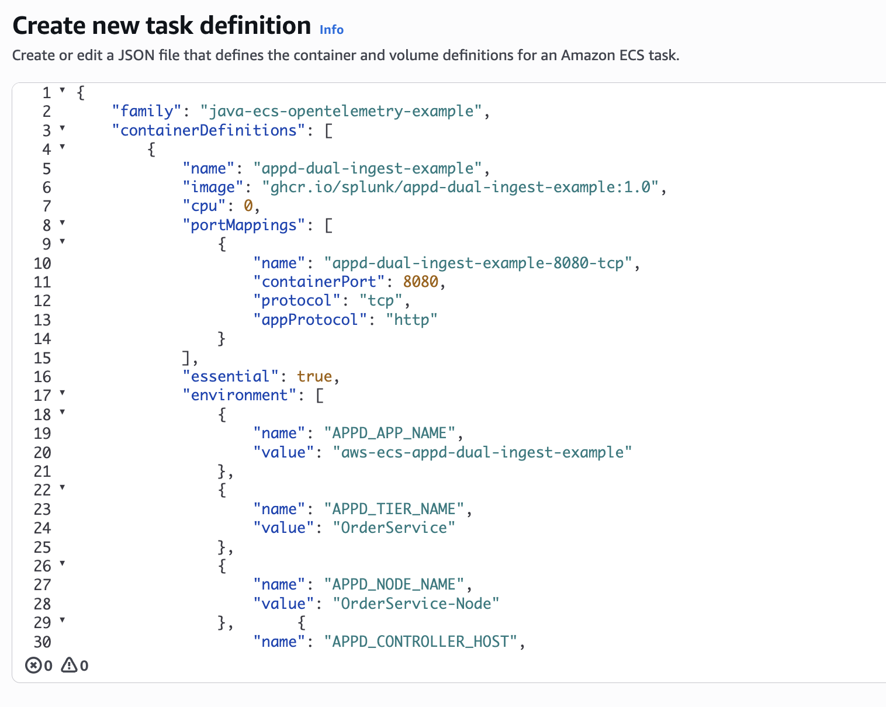
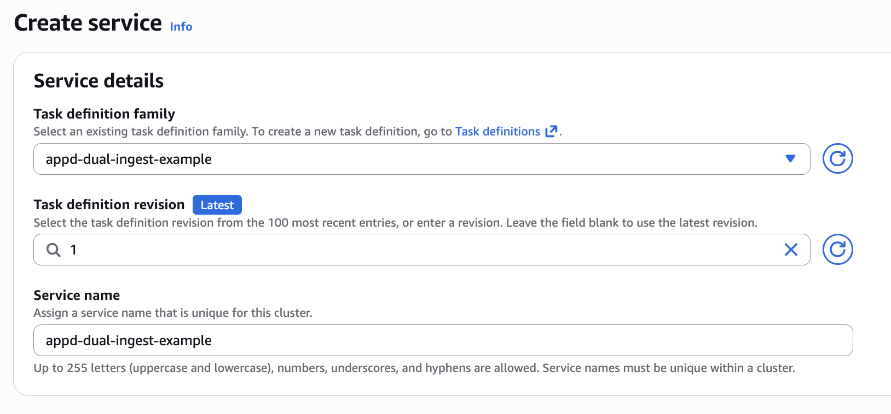
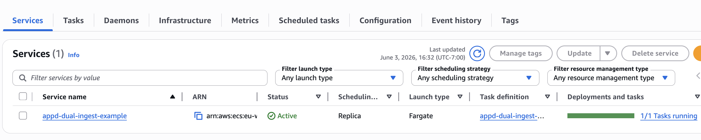
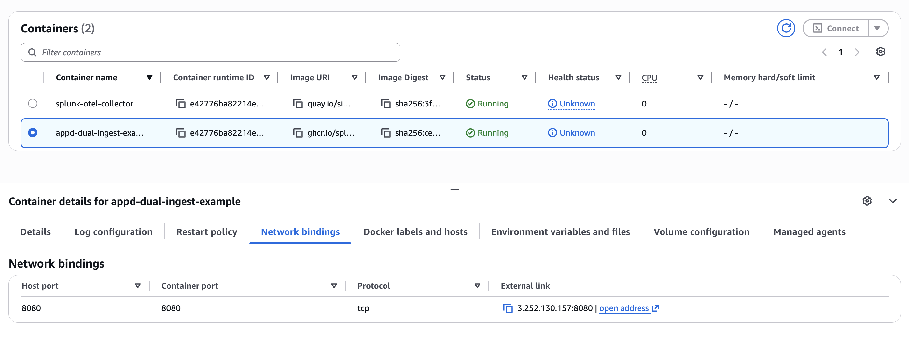
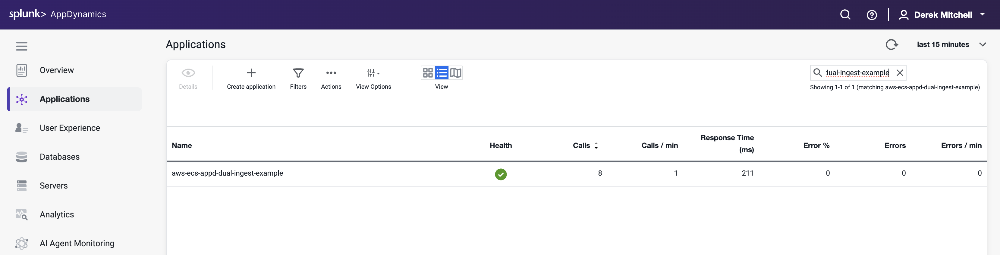
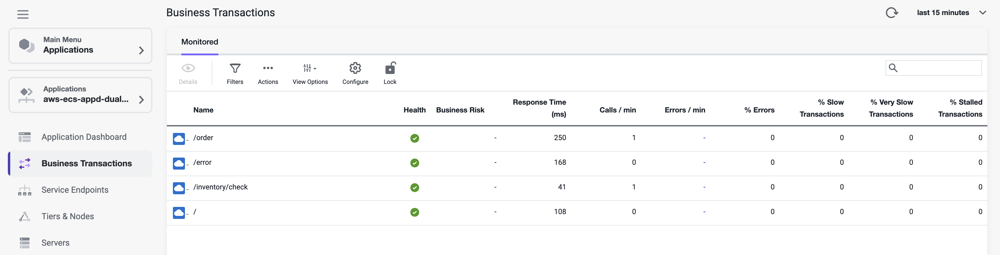
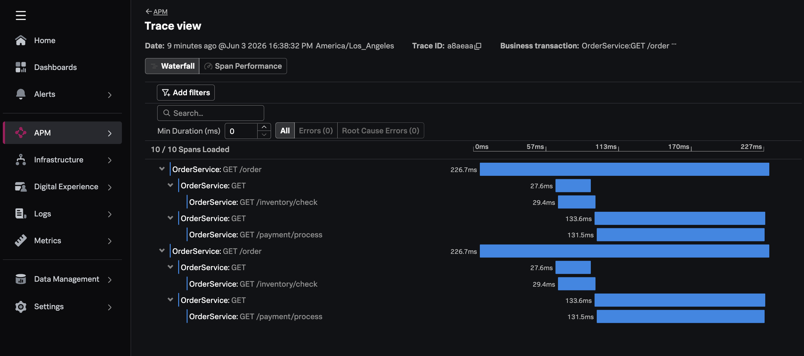

# Instrumenting a Java Application in Amazon ECS with AppD Dual Ingest

This example shows how to instrument a Java application running in 
Amazon ECS with the AppDynamics Java agent. Dual ingest mode is enabled 
to send data to both the AppDynamics controller, as well as an 
OpenTelemetry Collector installed as an ECS sidecar task. The collector 
then sends the data to Splunk Observability Cloud. 

This approach lets you maintain full AppDynamics functionality while 
streaming the same telemetry to Splunk Observability Cloud through 
an OpenTelemetry Collector.

## Prerequisites

The following tools are required to build and deploy the Java application and the
Splunk OpenTelemetry Collector:

* Docker
* An AWS account with an ECS cluster and appropriate permissions 
* A Splunk Observability Cloud org with an access token 
* An AppDynamics SaaS tenant 

## Introduction to Amazon ECS

Amazon Elastic Container Service (Amazon ECS) is a managed orchestration service 
that allows you to deploy and scale containerized applications. 

It comes in two flavors: 

* EC2: containers are deployed onto EC2 instances that are provisioned for your ECS cluster
* Fargate: containers are deployed in a serverless manner

We'll demonstrate how to deploy the Java application and OpenTelemetry collector 
using ECS Fargate, however EC2 is similar.

## Prepare the Application Image 

We used the following steps to build a Docker image for the 
example application.

### Build the Docker image (optional)

To run the application in ECS, we'll need a Docker image for the application.
We've already built one, so feel free to skip this section unless you want to use
your own image.

You can use the following command to build the Docker image:

````
docker build --platform="linux/amd64" -t appd-dual-ingest-example:1.0 app
````

Note that the [Dockerfile](./app/Dockerfile) adds the latest version of the AppD Java agent
to the container image, and then includes it as part of the java startup
command when the container is launched. 

The startup command included in the Dockerfile 
references environment variables to set the AppDynamics host name, 
application name, tier name, and node name. The OpenTelemetry resource 
attributes are also set in the command. 

```Dockerfile
ENTRYPOINT ["sh", "-c", "exec java \
  -javaagent:/app/agent/javaagent.jar \
  -Dappdynamics.controller.hostName=${APPD_CONTROLLER_HOST} \
  -Dappdynamics.controller.port=443 \
  -Dappdynamics.controller.ssl.enabled=true \
  -Dappdynamics.agent.applicationName=${APPD_APP_NAME} \
  -Dappdynamics.agent.tierName=${APPD_TIER_NAME} \
  -Dappdynamics.agent.nodeName=${APPD_NODE_NAME} \
  -Dappdynamics.agent.accountName=${APPD_ACCOUNT_NAME} \
  -Dappdynamics.agent.accountAccessKey=${APPD_ACCESS_KEY} \
  -Dagent.deployment.mode=dual \
  -Dotel.traces.exporter=otlp \
  -Dotel.exporter.otlp.endpoint=http://localhost:4318 \
  -Dotel.resource.attributes=${OTEL_RESOURCE_ATTRIBUTES} \
  -jar /app/app.jar"]
```

If you'd like to test the Docker image locally, set the environment variables first, 
replacing the appropriate values for AppD controller host, account name, and access key: 

```bash
APPD_APP_NAME="aws-ecs-appd-dual-ingest-example" \
    APPD_TIER_NAME="OrderService" \
    APPD_NODE_NAME="OrderService-Node" \
    APPD_CONTROLLER_HOST="your_appd_controller_host" \
    APPD_ACCOUNT_NAME="your_appd_account_name" \
    APPD_ACCESS_KEY="your_appd_access_key" \
    OTEL_RESOURCE_ATTRIBUTES="service.name=OrderService,service.namespaceaws-ecs-appd-dual-ingest-example,deployment.environment=aws-ecs-appd-dual-ingest-example,deployment.environment.name=aws-ecs-appd-dual-ingest-example"
```

Then run the Docker image with the following command: 

```bash
docker run \
    -e APPD_APP_NAME=$APPD_APP_NAME \
    -e APPD_TIER_NAME=$APPD_TIER_NAME \
    -e APPD_NODE_NAME=$APPD_NODE_NAME \
    -e APPD_CONTROLLER_HOST=$APPD_CONTROLLER_HOST \
    -e APPD_ACCOUNT_NAME=$APPD_ACCOUNT_NAME \
    -e APPD_ACCESS_KEY=$APPD_ACCESS_KEY \
    -e OTEL_RESOURCE_ATTRIBUTES=$OTEL_RESOURCE_ATTRIBUTES \
    -p 8080:8080 \
    appd-dual-ingest-example:1.0
```

Then access the application by pointing your browser to [http://localhost:8080/health](http://localhost:8080/health).

### Push the Docker image (optional)

We'll then need to push the Docker image to a repository that you have
access to, such as your Docker Hub account.  We've already done this for you,
so feel free to skip this step unless you'd like to use your own image.

Specifically, we've pushed the
image to GitHub's container repository using the following commands:

````
docker tag appd-dual-ingest-example:1.0 ghcr.io/splunk/appd-dual-ingest-example:1.0
docker push ghcr.io/splunk/appd-dual-ingest-example:1.0
````


## Update the ECS Task Definition 

The next step is to update the ECS Task definition for our application. 

For our application container, we first need to add several environment variables: 

````
   "environment": [
       {
           "name": "APPD_APP_NAME",
           "value": "aws-ecs-appd-dual-ingest-example"
       },
       {
           "name": "APPD_TIER_NAME",
           "value": "OrderService"
       },
       {
           "name": "APPD_NODE_NAME",
           "value": "OrderService-Node"
       },       {
           "name": "APPD_CONTROLLER_HOST",
           "value": "your_appd_controller_host"
       },
       },       {
           "name": "APPD_ACCOUNT_NAME",
           "value": "your_appd_account_name"
       },
       {
           "name": "APPD_ACCESS_KEY",
           "value": "your_appd_access_key"
       },
       {
           "name": "OTEL_RESOURCE_ATTRIBUTES",
           "value": "service.name=OrderService,service.namespaceaws-ecs-appd-dual-ingest-example,deployment.environment=aws-ecs-appd-dual-ingest-example,deployment.environment.name=aws-ecs-appd-dual-ingest-example"
       }
   ],
````

We then need to add a second container to the ECS task definition for the 
Splunk distribution of the OpenTelemetry Collector: 

````
   "name": "splunk-otel-collector",
   "image": "quay.io/signalfx/splunk-otel-collector:latest",
   "cpu": 0,
   "portMappings": [],
   "essential": true,
   "environment": [
       {
           "name": "SPLUNK_CONFIG",
           "value": "/etc/otel/collector/fargate_config.yaml"
       },
       {
           "name": "SPLUNK_REALM",
           "value": "<Realm - us0, us1, etc>"
       },
       {
           "name": "SPLUNK_ACCESS_TOKEN",
           "value": "<Access Token>"
       },
       {
           "name": "ECS_METADATA_EXCLUDED_IMAGES",
           "value": "[\"quay.io/signalfx/splunk-otel-collector:latest\"]"
       }
````

We've prepared a [task-definition.json](./task-definition.json) file that you can 
use as an example.  Open this file for editing, and replace the: 

* \<AppD Controller Host\>
* \<AppD Account Name\>
* \<AppD Access Key\>
* \<Splunk Realm\>
* \<Access Token\>
* \<AWS Region\>
* \<AWS Account ID\>

placeholders with appropriate values for your environment. 

## Deploy to Amazon ECS 

We have what we need now to deploy our task definition to Amazon ECS. 

So navigate to the AWS console and go to the Amazon Elastic Container Service page.  Assuming
that you've already got an ECS cluster setup, click on Task definitions and then 
Create a new task definition from JSON.  Copy and paste your task-definition.json file as
in the following screenshot: 



Once the task definition is created successfully, navigate to the ECS cluster 
where you'd like to deploy the application, then create a new service:



Specify "FARGATE" as the launch type: 


While this goes beyond the scope of this example, you may need to configure 
the networking details for the service, such as the VPC and subnet it belongs to, 
as well as the security group to allow traffic on port 8080.  We'll configure 
the service to use a public IP address and put it in a public subnet for our testing, 
though in production it would be better to put a load balancer in front of the service. Refer to
[Connect Amazon ECS applications to the internet](https://docs.aws.amazon.com/AmazonECS/latest/developerguide/networking-outbound.html) for
further details.

It will take a few minutes to deploy the service.  But once it's up and running, 
it should look like this in the AWS console: 



Let's get the IP address for the application container: 



If you're using a load balancer for your deployment, then use the load balancer IP instead. 

Using the command line terminal, set the ECS IP address in an environment variable: 

```bash
export ECS_IP_ADDRESS=your_ecs_ip_address
```

Then run the following commands a few times to generate application load: 

```bash
curl -s http://${ECS_IP_ADDRESS}:8080/order
curl -s http://${ECS_IP_ADDRESS}:8080/inventory/check
```

## View APM Data in AppDynamics

Open the AppDynamics UI, and search for the application named 
`aws-ecs-appd-dual-ingest-example`: 



When you open the application, the flow map should look like the following: 


You should see several business transactions, such as `/order` and `/inventory/check`:



## View Traces in Splunk Observability Cloud

Next, open the Observability Cloud UI. Navigate to `APM` -> `Overview` and filter 
on the environment named `aws-ecs-appd-dual-ingest-example`:


Then, click on the `Business Transactions` tab. You'll see the same business transactions 
we saw earlier in AppD: 


Next, click on traces and select one of the traces for `GET /order`:



Note that the trace has been decorated with Kubernetes attributes, such as `aws.ecs.cluster.arn`.  
This allows us to retain context when we navigate from APM to
infrastructure data within Splunk Observability Cloud. 
