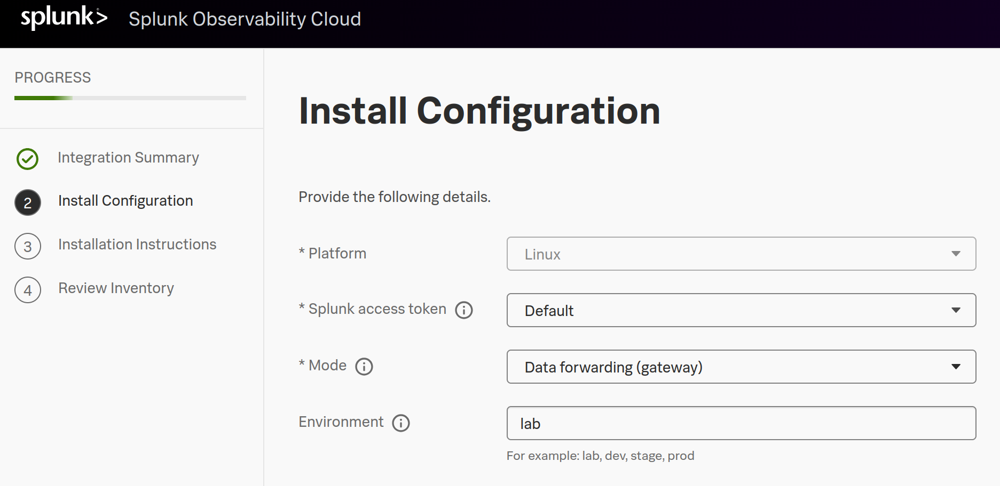

# Instrumenting a Java Application in Amazon ECS with OpenTelemetry

This example is based on the main [aws-ecs](../aws-ecs/) example. You will need to reference it while following these steps.

This specific example provides guidance on how to implement an ecs fargate application without the OTel Collector sidecar.

One way to accomplish this is with an OTel Collector Gateway. In this example we will deploy the gateway on an AWS EC2 host, that will apply metadata that ensures the host metadata is not counted (given Fargate is serverless).

## Similar Steps

To implement this, follow a similar process from the source material, including:
* Create the ecs cluster
* Create the task definition
* Create the service in the cluster

However, importantly some of the steps will be modified below.

## New Step: Create OTel Collector Gateway

Create an ec2/linux host, and install a new collector in gateway mode:


Once deployed, we need to make changes to the `/etc/otel/collector/gateway_config.yaml` file:

* Add processor

This attributes processor will apply the metadata needed to count properly.

```
processors:
  attributes/ecs:
    actions:
    - key: "cloud.provider"
      action: insert
      value: "aws"
    - key: "cloud.platform"
      action: insert
      value: "aws_ecs"
    - key: "aws.ecs.launchtype"
      action: insert
      value: "fargate"
```

* Add this to the traces pipeline

Now apply this to the pipeline

> :warning: It's really important that you are only applying this to the ECS Fargate applications. If you are doing this with an existing gateway you can setup a separate pipeline for those traces. There are other processors that can help with routing that is beyond the scope of this example.

* Add the new processor to the pipeline

Just add the new processor to the pipeline. For example:

```
service:
  pipelines:
    traces:
      receivers: [jaeger, otlp, zipkin]
      processors:
      - memory_limiter
      - batch
      - attributes/ecs
      exporters: [otlphttp]
```

Restart the collector, and we have a gateway listening on `http://<Gateway Host>:4318` for otlp (http).

## Create the ecs cluster

Create the cluster the same way, with Fargate instances.

## Create the task definition

For the task definition scenario we are making 2 changes:
* Removing the sidecar otel collector
* Adding an environment variable to send traces to the new gateway

See the example [task-definition.json](task-definition.json), and replace the following:

* \<Splunk Realm\>
* \<Access Token\>
* \<AWS Region\>
* \<AWS Account ID\>

and the new gateway

* \<Gateway Host\>

## Create the service in the cluster

Finally create the service as usual.

## Summary

Now access the application as usual. You should see that these services are not impacting the number of hosts reporting.