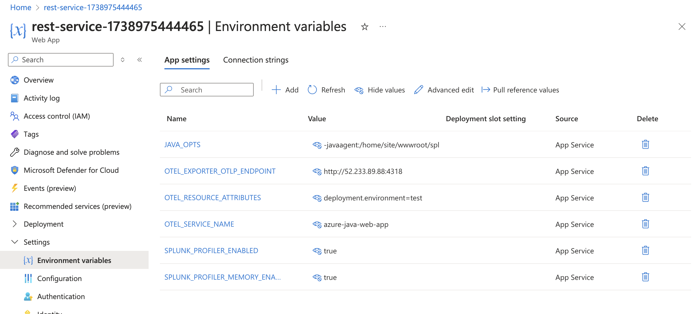
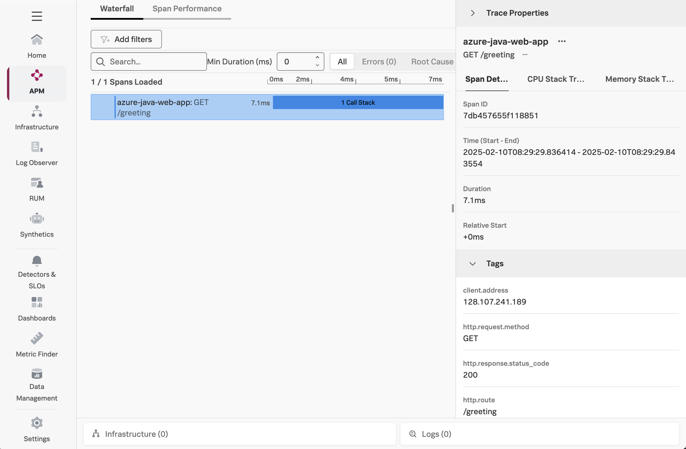
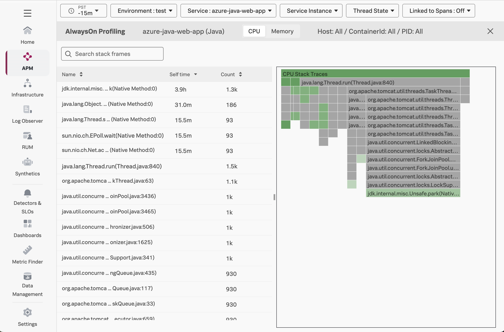
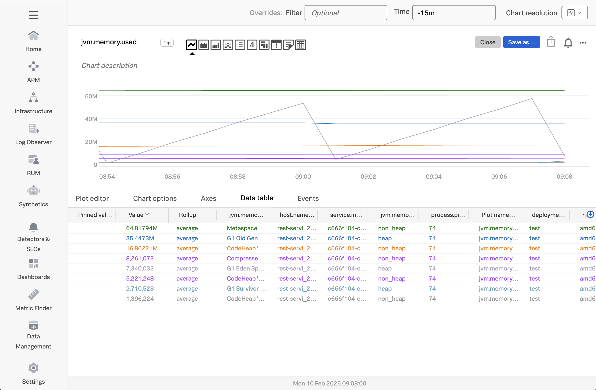

# Instrumenting a Java Application on Azure App Service with OpenTelemetry

This example demonstrates how to instrument a Java Application on Azure 
App  Service using OpenTelemetry,
and export traces, metrics, and logs to a collector running in Azure, which will then
export that data to Splunk. 

We'll show how the splunk-otel-javaagent.jar file can be uploaded to Azure and added
to the application startup command.

The example application is based on the [default Spring Boot web application template](https://github.com/rd-1-2022/rest-service), 
and the deployment steps are based on [Quickstart: Create a Java app on Azure App Service](https://learn.microsoft.com/en-us/azure/app-service/quickstart-java?tabs=springboot&pivots=java-javase). 

## Prerequisites

The following tools are required to build and deploy the Java application to Azure:

* Java 17+ JDK
* [Maven](https://maven.apache.org/install.html)
* An Azure account with permissions to create and execute Azure web applications
* [Azure CLI](https://learn.microsoft.com/en-us/cli/azure/install-azure-cli)

## Splunk Distribution of the OpenTelemetry Collector

For this example, we deployed the Splunk Distribution of the OpenTelemetry Collector onto a virtual machine
in Azure using Gateway mode, and ensured it's accessible to our Azure function.

We configured it with the `SPLUNK_HEC_TOKEN` and `SPLUNK_HEC_URL` environment variables, so that it
exports logs to our Splunk Cloud instance.

Please refer to [Install the Collector using packages and deployment tools](https://docs.splunk.com/observability/en/gdi/opentelemetry/install-the-collector.html#collector-package-install)
for collector installation instructions.

## Authenticate with Azure

Open a command line terminal and use the following command to authenticate with Azure: 

``` bash
az login
```

## Configure the Maven Plugin

We'll use the Maven plugin to deploy our Java application to Azure.  In order to do this, we'll
need to configure it first with the following command: 

``` bash
mvn com.microsoft.azure:azure-webapp-maven-plugin:2.13.0:config
```

When prompted, provide the following inputs: 

* Create new configuration: `Y`
* Define value for OS: `2` (for Linux)
* Define value for javaVersion: `1` (for Java 17)
* Define value for pricingTier: `3` (for P1v2)
* Confirm: `Y`

## Create Azure SQL Database

This example uses an Azure SQL database.  Follow the instructions 
[here](https://learn.microsoft.com/en-us/azure/azure-sql/database/connect-query-java?view=azuresql#prepare-the-working-environment) 
to create the database.  Ensure firewall rules are set so that it's accessible 
from the Azure app service we'll be creating below. 

Once the database is created, connect to it using the Query Editor in the Azure console, 
then create the following table: 

``` sql
  CREATE TABLE SiteActivity (
      SiteActivityID INT IDENTITY(1,1) PRIMARY KEY,
      Name NVARCHAR(256) NOT NULL,
      ActivityDate DATE
  );
```

## Build and Deploy the Java application to Azure

Let's build the application with Maven: 

``` bash
mvn clean package
```

And then deploy it to Azure: 

``` bash
mvn azure-webapp:deploy
```

## Test the Application

Point your browser to `http://<appName>.azurewebsites.net/greeting` to test the application.

> Note: you'll need to substitute your application name into the above URL, which was provided as 
> an output from the earlier Maven command used to deploy the application. 

You should see output such as the following: 

````
{"id":1,"content":"Hello, World!"}
````

## Download the latest splunk-otel-javaagent.jar file

Let's download the latest splunk-otel-javaagent.jar file, which we'll use
to instrument our Java application:

````
curl -L https://github.com/signalfx/splunk-otel-java/releases/latest/download/splunk-otel-javaagent.jar \
-o splunk-otel-javaagent.jar
````

## Upload splunk-otel-javaagent.jar

To instrument our Java application running in Azure with OpenTelemetry, we'll 
need to upload the `splunk-otel-javaagent.jar` file to Azure with the following 
command: 

``` bash 
az webapp deploy --src-path splunk-otel-javaagent.jar \
    --type static \
    --target-path /home/site/wwwroot/splunk-otel-javaagent.jar \
    --resource-group <resource group name> \
    --name <app name>
```

> Note: you'll need to substitute the resource group name and app name for your application 
> before running the above command.

## Set Environment Variables

Next, we'll set the following environment variables, which tells `splunk-otel-javaagent.jar`
what data to collect and where to send it: 

* `JAVA_OPTS`: `-javaagent:/home/site/wwwroot/splunk-otel-javaagent.jar`
* `OTEL_SERVICE_NAME`: `azure-java-web-app`
* `OTEL_EXPORTER_OTLP_ENDPOINT`: `http(s)://<collector URL>:4318`
* `OTEL_RESOURCE_ATTRIBUTES`: `deployment.environment=test`
* `SPLUNK_PROFILER_ENABLED`: `true`
* `SPLUNK_PROFILER_MEMORY_ENABLED`: `true`
* `SPLUNK_TRACE_RESPONSE_HEADER_ENABLED`: `true`
* `DATABASE_URL`: `jdbc:sqlserver://<database host>.database.windows.net:1433;database=<database name>;user=<database user>@<database name>;password=<database password>;encrypt=true;trustServerCertificate=false;hostNameInCertificate=*.database.windows.net;loginTimeout=30;`

> Note: remember to substitute the URL for your collector, and the database host, username, and password. 

The environment variables should look like the following in Azure: 



The approach used to upload `splunk-otel-javaagent.jar` to Azure and activate it by setting the `JAVA_OPTS` environment
variable is based on the steps in [Manually upgrade the monitoring extension/agent](https://learn.microsoft.com/en-us/azure/azure-monitor/app/codeless-app-service?tabs=java#manually-upgrade-the-monitoring-extensionagent).

> Important: Setting `JAVA_OPTS` requires Application Insights to be disabled in the Azure portal for the application being
> monitored.  If this is not possible, then follow the steps in
> [Manually upgrade the monitoring extension/agent](https://learn.microsoft.com/en-us/azure/azure-monitor/app/codeless-app-service?tabs=java#manually-upgrade-the-monitoring-extensionagent) 
> to include `-javaagent:/home/site/wwwroot/splunk-otel-javaagent.jar` in the Startup Command instead. 

Note that we've enabled both the CPU and memory profiler, so we can utilize the
AlwaysOn Profiling capabilities.

## Test the Application

Access the application by navigating your web browser to the following URL:

````
http://<appName>.azurewebsites.net/greeting
````

As before, you should see output such as the following:

````
{"id":1,"content":"Hello, World!"}
````

### View Traces in Splunk Observability Cloud

After a minute or so, you should start to see traces for the Java application
appearing in Splunk Observability Cloud:



### View AlwaysOn Profiling Data in Splunk Observability Cloud

You should also see profiling data appear:



### View Metrics in Splunk Observability Cloud

Metrics are collected by splunk-otel-javaagent.jar automatically.  For example,
the `jvm.memory.used` metric shows us the amount of memory used in the JVM
by type of memory:



### View Logs with Trace Context

The Splunk Distribution of OpenTelemetry Java automatically adds trace context
to logs. However, it doesn't add this context to the actual log file (unless
you explicitly configure the logging framework to do so).  Instead, the trace
context is added behind the scenes to the log events exported to the
OpenTelemetry Collector.

For example, if we add the debug exporter to the logs pipeline of the collector,
we can see that the trace_id and span_id have been added to the following log event
for our application:

````
Feb 10 16:15:59 splunk-otel-collector otelcol[776]: ScopeLogs #0
Feb 10 16:15:59 splunk-otel-collector otelcol[776]: ScopeLogs SchemaURL:
Feb 10 16:15:59 splunk-otel-collector otelcol[776]: InstrumentationScope org.springframework.web.servlet.DispatcherServlet
Feb 10 16:15:59 splunk-otel-collector otelcol[776]: LogRecord #0
Feb 10 16:15:59 splunk-otel-collector otelcol[776]: ObservedTimestamp: 2025-02-10 16:15:59.063905628 +0000 UTC
Feb 10 16:15:59 splunk-otel-collector otelcol[776]: Timestamp: 2025-02-10 16:15:59.063822027 +0000 UTC
Feb 10 16:15:59 splunk-otel-collector otelcol[776]: SeverityText: INFO
Feb 10 16:15:59 splunk-otel-collector otelcol[776]: SeverityNumber: Info(9)
Feb 10 16:15:59 splunk-otel-collector otelcol[776]: Body: Str(Initializing Servlet 'dispatcherServlet')
Feb 10 16:15:59 splunk-otel-collector otelcol[776]: Trace ID: 551fa951d47e609c046e23dbef393c03
Feb 10 16:15:59 splunk-otel-collector otelcol[776]: Span ID: c62ad3bd39da28ec
Feb 10 16:15:59 splunk-otel-collector otelcol[776]: Flags: 1
````

The OpenTelemetry Collector can be configured to export log data to
Splunk platform using the Splunk HEC exporter.  The logs can then be made
available to Splunk Observability Cloud using Log Observer Connect.  This will
provide full correlation between spans generated by Java instrumentation
with metrics and logs. 