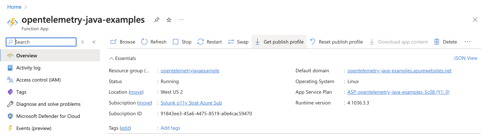
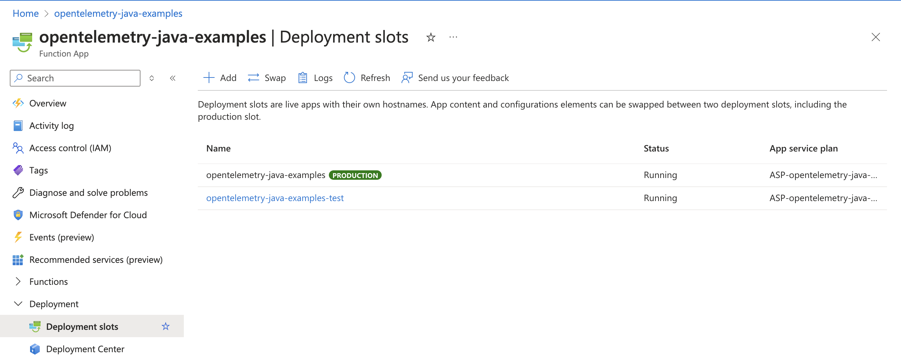
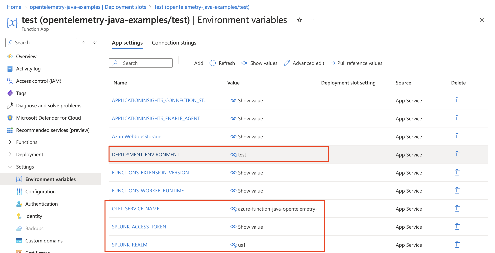
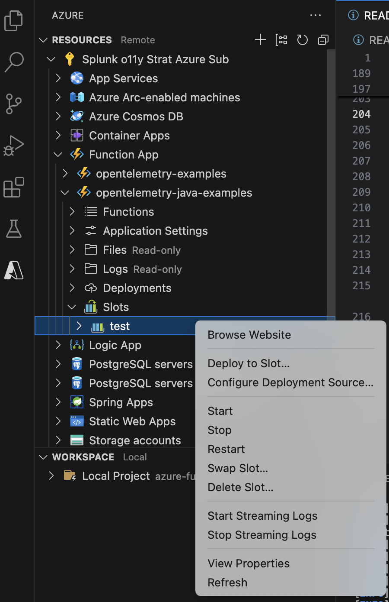
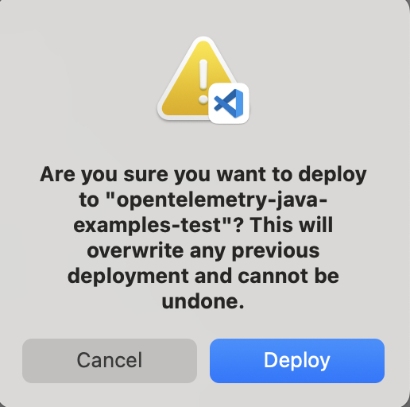
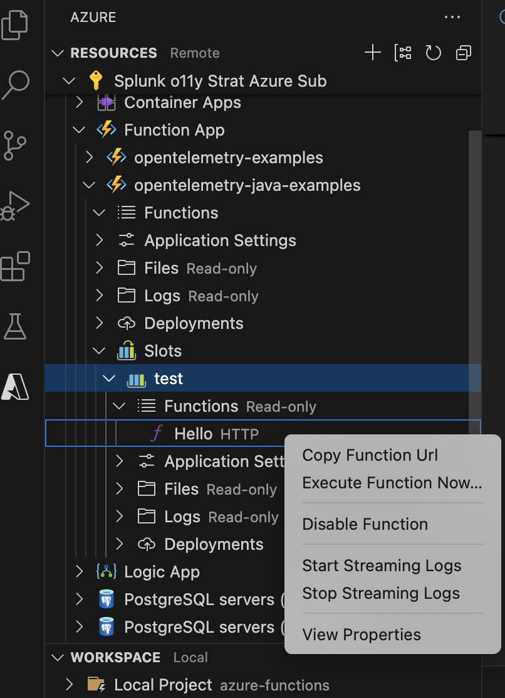
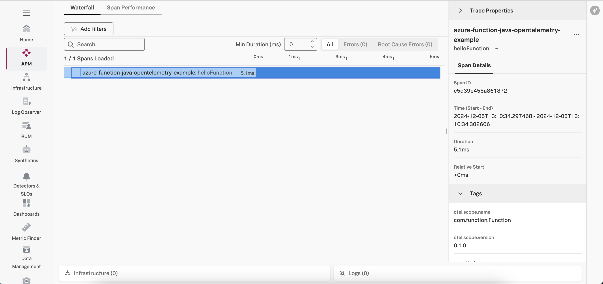

# Instrumenting a Java Azure Function with OpenTelemetry

This example demonstrates how to instrument an serverless Azure function written in
Java using OpenTelemetry, and then export the data to Splunk Observability
Cloud.  We'll use Java 21 for this example, but the steps earlier Java versions are
similar.

## Prerequisites

The following tools are required to deploy Java Azure functions:

* An Azure account with permissions to create and execute Azure functions
* [Visual Studio Code](https://code.visualstudio.com/)
* Azure Functions extension for Visual Studio Code (installed using Visual Studio Code)
* Java Platform extension for Visual Studio Code (installed using Visual Studio Code)

## Application Overview

If you just want to build and deploy the example, feel free to skip this section.

The application used for this example is a simple Hello World application.

We added a helper class named [SplunkTelemetryConfiguration](./src/main/java/com/function/SplunkTelemetryConfigurator.java), and included code to assist with initializing the OpenTelemetry SDK: 

````
    public static OpenTelemetry configureOpenTelemetry() {

    String serviceName = System.getenv("OTEL_SERVICE_NAME");
    String deploymentEnvironment = System.getenv("DEPLOYMENT_ENVIRONMENT");
    String realm = System.getenv("SPLUNK_REALM");
    String accessToken = System.getenv("SPLUNK_ACCESS_TOKEN");

    if (serviceName == null)
        throw new IllegalArgumentException("The OTEL_SERVICE_NAME environment variable must be populated");
    if (deploymentEnvironment == null)
        throw new IllegalArgumentException("The DEPLOYMENT_ENVIRONMENT environment variable must be populated");
    if (realm == null)
        throw new IllegalArgumentException("The SPLUNK_REALM environment variable must be populated");
    if (accessToken == null)
        throw new IllegalArgumentException("The SPLUNK_ACCESS_TOKEN environment variable must be populated");

    // Note:  an Azure resource detector isn't currently available but should be 
    // added here once it is 
    Resource resource = Resource
        .getDefault()
        .toBuilder()
        .put(ResourceAttributes.SERVICE_NAME, serviceName)
        .put(ResourceAttributes.DEPLOYMENT_ENVIRONMENT, deploymentEnvironment)
        .build();

    OtlpHttpSpanExporter spanExporter = OtlpHttpSpanExporter.builder()
        .setEndpoint(String.format("https://ingest.%s.signalfx.com/v2/trace/otlp", realm))
        .addHeader("X-SF-TOKEN", accessToken)
        .build();

    SdkTracerProvider sdkTracerProvider = SdkTracerProvider.builder()
        .addSpanProcessor(BatchSpanProcessor.builder(spanExporter).build())
        .setResource(resource)
        .build();
        
    return OpenTelemetrySdk.builder()
        .setTracerProvider(sdkTracerProvider)
        .setPropagators(ContextPropagators.create(W3CTraceContextPropagator.getInstance()))
        .build();
}
````

It requires the following dependencies to be added to the [pom.xml](./pom.xml) file: 

````
   <dependencyManagement>
        <dependencies>
            <dependency>
                <groupId>io.opentelemetry</groupId>
                <artifactId>opentelemetry-bom</artifactId>
                <version>1.44.1</version>
                <type>pom</type>
                <scope>import</scope>
            </dependency>
        </dependencies>
    </dependencyManagement>

    <dependencies>
        ...
        <dependency>
            <groupId>io.opentelemetry</groupId>
            <artifactId>opentelemetry-api</artifactId>
        </dependency>
        <dependency>
            <groupId>io.opentelemetry</groupId>
            <artifactId>opentelemetry-sdk</artifactId>
        </dependency>
        <dependency>
            <!-- Not managed by opentelemetry-bom -->
            <groupId>io.opentelemetry.semconv</groupId>
            <artifactId>opentelemetry-semconv</artifactId>
            <version>1.28.0-alpha</version>
        </dependency>
        <dependency>
            <groupId>io.opentelemetry</groupId>
            <artifactId>opentelemetry-exporter-otlp</artifactId>
        </dependency>
        <dependency>
            <groupId>io.opentelemetry.instrumentation</groupId>
            <artifactId>opentelemetry-log4j-context-data-2.17-autoconfigure</artifactId>
            <version>2.8.0-alpha</version>
            <scope>runtime</scope>
        </dependency>
    </dependencies>

````

Note that we've added `opentelemetry-log4j-context-data-2.17-autoconfigure` as a dependency as well, which injects the trace ID and span ID from an active span into Log4j's context data.  Refer to [ContextData Instrumentation for Log4j2]https://github.com/open-telemetry/opentelemetry-java-instrumentation/tree/main/instrumentation/log4j/log4j-context-data/log4j-context-data-2.17/library-autoconfigure) 
for further details. 


The log4j2.xml configuration file was modified to utilize this trace context and add it to the log output: 

````
    <Appenders>
        <Console name="console" target="SYSTEM_OUT">
            <PatternLayout>
                <pattern>%d %5p [%t] %c{3} - trace_id=%X{trace_id} span_id=%X{span_id} trace_flags=%X{trace_flags} service.name=${env:OTEL_SERVICE_NAME} %m%n</pattern>
            </PatternLayout>
        </Console>
    </Appenders>
````

The [Function.java file](./src/main/java/com/function/Function.java) was then modified to configure
OpenTelemetry using the helper class as follows:

````
import io.opentelemetry.api.OpenTelemetry;
import io.opentelemetry.api.trace.Span;
import io.opentelemetry.api.trace.Tracer;
import io.opentelemetry.context.Scope;

public class Function {

    private final OpenTelemetry openTelemetry = SplunkTelemetryConfigurator.configureOpenTelemetry();
    private final Tracer tracer = openTelemetry.getTracer(Function.class.getName(), "0.1.0");
    private static final Logger logger = LogManager.getLogger(Function.class);

    @FunctionName("Hello")
    public HttpResponseMessage run(
            @HttpTrigger(
                name = "req",
                methods = {HttpMethod.GET, HttpMethod.POST},
                authLevel = AuthorizationLevel.ANONYMOUS)
                HttpRequestMessage<Optional<String>> request,
            final ExecutionContext context) {
        
        Span span = tracer.spanBuilder("helloFunction").startSpan();

        try (Scope scope = span.makeCurrent()) {
            logger.info("Handling the Hello function call");
            return request.createResponseBuilder(HttpStatus.OK).body("Hello, World!").build(); 
        } 
        catch (Throwable t) {
            span.recordException(t);
            return request.createResponseBuilder(HttpStatus.BAD_REQUEST).body("An error occurred while processing the request").build(); 
        }
        finally {
            span.end();
        }
    }
````

The `local.settings.json` file was then updated to include the service name, deployment environment, Splunk realm and access token which is
used for local testing:

````
{
  "IsEncrypted": false,
  "Values": {
    "AzureWebJobsStorage": "",
    "FUNCTIONS_WORKER_RUNTIME": "java", 
    "APPLICATIONINSIGHTS_ENABLE_AGENT": "true",
    "OTEL_SERVICE_NAME": "azure-function-java-opentelemetry-example",
    "DEPLOYMENT_ENVIRONMENT": "test",
    "SPLUNK_REALM": "<Splunk Realm i.e. us0, us1, eu0, etc. >", 
    "SPLUNK_ACCESS_TOKEN": "<Splunk Observability Cloud Access Token>"
  }
}
````

Note that we also set APPLICATIONINSIGHTS_ENABLE_AGENT to "true" to ensure the log4j logs appear in App Insights. 

## Build and Deploy

Open the following project using Visual Studio Code:

````
splunk-opentelemetry-examples/instrumentation/java/azure-functions
````

### Create a Function App in Azure

Create a Function App in Azure if you don't already have one.  For my example,
I used `opentelemetry-java-examples` as the function name, and used the region of “West US 2”
with Java 21 as the runtime.



### Create a Deployment Slot (Optional)

By default, Azure will use a deployment slot named "Production" for an Azure Function App.  
In my example, I created a deployment slot named "test".



### Set Environment Variables

To allow OpenTelemetry to send trace data to Splunk Observability Cloud,
we need to set the APPLICATIONINSIGHTS_ENABLE_AGENT, OTEL_SERVICE_NAME, DEPLOYMENT_ENVIRONMENT, SPLUNK_REALM and SPLUNK_ACCESS_TOKEN environment variables for our Azure Function App:



### Build and Deploy the Azure Function

In the Azure section of Visual Studio Code, right click on the deployment slot of interest
and select `Deploy to Slot`.



It will ask you to confirm:



### Test the Azure Function

Copy the function URL from the Azure function:



Then point your browser to that URL, it should return:

````
Hello, World! 
````

### View Traces in Splunk Observability Cloud

After a minute or so, you should start to see traces for the serverless function
appearing in Splunk Observability Cloud:



### Add Trace Context to Logs

Logs generated by an Azure function get sent to Application Insights.
Various methods exist for ingesting logs into Splunk platform from Application Insights,
such as the
[Splunk Add-on for Microsoft Cloud Services](https://splunkbase.splunk.com/app/3110).

Once the logs are in Splunk platform, they can be made available to
Splunk Observability Cloud using Log Observer Connect.

In the following example,
we can see that the trace context was injected successfully into the logs
using the custom logging changes described above:

````
{
    2024-12-05 13:48:58,320  INFO [pool-2-thread-1] com.function.Function - trace_id=746bf6fd39b1c76cb587ed5ca29c4d8a span_id=0f93d5fb716a48e9 trace_flags=01 service.name=azure-function-java-opentelemetry-example Handling the Hello function call
}
````

This will ensure full correlation between traces generated by the OpenTelemetry instrumentation
with metrics and logs. 