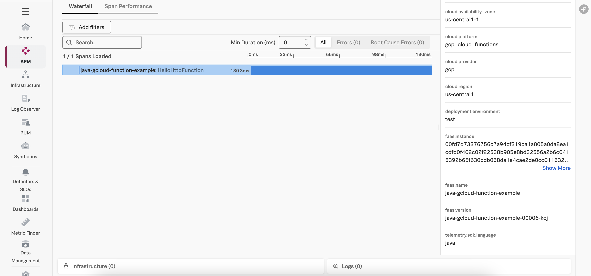

# Instrumenting a Java Google Cloud Run Function with OpenTelemetry

This example demonstrates how to instrument an serverless Google Cloud Run function written in
Java using OpenTelemetry, and then export the data to Splunk Observability
Cloud.  We'll use Java v21 for this example, but the steps for other Java versions are
similar.

## Prerequisites

The following tools are required to deploy Java Google Cloud Run functions:

* An Google Cloud Platform account with permissions to create and execute Google Cloud Run functions
* An OpenTelemetry collector that's accessible to the Google Cloud Run function
* [gCloud CLI](https://cloud.google.com/sdk/docs/install)

## Splunk Distribution of the OpenTelemetry Collector

For this example, we deployed the Splunk Distribution of the OpenTelemetry Collector onto a virtual machine
in GCP using Gateway mode, and ensured it's accessible to our Google Cloud Run function.

We configured it with the `SPLUNK_HEC_TOKEN` and `SPLUNK_HEC_URL` environment variables, so that it
exports logs to our Splunk Cloud instance.

Please refer to [Install the Collector using packages and deployment tools](https://docs.splunk.com/observability/en/gdi/opentelemetry/install-the-collector.html#collector-package-install)
for collector installation instructions.

## Application Overview

If you just want to build and deploy the example, feel free to skip this section.

The application used for this example is a simple Hello World application.

We added a helper class named [SplunkTelemetryConfiguration](./src/main/java/gcfv2/SplunkTelemetryConfigurator.java), and included code to assist with initializing the OpenTelemetry SDK:

````
public class SplunkTelemetryConfigurator {

    public static OpenTelemetry configureOpenTelemetry() {

        String serviceName = System.getenv("OTEL_SERVICE_NAME");
        String deploymentEnvironment = System.getenv("DEPLOYMENT_ENVIRONMENT");
        String otelExporterEndpoint = System.getenv("OTEL_EXPORTER_OTLP_ENDPOINT");

        if (serviceName == null)
            throw new IllegalArgumentException("The OTEL_SERVICE_NAME environment variable must be populated");
        if (deploymentEnvironment == null)
            throw new IllegalArgumentException("The DEPLOYMENT_ENVIRONMENT environment variable must be populated");
        if (otelExporterEndpoint == null)
            throw new IllegalArgumentException("The OTEL_EXPORTER_OTLP_ENDPOINT environment variable must be populated");

        Resource resource = Resource
            .getDefault()
            .toBuilder()
            .put(ResourceAttributes.SERVICE_NAME, serviceName)
            .put(ResourceAttributes.DEPLOYMENT_ENVIRONMENT, deploymentEnvironment)
            .build();

        OtlpHttpSpanExporter spanExporter = OtlpHttpSpanExporter.builder()
            .setEndpoint(String.format("%s/v1/traces", otelExporterEndpoint))
            .build();

        SdkTracerProvider sdkTracerProvider = SdkTracerProvider.builder()
            .addSpanProcessor(BatchSpanProcessor.builder(spanExporter).build())
            .setResource(resource)
            .build();

        return OpenTelemetrySdk.builder()
            .setTracerProvider(sdkTracerProvider)
            .setPropagators(ContextPropagators.create(W3CTraceContextPropagator.getInstance()))
            .build();
    }
}
````

It requires the following dependencies to be added to the [pom.xml](./pom.xml) file:

````
   <dependencyManagement>
        <dependencies>
            <dependency>
                <groupId>io.opentelemetry</groupId>
                <artifactId>opentelemetry-bom</artifactId>
                <version>1.44.1</version>
                <type>pom</type>
                <scope>import</scope>
            </dependency>
        </dependencies>
    </dependencyManagement>

    <dependencies>
        ...
        <dependency>
            <groupId>io.opentelemetry</groupId>
            <artifactId>opentelemetry-api</artifactId>
        </dependency>
        <dependency>
            <groupId>io.opentelemetry</groupId>
            <artifactId>opentelemetry-sdk</artifactId>
        </dependency>
        <dependency>
            <!-- Not managed by opentelemetry-bom -->
            <groupId>io.opentelemetry.semconv</groupId>
            <artifactId>opentelemetry-semconv</artifactId>
            <version>1.28.0-alpha</version>
        </dependency>
        <dependency>
            <groupId>io.opentelemetry</groupId>
            <artifactId>opentelemetry-exporter-otlp</artifactId>
        </dependency>
        <dependency>
            <groupId>io.opentelemetry.instrumentation</groupId>
            <artifactId>opentelemetry-log4j-context-data-2.17-autoconfigure</artifactId>
            <version>2.8.0-alpha</version>
            <scope>runtime</scope>
        </dependency>
    </dependencies>

````

Note that we've added `opentelemetry-log4j-context-data-2.17-autoconfigure` as a dependency as well, which injects the trace ID and span ID from an active span into Log4j's context data.  Refer to [ContextData Instrumentation for Log4j2](https://github.com/open-telemetry/opentelemetry-java-instrumentation/tree/main/instrumentation/log4j/log4j-context-data/log4j-context-data-2.17/library-autoconfigure)
for further details.


The log4j2.xml configuration file was modified to utilize this trace context and add it to the log output:

````
    <Appenders>
        <Console name="console" target="SYSTEM_OUT">
            <PatternLayout>
                <pattern>%d %5p [%t] %c{3} - trace_id=%X{trace_id} span_id=%X{span_id} trace_flags=%X{trace_flags} service.name=${env:OTEL_SERVICE_NAME} %m%n</pattern>
            </PatternLayout>
        </Console>
    </Appenders>
````

The [HelloHttpFunction.java file](./src/main/java/gcfv2/HelloHttpFunction.java) was then modified to configure
OpenTelemetry using the helper class as follows:

````
public class HelloHttpFunction implements HttpFunction {

    private final OpenTelemetry openTelemetry = SplunkTelemetryConfigurator.configureOpenTelemetry();
    private final Tracer tracer = openTelemetry.getTracer(HelloHttpFunction.class.getName(), "0.1.0");
    private static final Logger logger = LogManager.getLogger(HelloHttpFunction.class);

    public void service(final HttpRequest request, final HttpResponse response) throws Exception {
        Span span = tracer.spanBuilder("HelloHttpFunction").startSpan();

        try (Scope scope = span.makeCurrent()) {
            logger.info("Handling the HelloHttpFunction call");

            final BufferedWriter writer = response.getWriter();
            writer.write("Hello world!");
        }
        catch (Throwable t) {
            span.recordException(t);
        }
        finally {
            span.end();
        }
    }
}
````

## Build and Deploy

Open a terminal and navigate to the following directory:

````
splunk-opentelemetry-examples/instrumentation/java/google-cloud-functions
````

### Initialize the gCloud CLI

If you haven't already done so, [install](https://cloud.google.com/sdk/docs/install)
and [initialize](https://cloud.google.com/sdk/docs/initializing) the gcloud CLI.

### Build and Deploy the Google Cloud Run Function

Use the following command to deploy the Google Cloud Run function, substituting the
[region](https://cloud.google.com/functions/docs/locations)
that's best for you.  To allow OpenTelemetry to send trace data to Splunk Observability Cloud,
we also need to set the `OTEL_EXPORTER_OTLP_ENDPOINT`, `OTEL_SERVICE_NAME`, and `DEPLOYMENT_ENVIRONMENT`
environment variables as part of the gcloud deploy command:

```bash
gcloud functions deploy java-gcloud-function-example \
    --gen2 \
    --region=us-central1 \
    --runtime=java21 \
    --source=. \
    --entry-point=gcfv2.HelloHttpFunction \
    --trigger-http \
    --set-env-vars OTEL_SERVICE_NAME=java-gcloud-function-example,OTEL_EXPORTER_OTLP_ENDPOINT=http://<collector IP address>:4318,DEPLOYMENT_ENVIRONMENT=test
```

Answer "y" to the following question when asked:

````
Allow unauthenticated invocations of new function [java-gcloud-function-example]? (y/N)? 
````

If the function is created successfully, it should provide you with a URL such as the following:

````
https://us-central1-gcp-<account name>.cloudfunctions.net/java-gcloud-function-example
````

### Test the Google Cloud Run Function

Take the URL provided by the gcloud CLI above and enter it into your browser. It should return:

````
Hello World! 
````

### View Traces in Splunk Observability Cloud

After a minute or so, you should start to see traces for the serverless function
appearing in Splunk Observability Cloud:



### Add Trace Context to Logs

Logs generated by a Google Cloud Run function get sent to Google Cloud Logging.
Various methods exist for streaming logs into Splunk platform from Google Cloud Logging,
as described in
[Stream logs from Google Cloud to Splunk](https://cloud.google.com/architecture/stream-logs-from-google-cloud-to-splunk).

Once the logs are in Splunk platform, they can be made available to
Splunk Observability Cloud using Log Observer Connect.

Here's an example log entry, which includes the trace_id and span_id:

````
{
    insertId: "67c9e019000d8d25bdcb7fcf"
    labels: {3}
    logName: "projects/gcp-splunko11ystrat-nprd-11062/logs/run.googleapis.com%2Fstdout"
    payload: "textPayload"
    receiveLocation: "us-central1"
    receiveTimestamp: "2025-03-06T17:49:13.893130330Z"
    resource: {2}
    severity: "DEFAULT"
    textPayload: "2025-03-06 17:49:13,887  INFO [qtp959447386-15] gcfv2.HelloHttpFunction - trace_id=21cce75d5a25204f34662f3d72cf49fb span_id=30d5eed8929fcd04 trace_flags=01 service.name=java-gcloud-function-example Handling the HelloHttpFunction call"
    timestamp: "2025-03-06T17:49:13.888101Z"
    traceSampled: false
}
````

We can see that the log entry includes a trace_id and span_id, which allows us to correlate
logs with traces. 