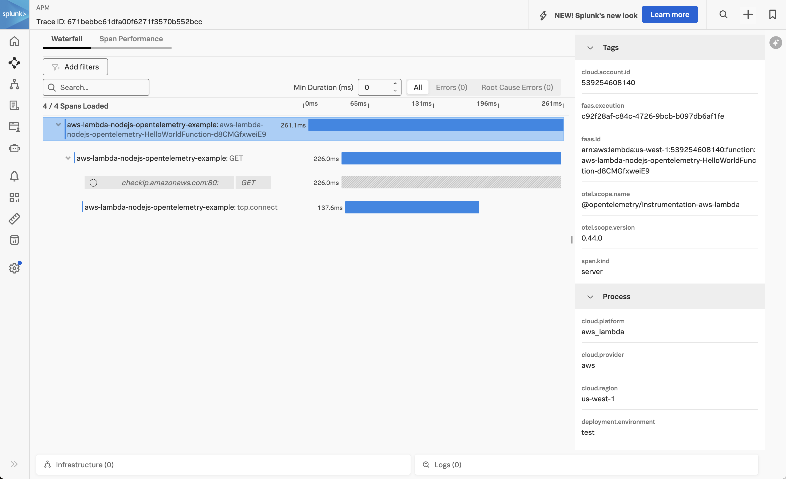
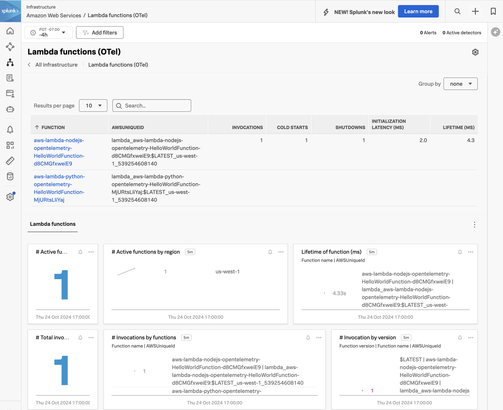

# Instrumenting a Node.js AWS Lambda Function with OpenTelemetry

This example demonstrates how to instrument an AWS Lambda function written in
Node.js using OpenTelemetry, and then export the data to Splunk Observability
Cloud.  Unlike the [base example](../aws-lambda), which uses a .zip archive 
to upload the node.js Lambda function, this example is deployed using a 
Docker container image. 

We'll use Node.js 20 for this example, but the steps for other Node.js versions
are similar.  The example also uses the AWS Serverless Application Model (SAM)
CLI to deploy the Lambda function and an associated API Gateway to access it.

## Prerequisites

The following tools are required to deploy Node.js functions into AWS Lambda using SAM:

* An AWS account with permissions to create and execute Lambda functions
* Node.js 20
* Download and install [AWS SAM](https://docs.aws.amazon.com/serverless-application-model/latest/developerguide/install-sam-cli.html)
* Docker 

## Application Overview

The application used here is based on the "Hello World" example application that's part of the
[AWS Quick Start templates](https://docs.aws.amazon.com/serverless-application-model/latest/developerguide/using-sam-cli-init.html).

## Build and Deploy

Open a command line terminal and navigate to the root of the directory.  
For example:

````
cd ~/splunk-opentelemetry-examples/instrumentation/nodejs/aws-lambda-container-image/hello-world
````

### Update the Dockerfile 

Update the [Dockerfile](./hello-world/Dockerfile) to substitute your target region and the 
corresponding layer ARN into the Dockerfile above, using 
[this list](https://raw.githubusercontent.com/signalfx/lambda-layer-versions/main/splunk-apm/splunk-apm.md) 
as a reference.

````
RUN curl $(aws lambda get-layer-version-by-arn --arn arn:aws:lambda:us-west-1:254067382080:layer:splunk-apm:116 --query 'Content.Location' --output text) --output layer.zip
````

### Build and Tag the Docker Image 

Use the following command to build the Docker image.  Substitute appropriate values for the 
AWS region, access key, etc. 

``` bash
docker build --platform linux/amd64 -t aws-lambda-container-image:1.0 . \
--build-arg AWS_DEFAULT_REGION=<AWS region> \
--build-arg AWS_ACCESS_KEY_ID="..." \
--build-arg AWS_SECRET_ACCESS_KEY="..." \
--build-arg AWS_SESSION_TOKEN="..."
```

### Provide your AWS credentials

````
export AWS_ACCESS_KEY_ID="<put the access key ID here>"
export AWS_SECRET_ACCESS_KEY="<put the secret access key here>"
export AWS_SESSION_TOKEN="<put the session token here>"
````

### Login to Amazon Elastic Container Registry (ECR)

Add the target AWS account ID and region before running the following command: 

``` bash
aws ecr get-login-password --region <AWS region> | \
    docker login --username AWS --password-stdin <AWS account ID>.dkr.ecr.<AWS region>.amazonaws.com
```

### Create an ECR Repository

Next, create a repository in ECR for the image (if you don’t already have one):

``` bash
aws ecr create-repository --repository-name hello-world \
    --region <AWS region> \
    --image-scanning-configuration scanOnPush=true \
    --image-tag-mutability MUTABLE
```

It should return output similar to the following: 

```bash
{
    "repository": {
        "repositoryArn": "arn:aws:ecr:eu-west-1:<AWS account ID>:repository/hello-world",
        "registryId": "<AWS account ID>",
        "repositoryName": "hello-world",
        "repositoryUri": "<AWS account ID>.dkr.ecr.<AWS region>.amazonaws.com/hello-world",
        "createdAt": "2024-06-14T16:28:04.672000-07:00",
        "imageTagMutability": "MUTABLE",
        "imageScanningConfiguration": {
            "scanOnPush": true
        },
        "encryptionConfiguration": {
            "encryptionType": "AES256"
        }
    }
}
```

### Tag and Push the Container Image to ECR

Then we’ll tag the container image we built earlier:

```bash
docker tag aws-lambda-container-image:1.0 <AWS account ID>.dkr.ecr.<AWS region>.amazonaws.com/aws-lambda-container-image:1.0
```

Then we'll push the image to ECR:

```bash
docker push <AWS account ID>.dkr.ecr.<AWS region>.amazonaws.com/aws-lambda-container-image:1.0
````

### Add the Splunk Observability Cloud Access Token and Realm

Let's first make a copy of the template.yaml.base file:

````
cp template.yaml.base template.yaml
````

We'll need to specify the realm and access token for the target
Splunk Observability Cloud environment.  This goes in the template.yaml
file:

````
  Environment: 
    Variables:
      SPLUNK_ACCESS_TOKEN: <access token>
      SPLUNK_REALM: us1
      OTEL_RESOURCE_ATTRIBUTES: deployment.environment=test
      OTEL_SERVICE_NAME: aws-lambda-nodejs-opentelemetry-example
````

We'll also need to add the AWS account ID and region to the `ImageUri`: 

````
   ImageUri: <AWS Account ID>.dkr.ecr.<AWS Region>.amazonaws.com/aws-lambda-container-image:1.0
````

### Deploy the SAM Function

Now we can deploy the function using SAM:

````
cd ..
sam deploy --guided
````

You'll be asked a number of questions along the way.  Here are sample responses,
but you should provide the desired stack name and AWS region for your lambda
function.

````
Setting default arguments for 'sam deploy'
=========================================
Stack Name [aws-lambda-nodejs-opentelemetry-example]: 
	AWS Region [us-west-1]: 
	#Shows you resources changes to be deployed and require a 'Y' to initiate deploy
	Confirm changes before deploy [Y/n]: 
	#SAM needs permission to be able to create roles to connect to the resources in your template
	Allow SAM CLI IAM role creation [Y/n]: 
	#Preserves the state of previously provisioned resources when an operation fails
	Disable rollback [y/N]: 
	HelloWorldFunction has no authentication. Is this okay? [y/N]: y
	Save arguments to configuration file [Y/n]: 
	SAM configuration file [samconfig.toml]: 
	SAM configuration environment [default]: 

	Looking for resources needed for deployment:

	Managed S3 bucket: aws-sam-cli-managed-default-samclisourcebucket-6i4nliehfiqk
	A different default S3 bucket can be set in samconfig.toml and auto resolution of buckets turned off by setting resolve_s3=False
	 Image repositories: Not found.
	 #Managed repositories will be deleted when their functions are removed from the template and deployed
	 Create managed ECR repositories for all functions? [Y/n]: n
	 ECR repository for HelloWorldFunction: <AWS Account ID>.dkr.ecr.<AWS Region>.amazonaws.com/aws-lambda-container-image
````

It will take a few moments for SAM to create all of the objects necessary to
support your lambda function.  Once it's ready, it will provide you with an API
Gateway Endpoint URL that uses the following format:

````
https://${ServerlessRestApi}.execute-api.${AWS::Region}.amazonaws.com/Prod/hello/
````

### Test the SAM Function

Use the API Gateway Endpoint URL provided in the previous step to test the SAM function.
You should see a response such as the following:

````
{"message":"hello world","location":"54.183.205.86"}
````

### View Traces in Splunk Observability Cloud

After a minute or so, you should start to see traces for the lambda function
appearing in Splunk Observability Cloud:



### View Metrics in Splunk Observability Cloud

If you added the Splunk Metrics Extension Layer, you'll also see metrics for your
lambda function by navigating to Infrastructure -> Lambda functions (OTel) and
then selecting your lambda function:



### Add Trace Context to Logs 

Logs generated by an AWS Lambda function get sent to AWS CloudWatch. 
Various methods exist for ingesting logs into Splunk platform from AWS CloudWatch, 
such as the solution described in 
[Stream Amazon CloudWatch Logs to Splunk Using AWS Lambda](https://www.splunk.com/en_us/blog/platform/stream-amazon-cloudwatch-logs-to-splunk-using-aws-lambda.html). 

Once the logs are in Splunk platform, they can be made available to
Splunk Observability Cloud using Log Observer Connect. 

To ensure full correlation between traces generated by AWS Lambda instrumentation with metrics and logs, 
the Splunk Distribution of OpenTelemetry JS automatically adds trace context to log entries 
when one of the following logging libraries is used: 

* Bunyan 
* Pino 
* Winston

This sample application uses Pino, and we can see that the `trace_id` and `span_id` have been added 
to the log entry in the following example: 

````
{
  "level": 30,
  "time": 1729885635761,
  "pid": 22,
  "hostname": "169.254.59.165",
  "trace_id": "671bf5c2280acdf678042a864dc1aae6",
  "span_id": "05c95f469ee9f529",
  "trace_flags": "01",
  "service.name": "aws-lambda-nodejs-opentelemetry-example",
  "service.environment": "test",
  "msg": "About to get the IP Address..."
}
````