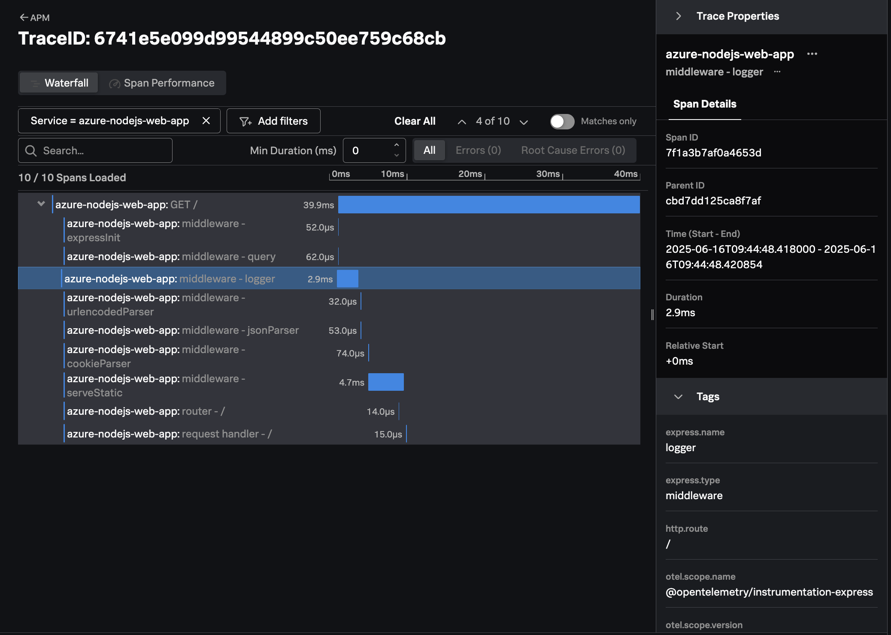
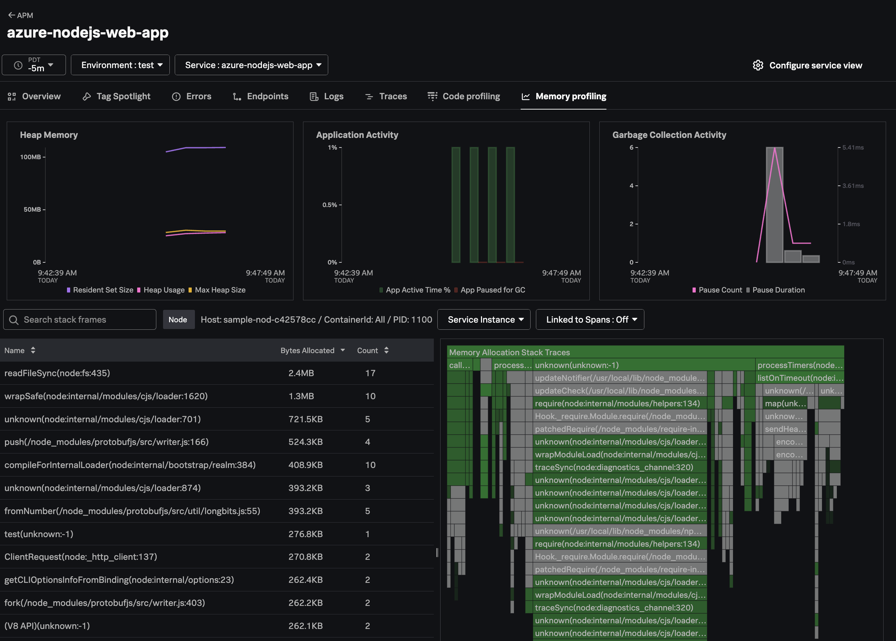
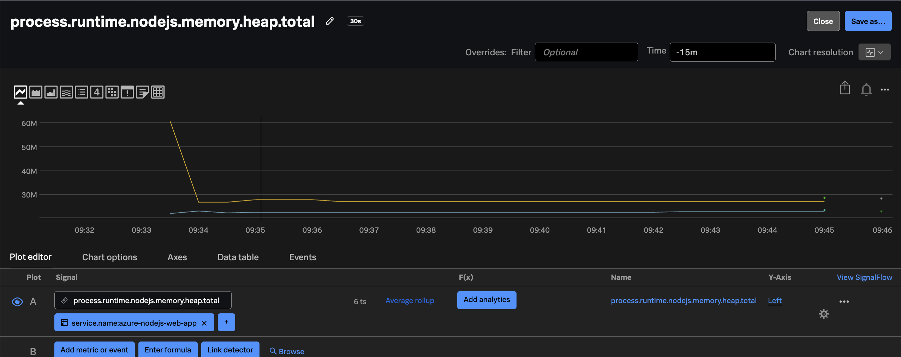

# Instrumenting a Node.js Application on Azure App Service with OpenTelemetry

This example demonstrates how to instrument a Node.js Application on Azure
App  Service using OpenTelemetry,
and export traces, metrics, and logs to a collector running in Azure, which will then
export that data to Splunk.

The example application was generated using the [Express Application Generator](https://expressjs.com/en/starter/generator.html),
and the deployment steps are based on [Quickstart: Deploy a Node.js web app in Azure](https://learn.microsoft.com/en-us/azure/app-service/quickstart-nodejs?tabs=linux&pivots=development-environment-cli).

## Prerequisites

The following tools are required to build and deploy the Java application to Azure:

* Node.js v18 (or higher)
* An Azure account with permissions to create and execute Azure web applications
* [Azure CLI](https://learn.microsoft.com/en-us/cli/azure/install-azure-cli)

## Splunk Distribution of the OpenTelemetry Collector

For this example, we deployed the Splunk Distribution of the OpenTelemetry Collector onto a virtual machine
in Azure using Gateway mode, and ensured it's accessible to our Azure function.

We configured it with the `SPLUNK_HEC_TOKEN` and `SPLUNK_HEC_URL` environment variables, so that it
exports logs to our Splunk Cloud instance.

Please refer to [Install the Collector using packages and deployment tools](https://docs.splunk.com/observability/en/gdi/opentelemetry/install-the-collector.html#collector-package-install)
for collector installation instructions.

## Authenticate with Azure

Open a command line terminal and use the following command to authenticate with Azure:

``` bash
az login
```

## Add OpenTelemetry Instrumentation (Optional)

This step has already been performed, so there's no need to run these commands again. 

We instrumented our application using the Splunk Distribution of OpenTelemetry JS by  
installing the `@splunk/otel` package: 

``` bash
npm install @splunk/otel
```

## Deploy the Node.js application to Azure

Navigate to the application directory: 

``` bash
cd ~/splunk-opentelemetry-examples/instrumentation/nodejs/azure-app-service/sample-nodejs-azure-app
```

Then deploy the application to Azure:

> Note: substitute an application name that's globally unique in Azure

``` bash
az webapp up --sku P1v2 --name <application name>
```

Note that you may need to register the `Microsoft.Web` namespace using the following command:

``` bash
az provider register --namespace Microsoft.Web
```

## Add OpenTelemetry Environment Variables 

Next, we'll set the following environment variables, which tells the OpenTelemetry SDK 
what data to collect and where to send it:

> Note: remember to substitute the URL for your collector

``` bash
az webapp config appsettings set --name <app_name> \
    --resource-group <resource_group> \
    --settings NODE_OPTIONS='--require "@splunk/otel/instrument"' \
        OTEL_SERVICE_NAME='azure-nodejs-web-app' \
        OTEL_RESOURCE_ATTRIBUTES='deployment.environment=test' \
        OTEL_EXPORTER_OTLP_ENDPOINT='http(s)://<collector URL>:4318' \
        SPLUNK_METRICS_ENABLED=true \
        SPLUNK_PROFILER_ENABLED=true \
        SPLUNK_PROFILER_MEMORY_ENABLED=true 
```

## Test the Application

Point your browser to `http://<appName>.azurewebsites.net` to test the application.

> Note: you'll need to substitute your application name into the above URL, which was provided as
> an output from the earlier command used to deploy the application.

You should see output such as the following:

````
Express

Welcome to Express
````

### View Traces in Splunk Observability Cloud

After a minute or so, you should start to see traces for the Java application
appearing in Splunk Observability Cloud:



### View AlwaysOn Profiling Data in Splunk Observability Cloud

You should also see profiling data appear:



### View Metrics in Splunk Observability Cloud

Metrics are collected by the Splunk Distribution of OpenTelemetry JS automatically.  For example,
the `process.runtime.nodejs.memory.heap.total` metric shows us the amount of heap memory used 
by the node.js runtime:



### View Logs with Trace Context

The Splunk Distribution of OpenTelemetry JS automatically adds trace context
to logs when one of the following logging frameworks is used:

* Bunyan
* Pino
* Winston

Here's an example log entry, which includes the trace_id and span_id:

````
{
  "level": 30,
  "time": 1750095942044,
  "pid": 1039,
  "hostname": "sample-nod-d464e386",
  "req": {
    "id": 2,
    "method": "GET",
    "url": "/",
    "query": {},
    "params": {},
    "headers": {
      "accept": "..."
    },
    "remoteAddress": "::ffff:169.254.129.1",
    "remotePort": 30409
  },
  "trace_id": "27ef123fc6adb40da0054682136892eb",
  "span_id": "dfa6060de7bbd13e",
  "trace_flags": "01",
  "service.name": "azure-nodejs-web-app",
  "service.environment": "test",
  "msg": "index.js endpoint invoked, sending response"
}
````

The OpenTelemetry Collector can be configured to export log data to
Splunk platform using the Splunk HEC exporter.  The logs can then be made
available to Splunk Observability Cloud using Log Observer Connect.  This will
provide full correlation between spans generated by Node.js instrumentation
with metrics and logs. 