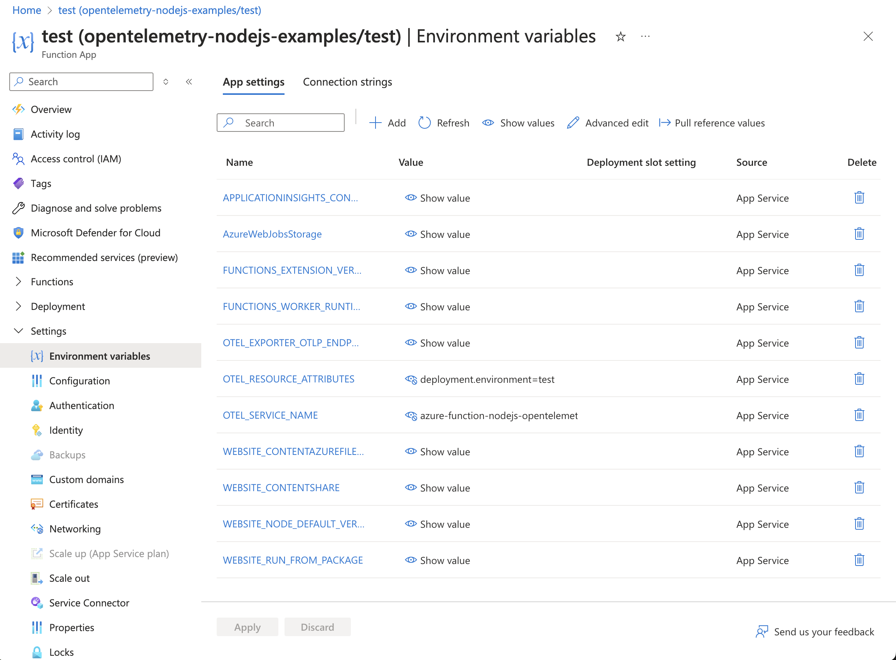

# Instrumenting a Node.js Azure Function with OpenTelemetry

This example demonstrates how to instrument an serverless Azure function written in
Node.js using OpenTelemetry, and then export the data to Splunk Observability 
Cloud.  We'll use Node.js v20 for this example, but the steps for other Node.js versions are 
similar.   

## Prerequisites 

The following tools are required to deploy Node.js Azure functions: 

* An Azure account with permissions to create and execute Azure functions
* [Visual Studio Code](https://code.visualstudio.com/)
* An OpenTelemetry collector that's accessible to the Azure function 
* Azure Functions extension for Visual Studio Code (installed using Visual Studio Code)

## Splunk Distribution of the OpenTelemetry Collector

For this example, we deployed the Splunk Distribution of the OpenTelemetry Collector onto a virtual machine 
in Azure using Gateway mode, and ensured it's accessible to our Azure function. 

We configured it with the `SPLUNK_HEC_TOKEN` and `SPLUNK_HEC_URL` environment variables, so that it 
exports logs to our Splunk Cloud instance. 

Please refer to [Install the Collector using packages and deployment tools](https://docs.splunk.com/observability/en/gdi/opentelemetry/install-the-collector.html#collector-package-install)
for collector installation instructions. 

## Application Overview

If you just want to build and deploy the example, feel free to skip this section. 

The application used for this example is a simple Hello World application. 

We updated the [index.js](./src/index.js) file to include code that starts the instrumentation, 
which adds the Azure function OpenTelemetry instrumentation: 

````
const sdk = new NodeSDK({
  traceExporter: new OTLPTraceExporter(),
  metricReader: new PeriodicExportingMetricReader({
    exporter: new OTLPMetricExporter(),
  }),
  logRecordProcessor: new BatchLogRecordProcessor(
    new OTLPLogExporter()
  ),
  instrumentations: [getNodeAutoInstrumentations(), new AzureFunctionsInstrumentation()],
});
sdk.start();
````

We also modified the 
[azure-function-nodejs-opentelemetry-example.js](./src/functions/azure-function-nodejs-opentelemetry-example.js) 
file to start a custom span and add a span attribute to it: 

````
const opentelemetry = require('@opentelemetry/api');

const tracer = opentelemetry.trace.getTracer('azure-function-nodejs-opentelemetry-example', '0.1.0');

app.http('azure-function-nodejs-opentelemetry-example', {
    methods: ['GET', 'POST'],
    authLevel: 'anonymous',
    handler: async (request, context) => {
        return tracer.startActiveSpan('nodejs-azure-http-trigger', (span) => {

            logger.info(`Http function processed request for url "${request.url}"`);

            const name = request.query.get('name') || 'world';
            
            span.setAttribute('app.name', name);
            span.end();

            return { body: `Hello, ${name}!` };
        });
    }
});
````

These code changes required the `@splunk/otel`, `@opentelemetry/api` and 
`@azure/functions-opentelemetry-instrumentation` packages to be installed with npm, which we can see
in the [package.json](./package.json) file: 

````
  "dependencies": {
    "@azure/functions": "^4.5.0",
    "@azure/functions-opentelemetry-instrumentation": "^0.1.0",
    "@opentelemetry/api": "^1.9.0",
    "@opentelemetry/sdk-node": "^0.56.0",
    "@opentelemetry/sdk-metrics": "^1.29.0",
    "@opentelemetry/sdk-logs": "^0.56.0",
    "@opentelemetry/exporter-trace-otlp-http": "^0.56.0",
    "@opentelemetry/exporter-metrics-otlp-http": "^0.56.0", 
    "@opentelemetry/exporter-logs-otlp-http": "^0.56.0",
    "@opentelemetry/auto-instrumentations-node": "^0.54.0",
    "pino": "^9.5.0"
  },
````

For this example, we'll send metrics, traces, and logs to a collector running on another virtual machine in Azure. The [local.settings.json](./local.settings.json) file was updated as follows: 

````
  "Values": {
    "AzureWebJobsStorage": "UseDevelopmentStorage=true",
    "FUNCTIONS_WORKER_RUNTIME": "node",
    "OTEL_EXPORTER_OTLP_ENDPOINT": "http://<Collector IP Address>:4318", 
    "OTEL_SERVICE_NAME": "azure-function-nodejs-opentelemetry-example", 
    "OTEL_RESOURCE_ATTRIBUTES": "deployment.environment=test" 
  }
````

The [host.json](./host.json) file was also updated to set the `telemetryMode` to `openTelemetry`.  This 
enables OpenTelemetry output from the host where the function runs: 

````
{
  "version": "2.0",
  "logging": {
    "applicationInsights": {
      "samplingSettings": {
        "isEnabled": true,
        "excludedTypes": "Request"
      }
    }
  },
  "telemetryMode": "OpenTelemetry",
  "extensionBundle": {
    "id": "Microsoft.Azure.Functions.ExtensionBundle",
    "version": "[4.*, 5.0.0)"
  }
````

Note:  while the above setting should be optional, during testing it was observed that 
application traces don't get captured either if this setting is not included.  

## Build and Deploy

Open the following project using Visual Studio Code: 

````
splunk-opentelemetry-examples/instrumentation/nodejs/azure-functions
````

### Create a Function App in Azure 

Create a Function App in Azure if you don't already have one.  For my example, 
I used `opentelemetry-nodejs-examples` as the function name, and used the region of “West US 2” 
with Node.js v20 as the runtime. 


### Create a Deployment Slot (Optional) 

By default, Azure will use a deployment slot named "Production" for an Azure Function App.  
In my example, I created a deployment slot named "test".


### Set Environment Variables 

To allow OpenTelemetry to send trace data to Splunk Observability Cloud, 
we need to set the `OTEL_EXPORTER_OTLP_ENDPOINT`, `OTEL_SERVICE_NAME`, 
and `OTEL_RESOURCE_ATTRIBUTES` environment variables 
for our Azure Function App: 



### Build and Deploy the Azure Function

In the Azure section of Visual Studio Code, right click on the deployment slot of interest 
and select `Deploy to Slot`. 


It will ask you to confirm: 


### Test the Azure Function

Copy the function URL from the Azure function: 


Then point your browser to that URL, it should return: 

````
Hello, World! 
````

### View Traces in Splunk Observability Cloud

After a minute or so, you should start to see traces for the serverless function
appearing in Splunk Observability Cloud: 


Note that the bottom-right of the trace includes a button that links to the related log entries. 

### Add Trace Context to Logs

Logs generated by an Azure function get sent to Application Insights.
Various methods exist for ingesting logs into Splunk platform from Application Insights,
such as the 
[Splunk Add-on for Microsoft Cloud Services](https://splunkbase.splunk.com/app/3110).

Once the logs are in Splunk platform, they can be made available to
Splunk Observability Cloud using Log Observer Connect.

In general, logs generated by an Azure function get sent to Application Insights.
Various methods exist for ingesting logs into Splunk platform from Application Insights,
such as the 
[Splunk Add-on for Microsoft Cloud Services](https://splunkbase.splunk.com/app/3110).

In this example, OpenTelemetry JavaScript also exports logs 
to our collector using OTLP.  

By following the link from the trace show above, we can see all of the log entries associated 
with this trace: 


We can see that the log entries include a trace_id and span_id, which allows us to correlate 
logs with traces. 