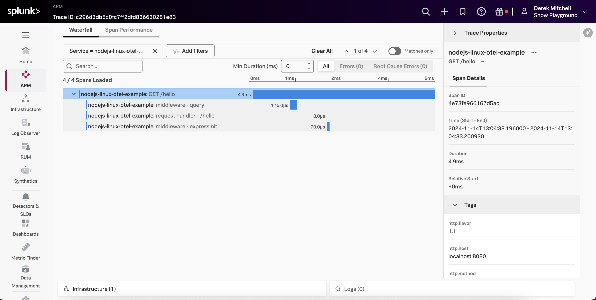
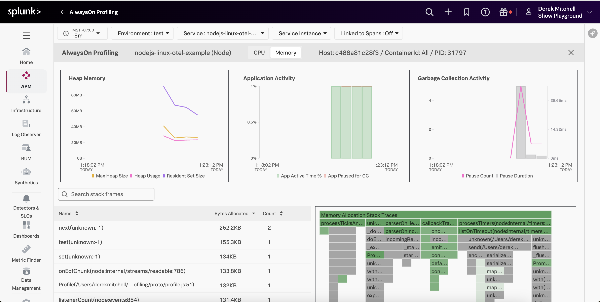
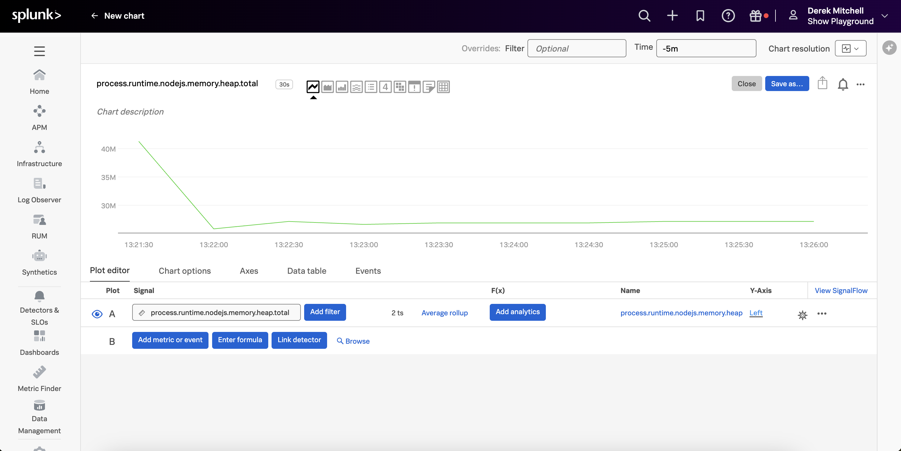

# Instrumenting a Node.js Application with OpenTelemetry

This example demonstrates how to instrument a Node.js Application using OpenTelemetry,
and export traces, metrics, and logs to a local collector, which will then
export that data to Splunk. We'll use Node.js 22 for this example, but the steps
for other Node.js versions are similar.

We'll show how the `@splunk/otel` NPM package can be installed 
and added to the application startup command.

Alternatively, you can add the `--with-instrumentation` command when starting the
collector on Linux, and have it automatically instrument any Node.js applications
on the host with a specific annotation.  Please refer to
[Automatic discovery and configuration for back-end applications in Linux](https://docs.splunk.com/observability/en/gdi/opentelemetry/automatic-discovery/linux/linux-backend.html)
for further details on this approach.

## Prerequisites

The following tools are required to build and execute the Node.js application:

* Node.js 22
* A Linux-compatible host (such as Ubuntu 24.04, or Mac OS)

## Deploy the Splunk OpenTelemetry Collector

This example requires the Splunk Distribution of the OpenTelemetry collector to
be running on the host and available via http://localhost:4318.  Follow the
instructions in [Install the Collector for Linux with the installer script](https://docs.splunk.com/observability/en/gdi/opentelemetry/collector-linux/install-linux.html#install-the-collector-using-the-installer-script)
to install the collector on your host.

## Build and Execute the Application

Open a command line terminal and navigate to the root of the directory.  
For example:

````
cd ~/splunk-opentelemetry-examples/instrumentation/nodejs/linux-winston
````

### Initialize NPM and Install Packages (Optional)

We generated a package.json file by executing the following command: 

````
npm init
```` 

Our sample application uses the Express web application framework, and winston for logging, 
so we'll need to install the corresponding package as follows: 

````
npm install express
npm install winston
````

Next, we'll instrument our application using the Splunk Distribution of OpenTelemetry JS
by first installing the `@splunk/otel` package, so let's install this package as well:

````
npm install @splunk/otel
````

There's no need to run these commands again as you can use the `package.json` file that 
was already created. 

### Configure the Splunk Distribution of OpenTelemetry JS 

To configure the instrumentation, we've set the following environment variables:

````
export OTEL_SERVICE_NAME=nodejs-linux-otel-example
export OTEL_RESOURCE_ATTRIBUTES='deployment.environment=test'
export SPLUNK_METRICS_ENABLED=true
export SPLUNK_PROFILER_ENABLED=true
export SPLUNK_PROFILER_MEMORY_ENABLED=true
````

Note that we've enabled both the CPU and memory profiler, so we can utilize the
AlwaysOn Profiling capabilities.

### Execute the application

Let's install the packages in the `package.json` file with the following command: 

````
npm install
````

Next, we'll execute the application with the `@splunk/otel` package as follows: 

````
node -r @splunk/otel/instrument index.js
````

Access the application by navigating your web browser to the following URL:

````
http://localhost:8080/hello
````

You should receive the following response: 

````
Hello, World! 
````

### View Traces in Splunk Observability Cloud

After a minute or so, you should start to see traces for the Node.js application
appearing in Splunk Observability Cloud:



### View AlwaysOn Profiling Data in Splunk Observability Cloud

You should also see profiling data appear:



### View Metrics in Splunk Observability Cloud

Metrics are collected by the Splunk Distribution of OpenTelemetry JS automatically.  For example,
the `process.runtime.nodejs.memory.heap.total` metric shows us the amount of heap memory used by the
Node.js process: 



### View Logs with Trace Context

The Splunk Distribution of OpenTelemetry JS automatically adds trace context
to logs when one of the following logging frameworks is used: 

* Bunyan 
* Pino 
* Winston

Here's an example log entry, which includes the trace_id and span_id: 

````
{"level":"info","message":"/hello endpoint invoked, sending response","service.environment":"test","service.name":"nodejs-linux-otel-example","span_id":"8b63d8152fb04a85","timestamp":"2025-03-04T20:49:15.930Z","trace_flags":"01","trace_id":"5ae247fc26af88a7e2cc253dbfc084f7"}
````

The OpenTelemetry Collector can be configured to export log data to
Splunk platform using the Splunk HEC exporter.  The logs can then be made
available to Splunk Observability Cloud using Log Observer Connect.  This will
provide full correlation between spans generated by Node.js instrumentation
with metrics and logs. 