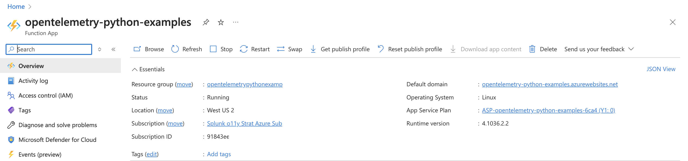
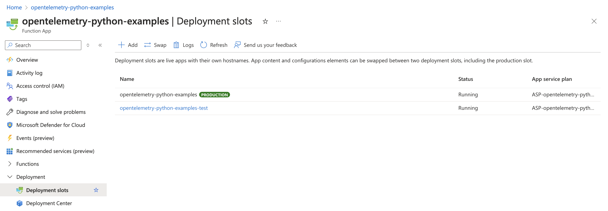
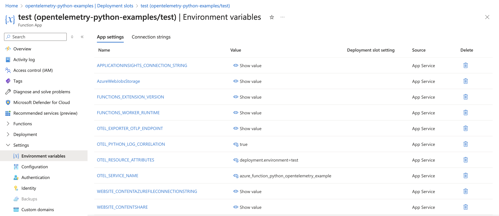
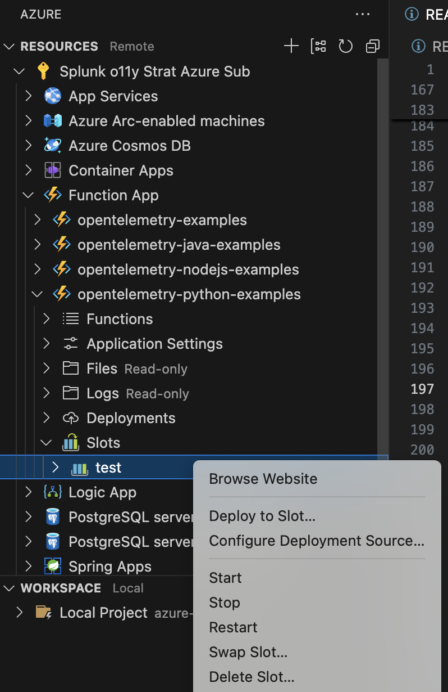
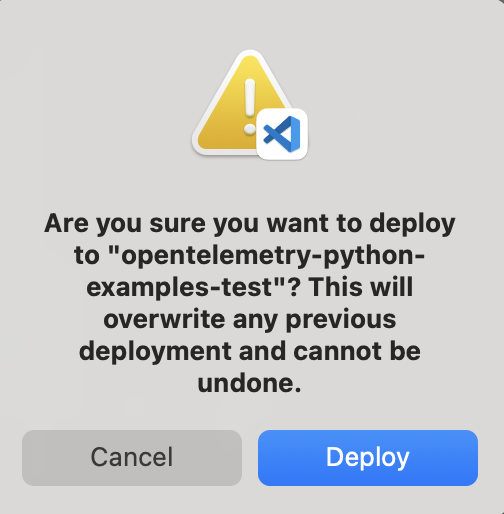
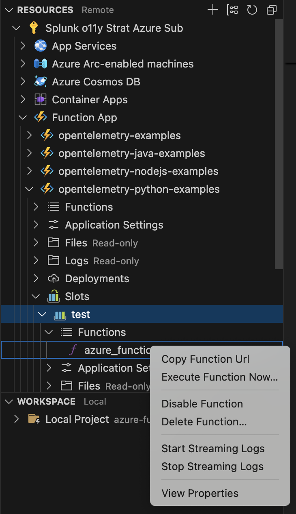
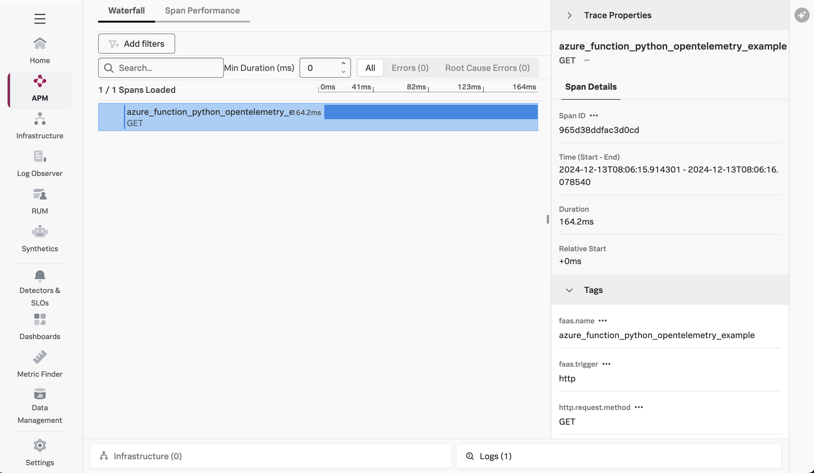
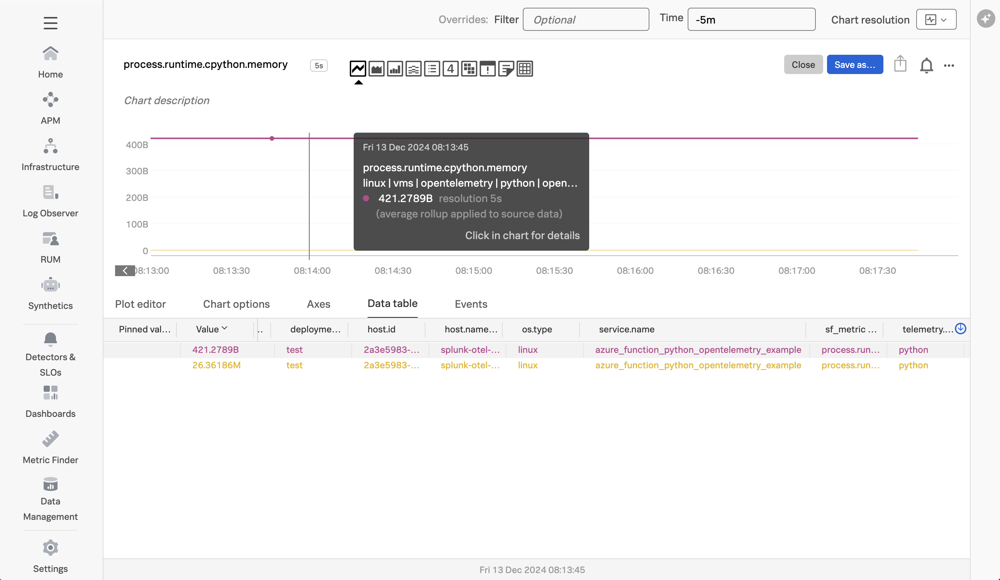
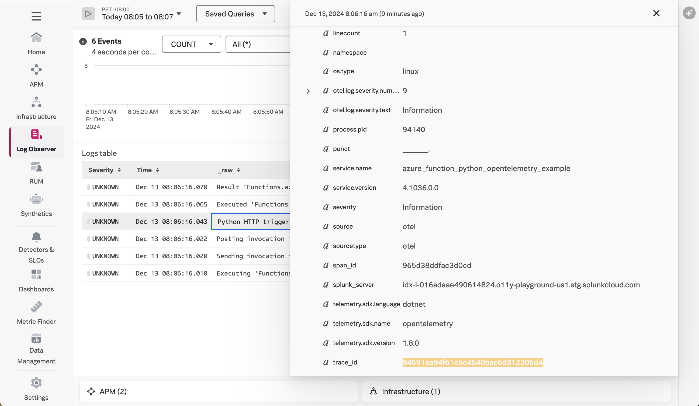

# Instrumenting a Python Azure Function with OpenTelemetry

This example demonstrates how to instrument an serverless Azure function written in
Python using OpenTelemetry, and then export the data to Splunk Observability 
Cloud.  We'll use Python 3.11 for this example, but the steps for other Python versions are 
similar.   

## Prerequisites 

The following tools are required to deploy Python Azure functions: 

* An Azure account with permissions to create and execute Azure functions
* [Visual Studio Code](https://code.visualstudio.com/)
* An OpenTelemetry collector that's accessible to the Azure function 
* Azure Functions extension for Visual Studio Code 
* Python extension for Visual Studio Code 

## Splunk Distribution of the OpenTelemetry Collector

For this example, we deployed the Splunk Distribution of the OpenTelemetry Collector onto a virtual machine 
in Azure using Gateway mode, and ensured it's accessible to our Azure function. 

We also configured it with the `SPLUNK_HEC_TOKEN` and `SPLUNK_HEC_URL` environment variables, so that it 
exports logs to our Splunk Cloud instance. 

Please refer to [Install the Collector using packages and deployment tools](https://docs.splunk.com/observability/en/gdi/opentelemetry/install-the-collector.html#collector-package-install)
for collector installation instructions. 

## Application Overview

If you just want to build and deploy the example, feel free to skip this section. 

The application used for this example is a simple Hello World application. 

We added a file named [splunk_opentelemetry.py](./splunk_opentelemetry.py) to include a helper function 
that initializes OpenTelemetry tracing and metrics: 

````
from splunk_otel.tracing import start_tracing
from splunk_otel.metrics import start_metrics

def init_opentelemetry(): 

    if 'OTEL_SERVICE_NAME' not in os.environ: 
        raise Exception('The OTEL_SERVICE_NAME environment variable must be set')

    if 'OTEL_EXPORTER_OTLP_ENDPOINT' not in os.environ: 
        raise Exception('The OTEL_EXPORTER_OTLP_ENDPOINT environment variable must be set')
    
    if 'OTEL_RESOURCE_ATTRIBUTES' not in os.environ: 
        raise Exception('The OTEL_RESOURCE_ATTRIBUTES environment variable must be set')

    start_tracing()
    start_metrics()

````

We also updated the [function_app.py](./function_app.py) file to call our helper function to initialize 
OpenTelemetry instrumentation, start a new span when the HTTP trigger function is invoked, and add
an attribute to the span: 

````
import azure.functions as func
import logging
from splunk_opentelemetry import init_opentelemetry
from opentelemetry import trace

logger = logging.getLogger(__name__)
logger.setLevel(logging.INFO)

init_opentelemetry()
tracer = trace.get_tracer("azure_function_python_opentelemetry_example")

app = func.FunctionApp(http_auth_level=func.AuthLevel.ANONYMOUS)

@app.route(route="azure_function_python_opentelemetry_example")
def azure_function_python_opentelemetry_example(req: func.HttpRequest) -> func.HttpResponse:

    with tracer.start_as_current_span("azure_function_python_opentelemetry_example") as span:
        
        logging.info('Python HTTP trigger function processed a request.')

        name = req.params.get('name')
        if not name:
            try:
                req_body = req.get_json()
            except ValueError:
                pass
            else:
                name = req_body.get('name')

        if name:
            span.set_attribute("app.name", name)
            return func.HttpResponse(f"Hello, {name}. This HTTP triggered function executed successfully.")
        else:
            return func.HttpResponse(
                "This HTTP triggered function executed successfully. Pass a name in the query string or in the request body for a personalized response.",
                status_code=200
            )
````

These code changes required the `splunk-opentelemetry[all]` and 
`opentelemetry-instrumentation-logging` packages to be installed, which we can see
in the [requirements.txt](./requirements.txt) file: 

````
splunk-opentelemetry[all]==1.21.0

# add this package to ensure trace context is added to logs
opentelemetry-instrumentation-logging
````

For this example, we'll send metrics, traces, and logs to a collector running on another virtual machine in Azure. The [local.settings.json](./local.settings.json) file was updated as follows: 

````
{
  "IsEncrypted": false,
  "Values": {
    "AzureWebJobsStorage": "",
    "FUNCTIONS_WORKER_RUNTIME": "python", 
    "OTEL_SERVICE_NAME": "azure_function_python_opentelemetry_example",
    "OTEL_EXPORTER_OTLP_ENDPOINT": "http://<Collector IP Address>:4317",
    "OTEL_RESOURCE_ATTRIBUTES": "deployment.environment=test",
    "OTEL_PYTHON_LOG_CORRELATION": "true"
  }
}
````

If you don't have a collector available and want to send traces directly to Splunk Observability Cloud, use the following
configuration instead for [local.settings.json](./local.settings.json): 

````
  "Values": {
    "AzureWebJobsStorage": "UseDevelopmentStorage=true",
    "FUNCTIONS_WORKER_RUNTIME": "node",
    "OTEL_EXPORTER_OTLP_ENDPOINT": "https://ingest.<Realm>.signalfx.com/v2/trace/otlp", 
    "OTEL_EXPORTER_OTLP_HEADERS": "X-SF-TOKEN=<Access Token>", 
    "OTEL_SERVICE_NAME": "azure-function-python-opentelemetry-example", 
    "OTEL_RESOURCE_ATTRIBUTES": "deployment.environment=test" 
  }
````

The [host.json](./host.json) file was also updated to set the `telemetryMode` to `openTelemetry`.  This 
enables OpenTelemetry output from the host where the function runs: 

````
{
  "version": "2.0",
  "logging": {
    "applicationInsights": {
      "samplingSettings": {
        "isEnabled": true,
        "excludedTypes": "Request"
      }
    }
  },
  "telemetryMode": "openTelemetry",
  "extensionBundle": {
    "id": "Microsoft.Azure.Functions.ExtensionBundle",
    "version": "[4.*, 5.0.0)"
  }
````

Note:  while the above setting should be optional, during testing it was observed that 
application traces don't get captured either if this setting is not included.  

## Build and Deploy

Open the following project using Visual Studio Code: 

````
splunk-opentelemetry-examples/instrumentation/python/azure-functions
````

### Create a Function App in Azure 

Create a Function App in Azure if you don't already have one.  For my example, 
I used `opentelemetry-python-examples` as the function name, and used the region of “West US 2” 
with Python 3.11 as the runtime. 



### Create a Deployment Slot (Optional) 

By default, Azure will use a deployment slot named "Production" for an Azure Function App.  
In my example, I created a deployment slot named "test".



### Set Environment Variables 

To allow OpenTelemetry to send trace data to Splunk Observability Cloud, 
we need to set the `OTEL_SERVICE_NAME`, `OTEL_EXPORTER_OTLP_ENDPOINT`, `OTEL_RESOURCE_ATTRIBUTES`, 
and `OTEL_PYTHON_LOG_CORRELATION` environment variables 
for our Azure Function App: 



### Build and Deploy the Azure Function

In the Azure section of Visual Studio Code, right click on the deployment slot of interest 
and select `Deploy to Slot`. 



It will ask you to confirm: 



### Test the Azure Function

Copy the function URL from the Azure function: 



Then point your browser to that URL, it should return: 

````
Hello, World! 
````

### View Traces in Splunk Observability Cloud

After a minute or so, you should start to see traces for the serverless function
appearing in Splunk Observability Cloud: 



Note that the bottom-right of the trace includes a button that links to the related log entries. 

### View Metrics in Splunk Observability Cloud

The Splunk distribution of OpenTelemetry Python automatically captures runtime metrics, 
such as `process.runtime.cpython.memory`: 



Note that the bottom-right of the trace includes a button that links to the related log entries. 

### Add Trace Context to Logs

In general, logs generated by an Azure function get sent to Application Insights.
Various methods exist for ingesting logs into Splunk platform from Application Insights,
such as the 
[Splunk Add-on for Microsoft Cloud Services](https://splunkbase.splunk.com/app/3110).

In this example, the Splunk distribution of OpenTelemetry Python also exports logs 
to our collector using OTLP.  

By following the link from the trace show above, we can see all of the log entries associated 
with this trace: 



We can see that the log entries include a trace_id and span_id, which allows us to correlate 
logs with traces. 