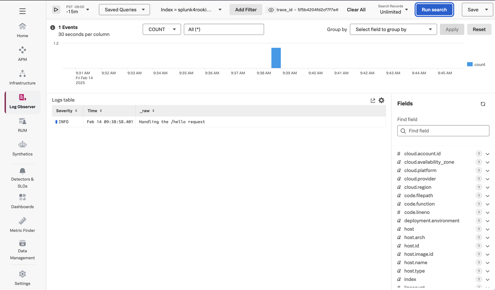

# Instrumenting a Python Application with OpenTelemetry

This example demonstrates how to instrument a Python application using OpenTelemetry,
and export traces, metrics, and logs to a local collector, which will then
export that data to Splunk. We'll use Python 3.12 for this example, but the steps
for other Python versions are similar.

## Prerequisites

The following tools are required to build and execute the Python application:

* Python 3.12+
* A Linux-compatible host (such as Ubuntu 24.04, or Mac OS)

## Deploy the Splunk OpenTelemetry Collector

This example requires the Splunk Distribution of the OpenTelemetry collector to
be running on the host and available via http://localhost:4317.  Follow the
instructions in [Install the Collector for Linux with the installer script](https://docs.splunk.com/observability/en/gdi/opentelemetry/collector-linux/install-linux.html#install-the-collector-using-the-installer-script)
to install the collector on your host.

## Instrument and Execute the Application

Open a command line terminal and navigate to the root of the directory, 
then create a virtual environment an activate it: 

````
cd ~/splunk-opentelemetry-examples/instrumentation/python/linux
python3 -m venv venv
source ./venv/bin/activate
````

### Prep Package Installation and Instrumentation (Optional)

We installed the following packages: 

````
pip3 install flask
pip3 install "splunk-opentelemetry" 
````

We then ran the following command to install instrumentation for packages 
used by our application: 

````
opentelemetry-bootstrap -a install
````

We then generated a requirements.txt file by executing the following command:

````
pip3 freeze > requirements.txt
````

There's no need to run these commands again as you can use the `requirements.txt` file that
was already created.

### Install Packages

Use the following command to install the required packages, which includes those 
used for OpenTelemetry instrumentation: 

````
pip3 install -r requirements.txt
````

### Set Environment Variables

To configure the instrumentation, we've set the following environment variables:

```` 
export OTEL_SERVICE_NAME=python-flask-otel
export OTEL_RESOURCE_ATTRIBUTES='deployment.environment=test'
export OTEL_PYTHON_DISABLED_INSTRUMENTATIONS=click
export OTEL_LOGS_EXPORTER=otlp
export OTEL_PYTHON_LOG_LEVEL=debug,console
export OTEL_PYTHON_LOGGING_AUTO_INSTRUMENTATION_ENABLED=true
export SPLUNK_PROFILER_ENABLED=true
````

Note that we've enabled both the CPU profiler, so we can utilize the
AlwaysOn Profiling capabilities.

### Execute the application

Next, we'll execute the application with the `opentelemetry-instrument` binary as follows:

````
opentelemetry-instrument flask run -p 8080
````

Access the application by navigating your web browser to the following URL:

````
http://localhost:8080/hello
````

You should receive the following response:

````
Hello, World! 
````

### View Traces in Splunk Observability Cloud

After a minute or so, you should start to see traces for the Python application
appearing in Splunk Observability Cloud:


### View AlwaysOn Profiling Data in Splunk Observability Cloud

You should also see profiling data appear:


### View Metrics in Splunk Observability Cloud

Metrics are collected by the Splunk Distribution of OpenTelemetry Python automatically.  For example,
the `process.runtime.cpython.memory` metric shows us the amount of memory used by the
Python process:


### View Logs with Trace Context

The Splunk Distribution of OpenTelemetry Python automatically adds trace context
to logs when the standard `logging` library is used. 

Here's an example log entry, which includes the trace_id and span_id:

````
{
    "body": "Handling the /hello request",
    "severity_number": 9,
    "severity_text": "INFO",
    "attributes": {
        "otelSpanID": "ceca0980ca032057",
        "otelTraceID": "5f5b4204fd2cf7f7e4907a294b6e935f",
        "otelTraceSampled": true,
        "otelServiceName": "python-flask-otel",
        "code.filepath": "/home/splunk/splunk-opentelemetry-examples/instrumentation/python/linux/app.py",
        "code.function": "hello_world",
        "code.lineno": 10
    },
    "dropped_attributes": 0,
    "timestamp": "2025-02-14T17:38:58.400733Z",
    "observed_timestamp": "2025-02-14T17:38:58.400797Z",
    "trace_id": "0x5f5b4204fd2cf7f7e4907a294b6e935f",
    "span_id": "0xceca0980ca032057",
    "trace_flags": 1,
    "resource": {
        "attributes": {
            "telemetry.sdk.language": "python",
            "telemetry.sdk.name": "opentelemetry",
            "telemetry.sdk.version": "1.29.0",
            "host.name": "derek-1",
            "host.arch": "x86_64",
            "deployment.environment": "test",
            "telemetry.distro.name": "splunk-opentelemetry",
            "telemetry.distro.version": "2.0.0",
            "service.name": "python-flask-otel",
            "process.runtime.description": "3.10.12 (main, Jan 17 2025, 14:35:34) [GCC 11.4.0]",
            "process.runtime.name": "cpython",
            "process.runtime.version": "3.10.12",
            "process.pid": 25738,
            "process.executable.name": "/home/splunk/splunk-opentelemetry-examples/instrumentation/python/linux/venv/bin/python3",
            "process.executable.path": "/home/splunk/splunk-opentelemetry-examples/instrumentation/python/linux/venv/bin",
            "process.command": "/home/splunk/splunk-opentelemetry-examples/instrumentation/python/linux/venv/bin/flask",
            "process.command_line": "/home/splunk/splunk-opentelemetry-examples/instrumentation/python/linux/venv/bin/flask run -p 8080",
            "process.command_args": [
                "/home/splunk/splunk-opentelemetry-examples/instrumentation/python/linux/venv/bin/flask",
                "run",
                "-p",
                "8080"
            ],
            "process.parent_pid": 23622,
            "process.owner": "splunk",
            "telemetry.auto.version": "0.50b0"
        },
        "schema_url": ""
    }
}
````

The OpenTelemetry Collector can be configured to export log data to
Splunk platform using the Splunk HEC exporter.  The logs can then be made
available to Splunk Observability Cloud using Log Observer Connect.  This will
provide full correlation between spans generated by Python instrumentation
with metrics and logs: 

