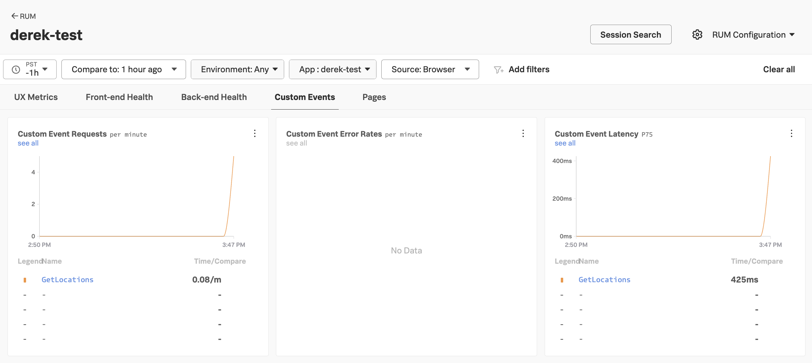
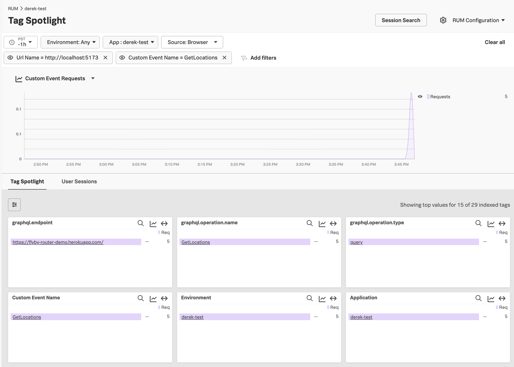

# apollo-client-example

This example is based off of https://www.apollographql.com/docs/react/get-started. 

## Prerequisites

A recent version of Node.js and NPM are required. These specific versions were used for testing: 

* node.js v24.11.0
* npm v11.6.1
* OpenTelemetry Collector (required for the backend application)

## Run the Backend Application

Ensure the GraphQL backend application is running before starting the frontend app. 
Instructions are in [backend/README.md](./backend/README.md). 

## Install Dependencies

``` bash
npm install @apollo/client graphql rxjs
npm install -D vite @vitejs/plugin-react
npm install react react-dom 
npm install @opentelemetry/api
```

## Add RUM MetricSets

In Splunk Observability Cloud, add new RUM MetricSets for the following tags: 

* `graphql.operation.name`
* `graphql.operation.type`
* `graphql.endpoint`


This ensures that GraphQL-related tags are available with features such as Tag Spotlight. 

## Configure RUM Settings

Edit the [index.html](./index.html) page and add your realm, RUM access token, 
application name, and environment name: 

````
        SplunkRum.init({
            realm: "your_realm",
            rumAccessToken: "your_access_token",
            applicationName: "your_app_name",
            deploymentEnvironment: "your_environment_name",
        });
````

## Run the Application 

``` bash
npm run dev
```

Access the application by pointing your browser to `http://localhost:5173/`.  

## Custom Events

After generating some traffic, navigate to the Custom Events tab for this RUM application 
in Splunk Observability Cloud. Here we can see that a custom event has been captured for the GraphQL 
operation that's invoked by Apollo Client, which in this case is `GetLocations`. 



## Tag Spotlight 

In Splunk Observability Cloud, navigate to the Tag Spotlight page for 
your RUM application.  See [Analyze service performance with Tag Spotlight](https://help.splunk.com/en/splunk-observability-cloud/monitor-end-user-experience/real-user-monitoring/analyze-services-with-span-tags/analyze-service-performance-with-tag-spotlight) 
for details. 

With Tag Spotlight, we can analyze performance of our web application in the context of
values for the `graphql.operation.name`, `graphql.operation.type`, and `graphql.endpoint` tag values.


 

