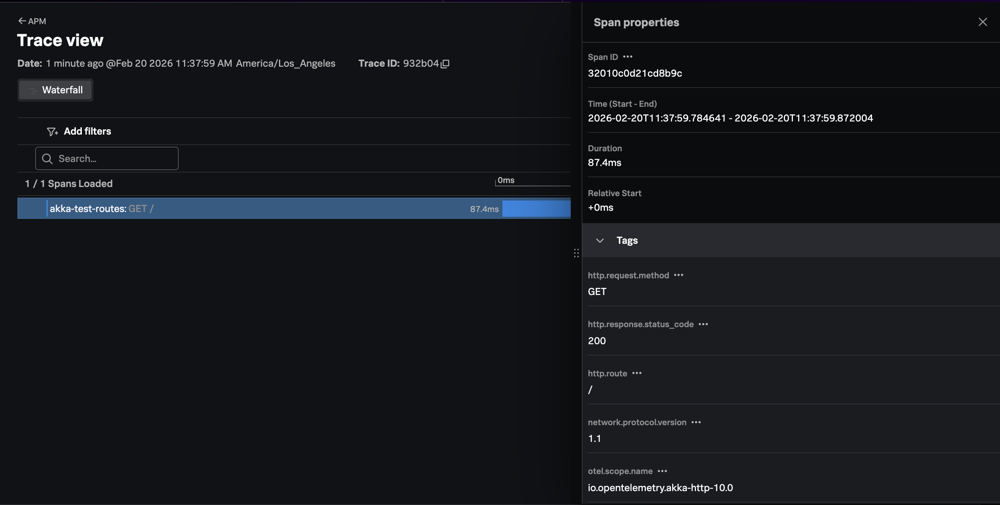

# Instrumenting a Scala Akka HTTP Application with OpenTelemetry

This example demonstrates how a Scala application using Akka HTTP can be instrumented with 
the Splunk distribution of OpenTelemetry Java to automatically capture traces. 

## Prerequisites

The following tools are required to build and execute the Python application:

* Scala 2.13.13+
* sbt 1.12.0+
* An OpenTelemetry Collector available available via `http://localhost:4318`

## Add OpenTelemetry Instrumentation

To add OpenTelemetry instrumentation, we first added 
the following plugin to the [project/plugins.sbt](./project/plugins.sbt) file: 

````
addSbtPlugin("com.lightbend.sbt" % "sbt-javaagent" % "0.1.6")
````

We then added the following to the [build.sbt](./build.sbt) file to 
enable the Java agent plugin, download the Splunk OTel Java agent, 
and configure java options to set the service name and enable profiling: 

````
enablePlugins(JavaAgent)

// Add the Splunk OTel Java Agent
javaAgents += "com.splunk" % "splunk-otel-javaagent" % "2.24.0" % "runtime"

// Set Splunk-specific default configurations
javaOptions ++= Seq(
  "-Dotel.service.name=akka-test-routes",
  "-Dsplunk.profiler.enabled=true",     // Enables AlwaysOn Profiling
  "-Dsplunk.metrics.enabled=true",       // Enables Splunk-specific metrics
  "-Dotel.traces.exporter=logging,otlp"  // Write traces to the console
)
````

## Compile and Run the Application

Compile and run the application: 

``` bash
sbt compile
sbt "run" 
```

Use another window to test the application via cURL: 

``` bash
curl http://localhost:8080/
```

## Review Trace Output

The application console should include traces such as the following: 

````
[otel.javaagent 2026-02-20 11:37:59:872 -0800] [hello-system-akka.actor.default-dispatcher-8] INFO io.opentelemetry.exporter.logging.LoggingSpanExporter - 'GET /' : 932b04646422daed2e5b4d0e922726ef 32010c0d21cd8b9c SERVER [tracer: io.opentelemetry.akka-http-10.0:2.24.0-alpha] AttributesMap{data={url.scheme=http, thread.name=hello-system-akka.actor.default-dispatcher-8, http.response.status_code=200, http.request.method=GET, http.route=/, thread.id=35, network.protocol.version=1.1, server.address=localhost, server.port=8080, user_agent.original=curl/8.7.1, url.path=/}, capacity=2147483647, totalAddedValues=11}
````

After a minute or so, you should start to see traces for the Scala Akka HTTP application
appearing in Splunk Observability Cloud:

