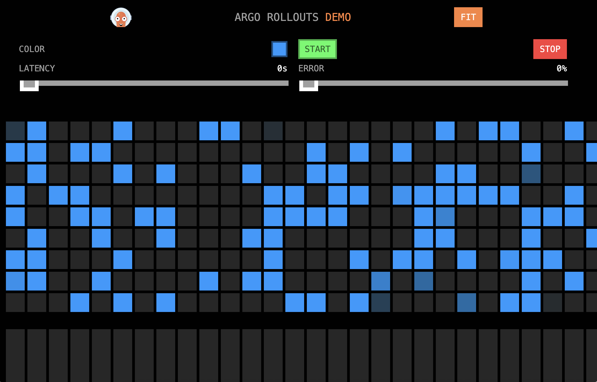

# Argo Rollouts Integration with Splunk Observability Cloud

"Argo Rollouts is a Kubernetes controller and set of CRDs which provide advanced deployment 
capabilities such as blue-green, canary, canary analysis, experimentation, and progressive 
delivery features to Kubernetes."

Source:  [Argo Rollouts - Kubernetes Progressive Delivery Controller](https://argoproj.github.io/argo-rollouts/)

## Deploy the Splunk OpenTelemetry Collector

This example requires the Splunk Distribution of the OpenTelemetry collector to
be running on the host and available within the Kubernetes cluster.  Follow the
instructions in [Install the Collector for Kubernetes using Helm](https://docs.splunk.com/observability/en/gdi/opentelemetry/collector-kubernetes/install-k8s.html)
to install the collector in your k8s cluster.

If you'd like to capture logs from
the Kubernetes cluster, ensure the HEC URL and HEC token are provided when the
collector is deployed.

Here's an example command that shows how to deploy the collector in Kubernetes using Helm:

````
helm install splunk-otel-collector --set="splunkObservability.accessToken=<Access Token>,clusterName=<Cluster Name>,splunkObservability.realm=<Realm>,gateway.enabled=false,splunkPlatform.endpoint=https://<HEC URL>:443/services/collector/event,splunkPlatform.token=<HEC token>,splunkPlatform.index=<Index>,splunkObservability.profilingEnabled=true,environment=<Environment Name>" splunk-otel-collector-chart/splunk-otel-collector
````

You'll need to substitute your access token, realm, and other information.

## Argo Rollouts Controller Installation

To start, we'll need a Kubernetes cluster that has the Argo Rollouts controller 
installed. Run the following commands to perform a default install: 

``` bash
kubectl create namespace argo-rollouts
kubectl apply -n argo-rollouts -f https://github.com/argoproj/argo-rollouts/releases/latest/download/install.yaml
```

See [Controller Installation](https://argoproj.github.io/argo-rollouts/installation/#controller-installation) 
for customization options. 

## Argo Rollouts Kubectl Plugin Installation

Next, install the kubectl plugin using the following commands (for Linux-based systems):

``` bash
curl -LO https://github.com/argoproj/argo-rollouts/releases/latest/download/kubectl-argo-rollouts-linux-amd64
chmod +x ./kubectl-argo-rollouts-linux-amd64
sudo mv ./kubectl-argo-rollouts-linux-amd64 /usr/local/bin/kubectl-argo-rollouts
```

See [Kubectl Plugin Installation](https://argoproj.github.io/argo-rollouts/installation/#manual)
for additional installation options. 

## Deploy the Job

Argo Rollouts allows a Kubernetes Job to be utilized to as a test, to determine 
whether to continue with the rollout of a new version of software. 

To integrate Argos Rollout with Splunk Observability Cloud, we'll define a job 
that calls a shell script, which in turn uses curl to retrieve metrics from 
Splunk Observability Cloud. The script returns an exit code of zero if the 
metric meets the specified condition. 

### Create a Script to Retrieve Metrics from Splunk

The script can be found in [check_splunk_metric.sh](./check_splunk_metric.sh). 

We can run the script manually as follows: 

``` bash
./check_splunk_metric.sh -r $SPLUNK_REALM -t "$SPLUNK_API_TOKEN" -q 'sf_metric:demo.trans.latency' -o gt -v 200 --scope any
```

> Be sure to define the SPLUNK_REALM and SPLUNK_API_TOKEN environment variables before 
> running the command. 

It should respond with something like the following: 

````
Criteria met (10/18) for query 'sf_metric:demo.trans.latency' with gt 200.
````

### Create a Docker Image 

Next, we'll create a Docker image that will be used by the Job to execute 
the script we just created using [Dockerfile](./Dockerfile). 

Build the Dockerfile and push it to your repository using the following commands: 

> Note: we're using a local repository for this example; update the below commands with
> your target repository name before running them.

``` bash
docker build -t localhost:9999/check-splunk-metrics:latest .
docker push localhost:9999/check-splunk-metrics:latest
```

### Create a Kubernetes Secret 

Let's create a Kubernetes secret to securely store the API token that 
the script will use to access Splunk Observability Cloud: 

``` bash
kubectl create secret generic splunk-token --from-literal=token=YOUR_SPLUNK_API_TOKEN
```

### Create the Job 

Now, we can create the job, which you can find in [analysis-template.yaml](./analysis-template.yaml). 

``` bash
kubectl apply -f ./analysis-template.yaml
```

The `analysis-template.yaml` file should be updated with the criteria you require for your 
application rollouts.  For this example, we used the following criteria, which tells the 
script to connect to Splunk Observability Cloud using the us1 realm and the provided token. 
It will then retrieve the value of the `service.request.duration.ns.p99` metric where 
the `service.name` has a value of `argo-rollouts-demo`. It will return 1 if the metric 
value is less than 500,000 microseconds (which is equivalent to 0.5 seconds). Otherwise, 
it will return 0, telling Argo Rollouts that the service is effectively too slow to continue 
with the rollout process: 

``` yaml
  args:
    - name: realm
      value: us1
    - name: token
      valueFrom:
        secretKeyRef:
          name: splunk-token
          key: token
    - name: query
      value: "(sf_metric:service.request.duration.ns.p99 AND service.name:argo-rollouts-demo)"
    - name: operator
      value: lt
    - name: threshold
      value: "500000"
    - name: scope
      value: any
```

## Deploy the Demo Application 

### Build the Demo Application Image

``` bash
git clone https://github.com/argoproj/rollouts-demo.git
cd rollouts-demo
```

Update the Dockerfile to use `FROM golang:1.25 as build` instead of `FROM golang:1.16 as build`, 
since OpenTelemetry GO auto-instrumentation is not compatible with v1.16. 

Then build the images and push them to the local repository: 

``` bash
make release IMAGE_NAMESPACE=localhost:9999 DOCKER_PUSH=true
```

### Create the Rollout 

With Argo Rollouts, a "rollout" is used in place of a usual Kubernetes Deployment 
to manage the deployment of an application. 

In this example, we'll deploy the [rollouts-demo](https://github.com/argoproj/rollouts-demo). 

The [rollout.yaml](./rollout.yaml) refers to the job we created 
earlier to ensure that the rollout doesn't proceed beyond 40% until 
the analysis is run: 

``` yaml
apiVersion: argoproj.io/v1alpha1
kind: Rollout
metadata:
  name: splunk-argo-rollouts-example
spec:
  replicas: 3
  strategy:
    canary:
      analysis:
        templates:
          - templateName: check-splunk-metrics
        startingStep: 2 # delay starting analysis run until setWeight: 40%
```

Deploy the application using the rollout manifest as follows: 

``` bash
kubectl apply -f ./rollout.yaml
kubectl apply -f ./service.yaml
```

You can access your application by using your browser to navigate to: 

````
http://<IP address>:81
````

It should look something like this: 



The first time an application is deployed, Argo Rollouts deploys 100% of pods.
We can monitor progress of the rollout using the following command: 

``` bash
kubectl argo rollouts get rollout splunk-argo-rollouts-example --watch
```

Let's update our deployment to use the `slow-yellow` image instead of 
the `blue` image. This will trigger Argo Rollouts to perform analysis 
using our job and shell script, before moving on to the next step of the rollout. 

``` bash
kubectl argo rollouts set image splunk-argo-rollouts-example \
  rollouts-demo=localhost:9999/rollouts-demo:slow-yellow
```

We can monitor progress of the rollout using the following command:

``` bash
kubectl argo rollouts get rollout splunk-argo-rollouts-example --watch
```

Argo Rollouts will re-deploy the first pod only, and then pause for one 
minute (per the specified configuration). 

````
Name:            splunk-argo-rollouts-example
Namespace:       default
Status:          ॥ Paused
Message:         CanaryPauseStep
Strategy:        Canary
  Step:          1/8
  SetWeight:     20
  ActualWeight:  25
Images:          localhost:9999/rollouts-demo:blue (stable)
                 localhost:9999/rollouts-demo:slow-yellow (canary)
                 otel/autoinstrumentation-go (canary, stable)
Replicas:
  Desired:       3
  Current:       4
  Updated:       1
  Ready:         4
  Available:     4

NAME                                                      KIND        STATUS     AGE  INFO
⟳ splunk-argo-rollouts-example                            Rollout     ॥ Paused   2m   
├──# revision:2                                                                       
│  └──⧉ splunk-argo-rollouts-example-5b95974b48           ReplicaSet  ✔ Healthy  21s  canary
│     └──□ splunk-argo-rollouts-example-5b95974b48-mqbt6  Pod         ✔ Running  21s  ready:2/2
└──# revision:1                                                                       
   └──⧉ splunk-argo-rollouts-example-7574bd5fd6           ReplicaSet  ✔ Healthy  2m   stable
      ├──□ splunk-argo-rollouts-example-7574bd5fd6-fsn22  Pod         ✔ Running  2m   ready:2/2
      ├──□ splunk-argo-rollouts-example-7574bd5fd6-sv2t7  Pod         ✔ Running  2m   ready:2/2
      └──□ splunk-argo-rollouts-example-7574bd5fd6-z6mfp  Pod         ✔ Running  2m   ready:2/2
````

Then, it will perform analysis by invoking our job, which in turn invokes the script to fetch metrics 
from Splunk Observability Cloud. If the criteria is met, then the rollout will proceed to the second pod
and we should see output such as the following: 

````
NAME                                                                    KIND         STATUS        AGE    INFO
⟳ splunk-argo-rollouts-example                                          Rollout      ॥ Paused      3m55s  
├──# revision:2                                                                                           
│  ├──⧉ splunk-argo-rollouts-example-5b95974b48                         ReplicaSet   ✔ Healthy     2m16s  canary
│  │  ├──□ splunk-argo-rollouts-example-5b95974b48-mqbt6                Pod          ✔ Running     2m16s  ready:2/2
│  │  └──□ splunk-argo-rollouts-example-5b95974b48-clgwq                Pod          ✔ Running     16s    ready:2/2
│  └──α splunk-argo-rollouts-example-5b95974b48-2                       AnalysisRun  ✔ Successful  76s    ✔ 1
│     └──⊞ 48f24472-ba81-43ec-97c5-075b15bc9914.check-splunk-metrics.1  Job          ✔ Successful  76s    
└──# revision:1                                                                                           
   └──⧉ splunk-argo-rollouts-example-7574bd5fd6                         ReplicaSet   ✔ Healthy     3m55s  stable
      └──□ splunk-argo-rollouts-example-7574bd5fd6-z6mfp                Pod          ✔ Running     3m55s  ready:2/2
````

If the criteria is *not* met, then the deployment will be rolled back and we should see output
such as the following: 

````
NAME                                                                    KIND         STATUS         AGE  INFO
⟳ splunk-argo-rollouts-example                                          Rollout      ✖ Degraded     91s  
├──# revision:2                                                                                          
│  ├──⧉ splunk-argo-rollouts-example-5b95974b48                         ReplicaSet   • ScaledDown   81s  canary
│  │  └──□ splunk-argo-rollouts-example-5b95974b48-kw4s2                Pod          ◌ Terminating  81s  ready:2/2
│  └──α splunk-argo-rollouts-example-5b95974b48-2                       AnalysisRun  ✖ Failed       20s  ✖ 1
│     └──⊞ 4c9c87ac-6f68-4e73-bb4b-31c6fd3d4fe0.check-splunk-metrics.1  Job          ✖ Failed       20s  
└──# revision:1                                                                                          
   └──⧉ splunk-argo-rollouts-example-7574bd5fd6                         ReplicaSet   ✔ Healthy      91s  stable
      ├──□ splunk-argo-rollouts-example-7574bd5fd6-crl65                Pod          ✔ Running      91s  ready:2/2
      ├──□ splunk-argo-rollouts-example-7574bd5fd6-lhkwc                Pod          ✔ Running      91s  ready:2/2
      └──□ splunk-argo-rollouts-example-7574bd5fd6-wjklw                Pod          ✔ Running      5s   ready:2/2
````
