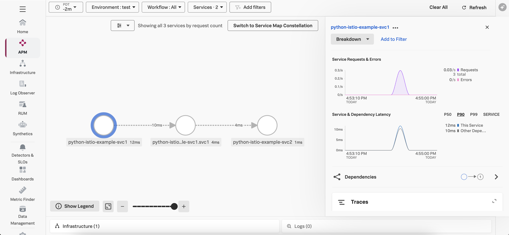
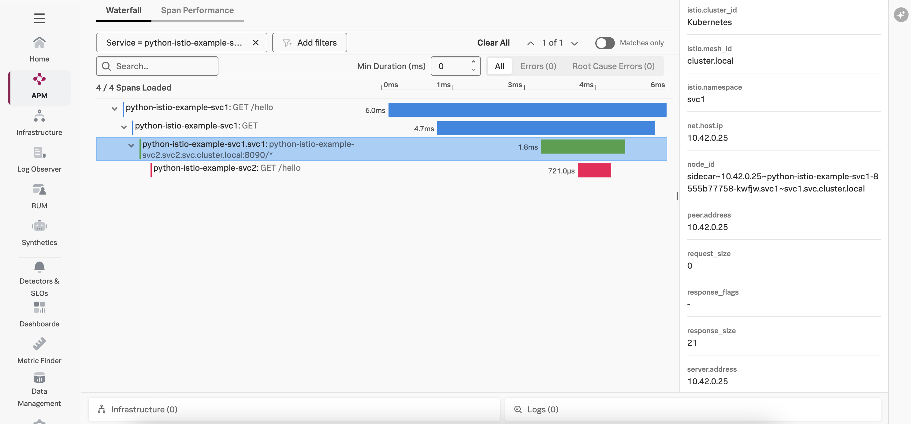

# Istio with OpenTelemetry 

This example shows traces can be captured from Istio, and how these traces interoperate 
with traces captured using OpenTelemetry. 

For this example, we'll use two simple Python services:  Service 1, which calls Service 2. 
Calls into and out of service 1 go through an Istio service mesh, while Service 2 
resides outside the service mesh.  Both services are instrumented with the Splunk
Distribution of OpenTelemetry Python. 

## Prerequisites

The following tools are required to run this example: 

* A Linux machine (Ubuntu 22.04 was used to test this example)
* Docker
* Kubernetes
* Helm 3

## Install istioctl 

Ensure the istioctl command line utility is installed on the machine 
where you're running the example: 

``` bash
curl -sL https://istio.io/downloadIstioctl | sh -
export PATH=$HOME/.istioctl/bin:$PATH
```

See [Install istioctl](https://istio.io/latest/docs/ops/diagnostic-tools/istioctl/#install-hahahugoshortcode962s2hbhb) 
for further details on the installation process. 

## Install Istio

Ensure Istio is installed in the Kubernetes cluster used for testing:

``` bash
helm repo add istio https://istio-release.storage.googleapis.com/charts

helm repo update

helm install istio-base istio/base -n istio-system --set defaultRevision=default --create-namespace

helm install istiod istio/istiod -n istio-system --wait
```

## Deploy the Splunk OpenTelemetry Collector

This example requires the Splunk Distribution of the OpenTelemetry collector to
be running on the host and available within the Kubernetes cluster.  Follow the
instructions in [Install the Collector for Kubernetes using Helm](https://docs.splunk.com/observability/en/gdi/opentelemetry/collector-kubernetes/install-k8s.html)
to install the collector in your k8s cluster.

Set environment variables for the Splunk Observability Cloud access token and realm 
you'd like to use: 

``` bash
export ACCESS_TOKEN=<access token>
export REALM=<realm> 
export OTEL_ENVIRONMENT=test
```

Here's an example command that shows how to deploy the collector in Kubernetes using Helm:

``` bash
helm repo add splunk-otel-collector-chart https://signalfx.github.io/splunk-otel-collector-chart

helm repo update

helm install splunk-otel-collector \
    --set="splunkObservability.accessToken=$ACCESS_TOKEN" \
    --set="clusterName=istio-example" \
    --set="splunkObservability.realm=$REALM" \
    --set="gateway.enabled=false" \
    --set="environment=$OTEL_ENVIRONMENT" \
    -f collector-values.yaml \
    splunk-otel-collector-chart/splunk-otel-collector
```

Note that we've set  `autodetect.istio=true` as part of the `collector-values.yaml` file.

## Configure the Istio Operator

Then we configure the Istio operator to use the Zipkin tracer to send
data to the Splunk OpenTelemetry Collector running on the host.  We'll also
set the `deployment.environment` attribute, to ensure traces are reported to the
appropriate environment in Splunk Observability Cloud:

``` bash
istioctl install -f ./tracing.yaml
```
Enable tracing by applying the following configuration:

``` bash
kubectl apply -f - <<EOF
apiVersion: telemetry.istio.io/v1
kind: Telemetry
metadata:
  name: mesh-default
  namespace: istio-system
spec:
  tracing:
  - providers:
    - name: "zipkin"
    customTags:
      "deployment.environment":
        literal:
          value: "test"
EOF
```

## Deploy the Application Services 

The services can be deployed using the following commands: 

``` bash
kubectl create ns svc1
kubectl label namespace svc1 istio-injection=enabled --overwrite
kubectl apply -f svc1.yaml

kubectl create ns svc2
kubectl apply -f svc2.yaml
```

Note that we've enabled Istio side-car injection on the service 1 namespace. 

And in the `svc1.yaml` and `svc2.yaml` manifest files, we've set the 
`OTEL_PROPAGATORS` environment variable to include `b3multi`, since the 
traces generated by Istio utilize B3 context propagation: 

````
    - name: OTEL_PROPAGATORS
      value: "tracecontext,baggage,b3multi"
````

## Test the Application Services

We can use port forward to make service 1 available via localhost:

``` bash
kubectl port-forward service/python-istio-example-svc1 8080:8080 -n svc1
```

Then access it using curl: 

``` bash
curl http://localhost:8080/hello
```

It should respond with: 

````
Hello from Service 1 and...Hello from Service 2!
````

## Review Trace Data 

After a minute or so, you should see a service map that looks like the following, 
showing service one connecting to service two via istio: 



The trace should look like the following: 


